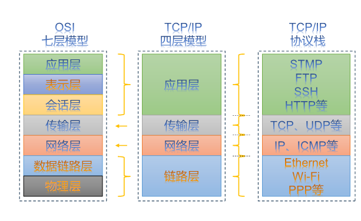
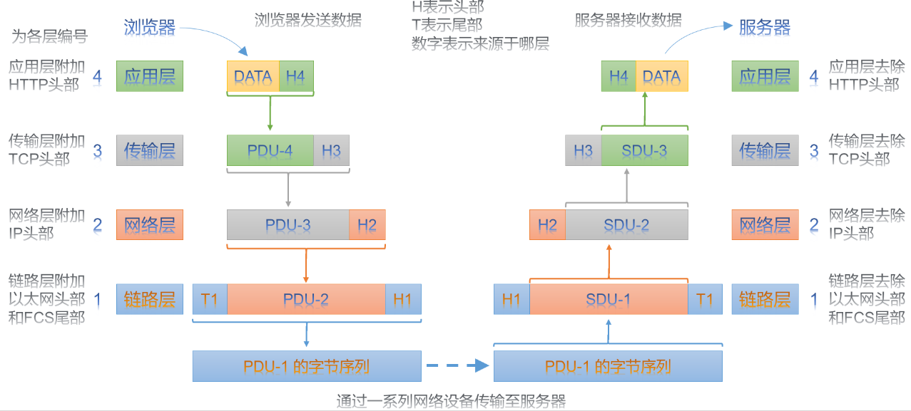
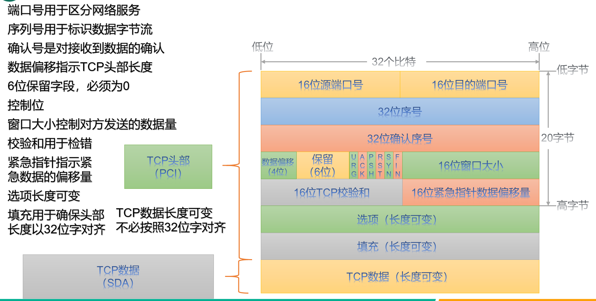
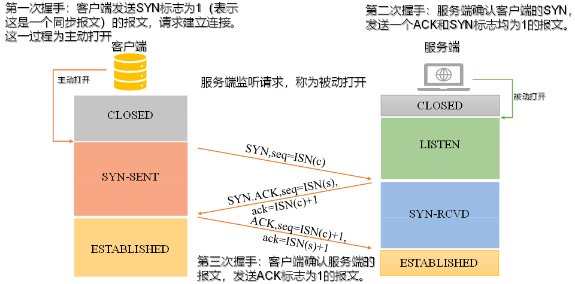
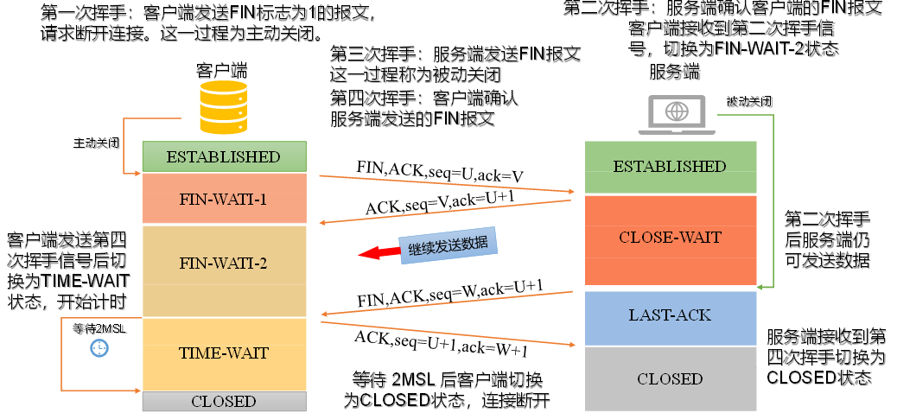

# Socket编程


OSI模型七个层次

---

TCP/IP四层模型，亦称互联网协议套件（Internet Protocol Suite），该套件中的基础协议包括传输控制协议（TCP）、用户数据报协议（UDP）和互联网协议（IP）



以下是用户向服务端发送数据的过程



---

TCP协议特征

- 面向连接
- 可靠传输 必须要应答
- 流量控制 可以窗口大小调整机制来进行流量控制
- 拥塞控制 慢启动 拥塞避免 快重传 快恢复等
- 数据排序 以正确的顺序交付给应用层
- 端到端通信 源IP地址、源端口号、目标IP地址、目标端口号



一个报文段的序号是该报文段首字节的字节流编号。

即若数据流要分为若干个报文段传输 则每一个报文段的序号就是若干个报文段的首字节

报文段的确认号是发送方期望从对方收到的下一字节的序号

客户端建立联系的三次握手

我们用小写的seq表示TCP报文头部的序号，用小写的ack表示确认号。未提到的标志位均为0。





ACK的值为接收到的FIN或SYN报文中seq+1

流量控制

- 慢启动 到达阈值ssthresh的时候进入拥塞避免阶段 每收到一个ack cwnd+1
- 超时重传 当窗口增长的时候 如果限定时间内未收到ack则判定超时 将ssthresh调整为当前cwnd一般 然后将cwnd置1 重新慢启动
- 快速重传 当报文段丢失的时候 连续收到重复ack就会重传 避免了数据的长期等待
- 在快速重传的时候 sshthresh调整为cwnd的一半  cwnd不必从1开始 等于新的sshthresh 重新执行拥塞避免策略

真正的TCP协议实现中，滑动窗口和拥塞控制机制是协同工作的。

---

## 嵌套字

```c
#include <sys/socket.h>
#include <sys/types.h>

/**
 * @brief 在通信域中创建一个未绑定的socket，并返回一个文件描述符，该描述符可以在后续对socket进行操作的函数调用中使用
 * 
 * @param domain 指定要创建套接字的通信域。
 *      AF_UNIX：本地通信，通常用于 UNIX 系统间的进程间通信。
 *      AF_LOCAL：AF_UNIX 的别名。
 *      AF_INET：IPv4 互联网协议。
 *      AF_AX25：业余无线电 AX.25 协议。
 *      AF_IPX：IPX - Novell 协议。
 *      AF_APPLETALK：AppleTalk 协议。
 *      AF_X25：ITU-T X.25 / ISO-8208 协议。
 *      AF_INET6：IPv6 互联网协议。
 *      AF_DECnet：DECnet 协议套接字。
 *      AF_KEY：密钥管理协议，最初用于 IPsec。
 *      AF_NETLINK：内核用户接口设备。
 *      AF_PACKET：低级报文段接口。
 *      AF_RDS：可靠数据报套接字（RDS）协议。
 *      AF_PPPOX：通用 PPP 传输层，用于设置 L2 隧道（L2TP 和 PPPoE）。
 *      AF_LLC：逻辑链路控制（IEEE 802.2 LLC）协议。
 *      AF_IB：InfiniBand 本机寻址。
 *      AF_MPLS：多协议标签交换。
 *      AF_CAN：控制器区域网络汽车总线协议。
 *      AF_TIPC：TIPC，“集群域套接字”协议。
 *      AF_BLUETOOTH：蓝牙低级套接字协议。
 *      AF_ALG：与内核加密 API 接口。
 *      AF_VSOCK：VSOCK（最初为“VMWare VSockets”）协议，用于虚拟机和宿主机之间的通信。
 *      AF_KCM：KCM（内核连接复用器）接口。
 *      AF_XDP：XDP（快速数据通道）接口。
 * @param type 指定要创建的socket类型
 *      SOCK_STREAM：提供序列化、可靠的、双向的、基于连接的字节流。可以支持带外数据传输机制。
 *      SOCK_DGRAM：支持数据报（无连接、不可靠的固定最大长度的消息）。
 *      SOCK_SEQPACKET：为固定最大长度的数据报提供了一个序列化的、可靠的、双向的基于连接的数据传输路径；消费者需要在每次输入系统调用中读取整个报文段。
 *      SOCK_RAW：提供原始的网络协议访问。
 *      SOCK_RDM：提供一个不保证顺序的可靠数据报层。
 * 自 Linux 2.6.27 以来，type 参数还具有第二个目的：除了指定套接字类型外，它还可以包含任何以下值的按位 OR，以修改 socket() 的行为：
 *      SOCK_NONBLOCK：在新文件描述符引用的打开文件描述符上设置 O_NONBLOCK 文件状态标志（参见 open(2)）。使用此标志可以节省调用 fcntl(2) 来实现相同结果的额外调用。
 *      SOCK_CLOEXEC：在新文件描述符上设置关闭时执行（FD_CLOEXEC）标志。有关为什么可能有用的原因，请参阅 open(2) 中 O_CLOEXEC 标志的描述。
 * @param protocol 指定要与socket一起使用的特定协议。指定协议为 0 会导致 socket() 使用适用于所请求的socket类型的未指定的默认协议
 * @return int 文件描述符，如果失败返回-1
 */
int socket(int domain, int type, int protocol);
```

```c
/**
 * @brief 当使用 socket(2) 创建套接字时，它存在于一个名称空间（地址族）中，但没有为其分配地址。bind() 将由 addr 指定的地址分配给文件描述符 sockfd 所引用的套接字。addrlen 指定了 addr 指向的地址结构的大小（以字节为单位）。传统上，这个操作被称为“给套接字分配一个名称”
 * 
 * @param sockfd 套接字文件描述符
 * @param addr 指定的地址。地址的长度和格式取决于socket的地址族
 * @param addrlen addr 指向的地址结构的大小（以字节为单位）。
 * @return int 成功 0
 *             失败 -1
 */
int bind(int sockfd, const struct sockaddr *addr, socklen_t addrlen);
```

在网络编程中，地址族（Address Family）指定了套接字（socket）使用的网络协议类型以及地址的格式。简而言之，地址族决定了网络通信的范围和方式，比如是在同一台机器上的进程间通信，还是在网络上不同主机间的通信。每种地址族都支持特定类型的通信协议和地址格式。下面是一些常见的地址族

- AF_INET 代表IPv4网络协议的地址族,使用32位地址。 地址格式通常为点分十进制，如192.168.1.1。
- AF_INET6 使用128位地址。
是IPv4的后继，旨在解决IPv4地址耗尽问题，并提供更多的功能。地址格式为冒号分隔的十六进制，2001:0db8:85a3:0000:0000:8a2e:0370:7334
- AF_UNIX (或 AF_LOCAL) 用于同一台机器上的进程间通信（IPC）。
使用文件系统路径名作为地址。
这种方式不通过网络层进行数据传输，而是在操作系统内部完成，因此效率较高
- AF_PACKET 用于直接访问底层网络设备的数据链路层。
允许发送和接收在网络设备驱动层的帧，常用于实现低级网络协议

```c
/**
 * @brief 将 sockfd 指定的套接字标记为被动套接字，即将用于使用 accept(2) 接受传入的连接请求。
 * 
 * @param sockfd 套接字文件描述符
 * @param backlog 指定还未accpet但是已经完成链接的队列长度
 * @return int 成功 0 
 *             失败 -1
 */
int listen(int sockfd, int backlog);
```

```c
/** * @brief 从监听套接字 sockfd 的待处理连接队列中提取第一个连接请求，创建一个新的连接套接字，并返回指向该套接字的新文件描述符。新创建的套接字不处于监听状态。原始套接字 sockfd 不受此调用的影响。
 * 
 * @param sockfd 一个使用 socket(2) 创建、使用 bind(2) 绑定到本地地址，并在 listen(2) 后监听连接的套接字。
 * @param addr 要么是一个空指针，要么是一个指向 sockaddr 结构的指针，用于返回连接socket的地址。
 * @param addrlen 如果 address 是空指针，则为一个空指针；如果 address 不是空指针，则为一个指向 socklen_t 对象的指针，该对象在调用前指定提供的 sockaddr 结构的长度，并在调用后指定存储地址的长度。
 * @return int 返回一个新的套接字文件描述符，用于与客户端通信，如果失败返回-1，并设置errno来表示错误原因
 */
int accept(int sockfd, struct sockaddr *addr, socklen_t *addrlen);
```

```c
/*** @brief 由客户端调用，来与服务端建立连接。
 * 
 * @param sockfd 客户端套接字的文件描述符
 * @param addr 指向sockaddr结构体的指针，包含目的地地址信息
 * @param addrlen 指定addr指向的结构体的大小
 * @return int 成功 0 
 *             失败 -1，并设置errno以指示错误原因
 */
int connect(int sockfd, const struct sockaddr *addr, socklen_t addrlen);
```

```c
/**
 * @brief 用于向另一个套接字传输消息。
 * 
 * @param sockfd 发送套接字的文件描述符。
 * @param buf 发送缓冲区，并非操作系统分配为服务端和客户端分配的缓冲区，而是用户为了发送数据，自己维护的字节序列。const修饰表名它是“只读”的，即send函数不会修改这块内存的内容。*
 *  @param len 要发送的数据的字节长度。它决定了从buf指向的缓冲区中将发送多少数据。
 * @param flags flags 参数是以下标志之一或多个的按位或。对于大多数应用，这个参数被设置为0，表示不使用任何特殊行为。
 *      MSG_CONFIRM 告知链路层发生了前进：您从另一端收到了成功的回复。如果链路层没有收到此消息，它将定期重新探测邻居（例如，通过单播 ARP）。仅对 SOCK_DGRAM 和 SOCK_RAW sockets 有效，当前仅对 IPv4 和 IPv6 实现。有关详情，请参阅 arp(7)。
 *      MSG_DONTROUTE 不要使用网关发送报文段，只发送到直接连接的网络中的主机。通常仅由诊断或路由程序使用。仅为具有路由功能的协议族定义；报文段套接字不支持。
 *      MSG_DONTWAIT 启用非阻塞操作；如果操作会阻塞，则返回 EAGAIN 或 EWOULDBLOCK。这提供了类似于设置 O_NONBLOCK 标志（通过 fcntl(2) F_SETFL 操作）的行为，但不同之处在于 MSG_DONTWAIT 是一个每次调用的选项，而 O_NONBLOCK 是对打开文件描述符（参见 open(2)）的设置，将影响调用进程中的所有线程以及持有引用相同打开文件描述符的其他进程。
 *  *      MSG_EOR 终止记录（当支持此概念时，例如 SOCK_SEQPACKET 类型的套接字）。
 *      MSG_MORE 调用方有更多数据要发送。此标志与 TCP sockets 一起使用，以获得与 TCP_CORK 套接字选项相同的效果（请参阅 tcp(7)），不同之处在于此标志可以基于每次调用设置。自 Linux 2.6 起，此标志还适用于 UDP sockets，并告知内核将使用此标志设置的所有调用发送的数据打包到单个数据报中，仅在执行不指定此标志的调用时才传输。（另请参阅 udp(7) 中描述的 UDP_CORK 套接字选项。）
 *      MSG_NOSIGNAL 如果面向流的套接字的对等端关闭了连接，则不生成 SIGPIPE 信号。仍会返回 EPIPE 错误。这提供了类似于使用 sigaction(2) 忽略 SIGPIPE 的行为，但 MSG_NOSIGNAL 是每次调用的特性，而忽略 SIGPIPE 设置了一个影响进程中的所有线程的进程属性。
 *      MSG_OOB 在支持此概念的套接字上发送带外数据（例如，类型为 SOCK_STREAM 的套接字）；底层协议还必须支持带外数据。
 * @return ssize_t成功发送的字节数。如果出现错误，它将返回-1，并设置errno以指示错误的具体原因。
 */
ssize_t send(int sockfd, const void *buf, size_t len, int flags);
```

```c
/**
 * @brief 从套接字关联的连接中接收数据。
 * 
 * @param sockfd 套接字文件描述符。
 * @param buf 接收缓冲区，同样地，此处也并非内核维护的缓冲区。
 * @param len 缓冲区长度，即buf可以接收的最大字节数。
 * @param flags flags 参数是以下标志之一或多个的按位或。对于大多数应用，这个参数被设置为0，表示不使用任何特殊行为。
 *      MSG_DONTWAIT 启用非阻塞操作；如果操作会阻塞，则调用失败
 *      MSG_ERRQUEUE 此标志指定应该从套接字错误队列中接收排队的错误。
 *      MSG_OOB 此标志请求接收在正常数据流中不会接收到的带外数据。
*      MSG_PEEK 此标志导致接收操作从接收队列的开头返回数据，而不从队列中删除该数据。因此，后续的接收调用将返回相同的数据。
 *      MSG_TRUNC 对于原始（AF_PACKET）、Internet 数据报、netlink和 UNIX 数据报套接字：返回报文段或数据报的实际长度，即使它比传递的缓冲区长。
 *      MSG_WAITALL 此标志请求操作阻塞，直到满足完整的请求。
 * @return ssize_t 返回接收到的字节数，如果连接已经正常关闭，返回值将是0。如果出现错误，返回-1，并且errno变量将被设置为指示错误的具体原因。
 */
ssize_t recv(int sockfd, void *buf, size_t len, int flags);
```

```c
/**
 * @brief关闭套接字的一部分或全部连接
 * 
 * @param sockfd 套接字文件描述符
 * @param how 指定关闭的类型。其取值如下：
*      SHUT_RD：关闭读。之后，该套接字不再接收数据。任何当前阻塞在recv调用上的操作都将返回0，表示连接的另一端已经关闭。
 *      SHUT_WR：关闭写。之后，试图通过该套接字发送数据将导致错误。如果使用此选项，TCP连接将发送一个FIN包给连接的对端，表明此方向上的数据传输已经完成。此时对端的recv调用将接收到0。
 *      SHUT_RDWR：关闭读写。同时关闭套接字的读取和写入部分，等同于分别调用SHUT_RD和SHUT_WR。之后，该套接字既不能接收数据也不能发送数据。
 * @return int 成功 0 
 *             失败 -1，并设置errno变量以指示具体的错误原因。
 */
int shutdown(int sockfd, int how);
```

```c
#include <unistd.h>

/*
    用于关闭一个之前通过open()、socket()等函数打开的文件描述符
    int __fd: 这是一个整数值,表示要关闭的文件描述符
    return: 成功关闭文件描述符时,close()函数返回0
            发送失败,例如试图关闭一个已经关闭的文件描述符或系统资源不足,close()会返回-1
*/
int close(int __fd);
```

字节序指的是多字节数据在内存中的存储顺序

高位字节存储在内存的低地址处，低位字节存储在高地址处。这种字节序遵循自然数字的书写习惯，也被称为网络字节序（Network Byte Order）或网络标准字节序，因为它在网络通信中被广泛采用，如IP协议就要求使用大端字节序。

低位字节存储在内存的低地址处，高位字节存储在高地址处。这是Intel x86-64架构以及其他一些现代处理器普遍采用的字节序，称为主机字节序（Host Byte Order）。

```c
#include <arpa/inet.h>

/**
 * @brief 将无符号整数 hostlong 从主机字节顺序（h）转换为网络字节顺序（n）。
 */
uint32_t htonl(uint32_t hostlong);

/**
 * @brief 将无符号短整数 hostshort 从主机字节顺序（h）转换为网络字节顺序（n）。
 */
uint16_t htons(uint16_t hostshort);

/** * @brief 将无符号整数 netlong 从网络字节顺序（n）转换为主机字节顺序（h）。
 */
uint32_t ntohl(uint32_t netlong);

/**
 * @brief 将无符号短整数 netshort 从网络字节顺序（n）转换为主机字节顺序（h）。
 */
uint16_t ntohs(uint16_t netshort);
```

```c
#include <sys/socket.h>
#include <netinet/in.h>
#include <arpa/inet.h>

/**
 * @brief 将来自 IPv4 点分十进制表示法的 Internet 主机地址 cp 转换为二进制形式（以网络字节顺序）并将其存储在 inp 指向的结构体中。
 * @return int 成功返回 1;失败 返回 0
 */
int inet_aton(const char *cp, struct in_addr *inp);

/**
 * @brief 将来自 IPv4 点分十进制表示法的 Internet 主机地址 cp 转换为网络字节顺序的二进制数据。
 * @return 如果输入无效，则返回 INADDR_NONE（通常为 -1）。使用此函数存在问题，因为 -1 是一个有效地址（255.255.255.255）。请优先使用 inet_aton()、inet_pton(3) 或 getaddrinfo(3)，它们提供了更清晰的错误返回方式。
 */
in_addr_t inet_addr(const char *cp);

/**
 * @brief 函数将字符串 cp（以 IPv4 点分十进制表示法表示）转换为适合用作 Internet 网络地址的主机字节顺序中的数字。
 * @return in_addr_t 成功时，返回转换后的地址。如果输入无效，则返回 -1。
 */
in_addr_t inet_network(const char *cp);

/* @brief   字符串格式转换为sockaddr_in格式
   @param int af: 通常为 AF_INET 用于IPv4地址，或 AF_INET6 用于IPv6地址
   @param  char *src: 包含IP地址字符串的字符数组，如果是IPv4地址，格式为点分十进制（如 "192.168.1.1"）；如果是IPv6地址，格式为冒号分隔的十六进制表示（如 "2001:0db8:85a3:0000:0000:8a2e:0370:7334"）
   @param  void *dst：指向一个足够大的缓冲区（对于IPv4是一个struct in_addr结构体，对于IPv6是一个struct in6_addr结构体），用于存储转换后的二进制IP地址
   @return int : 成功转换返回0; 输入地址错误返回1;发生错误返回-1
*/
int inet_pton(int af, const char *src, void *dst);


/**
 * @brief 
 * 
 * @param in 将以网络字节顺序给出的 Internet 主机地址 in 转换为 IPv4 点分十进制表示法的字符串。字符串存储在静态分配的缓冲区中，后续调用将覆盖该缓冲区。
 * @return char* 缓冲区指针
 */
char *inet_ntoa(struct in_addr in);

/**
 * @brief 是 inet_netof() 和 inet_lnaof() 的反函数。它返回一个以网络字节顺序表示的 Internet 主机地址，由主机字节顺序中的网络号 net 和本地地址 host 组成。
 */
struct in_addr inet_makeaddr(in_addr_t net, in_addr_t host);

/**
 * @brief 返回 Internet 地址 in 的本地网络地址部分。返回的值以主机字节顺序表示。
 */
in_addr_t inet_lnaof(struct in_addr in);

/**
 * @brief 返回 Internet 地址 in 的网络号部分。返回的值以主机字节顺序表示。
 */
in_addr_t inet_netof(struct in_addr in);
```

```c
#include <sys/socket.h>
#include <sys/types.h>
#include <netinet/in.h>
#include <stdio.h>
#include <stdlib.h>
#include <string.h>
#include <arpa/inet.h>
#include <pthread.h>
#include <unistd.h>

#define handle_error(cmd, result) \
    if (result < 0)               \
    {                             \
        perror(cmd);              \
        return -1;                \
    }


void *read_from_client(void *argv)
{
    int client_fd = *(int *)argv;
    char *read_buf = NULL;
    ssize_t cnt = 0;

    read_buf = malloc(sizeof(char) * 1024);
    if(!read_buf)
    {
        perror("malloc server read buf");
        return NULL;
    }

    while((cnt = recv(client_fd,read_buf,1024,0))) //非零则处理
    {
        if(cnt < 0)
        {
            perror("recv");
        }
        fputs(read_buf,stdout);
    }

    printf("客户端请求关闭连接......\n");

    free(read_buf);

    return NULL;
}

/*  将标准输入写入 到嵌套字里面去
*/

void *write_to_client(void *argv)
{
    int client_fd = *(int *)argv;
    char *write_buf = NULL;
    ssize_t send_num;
    write_buf = malloc(sizeof(char *) * 1024);

    if(!write_buf)
    {
        perror("malloc write buf");
        return NULL;
    }
    //将标准输入写入到write_buf中
    while(fgets(write_buf,1024,stdin) !=NULL)
    {
       send_num = send(client_fd,write_buf,1024,0);
       if(send_num < 0)
       {
            perror("send");
       }
    }

    printf("接收到命令行的终止信号 不再写入 开始退出......\n");

    shutdown(client_fd,SHUT_WR);
    free(write_buf);

    return NULL;
}


int main(int argc,char const *argv[])
{
    int sockfd;
    int temp_err;
    int client_fd;

    pthread_t pid_read,pid_write;
    //创建服务端地址 客户端地址
    struct sockaddr_in server_addr,client_addr;
    //初始化 清零
    memset(&server_addr,0,sizeof(server_addr));
    memset(&client_addr,0,sizeof(client_addr));

    //声明IPV4协议
    server_addr.sin_family = AF_INET;
    //绑定0.0.0.0地址 转换成网络字节序
    server_addr.sin_addr.s_addr = htonl(INADDR_ANY);
    //设置端口
    server_addr.sin_port = htons(6666);

    //创建socket
    sockfd = socket(AF_INET,SOCK_STREAM,0);
    handle_error("socket",sockfd);

    //绑定地址
    temp_err = bind(sockfd,(struct sockaddr *)&server_addr,sizeof(server_addr));
    handle_error("bind",temp_err);

    //进入监听模式
    temp_err = listen(sockfd,128);
    handle_error("listen",temp_err);

    //接受第一个client连接
    socklen_t clientaddr_len = sizeof(client_addr);
    client_fd = accept(sockfd,(struct sockaddr *)&client_addr,&clientaddr_len);
    handle_error("accept",client_fd);

    //打印连接信息
    printf("与客户端 from %s at PORT %d 文件描述符 %d 建立连接\n",inet_ntoa(client_addr.sin_addr),ntohs(client_addr.sin_port),client_fd);

    //启动子线程用于读取客户端数据 并打印到stdout
    pthread_create(&pid_read,NULL,read_from_client,&client_fd);
    pthread_create(&pid_write,NULL,write_to_client,&client_fd);

    pthread_join(pid_read,NULL);
    pthread_join(pid_write,NULL);

    printf("释放资源\n");

    close(client_fd);
    close(sockfd);
}
```

```c
#include <sys/socket.h>
#include <sys/types.h>
#include <netinet/in.h>
#include <stdio.h>
#include <stdlib.h>
#include <string.h>
#include <arpa/inet.h>
#include <unistd.h>
#include <pthread.h>

#define INADDR_LOCAL 0xC0A80A96

#define handle_error(cmd, result) \
    if (result < 0)               \
    {                             \
        perror(cmd);              \
        return -1;                \
    }

void *read_from_server(void *argv)
{
    int sockfd = *(int *)argv;
    char *read_buf = NULL;
    ssize_t cnt = 0;

    read_buf = malloc(sizeof(char) * 1024);
    if(!read_buf)
    {
        perror("malloc  client read buf");
        return NULL;
    }

    while((cnt = recv(sockfd,read_buf,1024,0))) //非零则处理
    {
        if(cnt < 0)
        {
            perror("recv");
        }
        fputs(read_buf,stdout);
    }

    printf("收到服务器的终止信号......\n");

    free(read_buf);

    return NULL;
}

//写标准输入到socket
void *write_to_server(void *argv)
{
    int sockfd = *(int *)argv;
    char *write_buf = NULL;
    ssize_t send_num;
    write_buf = malloc(sizeof(char *) * 1024);

    if(!write_buf)
    {
        perror("malloc client write buf");
        return NULL;
    }
    //将标准输入写入到write_buf中
    while(fgets(write_buf,1024,stdin) !=NULL)
    {
       send_num = send(sockfd,write_buf,1024,0);
       if(send_num < 0)
       {
            perror("send");
       }
    }

    printf("接收到命令行的终止信号 不再写入 关闭连接......\n");

    shutdown(sockfd,SHUT_WR);
    free(write_buf);

    return NULL;
}

int main(int argc,char const *argv[])
{
    int sockfd;
    int temp_err;
    int client_fd;

    pthread_t pid_read,pid_write;
    //创建服务端地址 客户端地址
    struct sockaddr_in server_addr,client_addr;
    //初始化 清零
    memset(&server_addr,0,sizeof(server_addr));
    memset(&client_addr,0,sizeof(client_addr));

    //声明IPV4协议
    server_addr.sin_family = AF_INET;
    //连接本机127.0.0.1
    server_addr.sin_addr.s_addr = htonl(INADDR_LOOPBACK);
    //设置端口
    server_addr.sin_port = htons(6666);

    //声明IPV4协议
    client_addr.sin_family = AF_INET;
    //连接本机 192.168.10.150
    client_addr.sin_addr.s_addr = htonl(INADDR_ANY);
    //设置端口 8888
    client_addr.sin_port = htons(8888);

    //创建socket
    sockfd = socket(AF_INET,SOCK_STREAM,0);
    handle_error("socket",sockfd);

    //绑定地址
    temp_err = bind(sockfd,(struct sockaddr *)&client_addr,sizeof(client_addr));
    handle_error("bind",temp_err);

    //连接server
    temp_err = connect(sockfd,(struct sockaddr *)&server_addr,sizeof(server_addr));
    handle_error("connect",temp_err);

  

    //启动子线程用于读取客户端服务端数据 并打印到stdout
    pthread_create(&pid_read,NULL,read_from_server,(void *)&sockfd);
    pthread_create(&pid_write,NULL,write_to_server,(void *)&sockfd);

    pthread_join(pid_read,NULL);
    pthread_join(pid_write,NULL);

    printf("关闭资源\n");

    //close(client_fd);
    close(sockfd);
    return 0;
}
```

服务端流程：

- 编写功能代码 要从客户端读什么 要做什么功能
- 创建server_addr client_addr
- 设置server_addr的协议 绑定地址 设置端口
- 创建socket
- 绑定地址 bind 进入监听模式 listen 等待客户端请求
- 收到请求后 accept接受client_addr
- 创建线程执行功能函数
- 回收资源 关闭socket client_fd

客户端流程：

- 编写功能代码 要从服务端读什么 要做什么功能
- 创建server_addr client_addr
- 连接服务端server_addr ip和端口
- 设置客户端 协议 ip和端口
- 创建socket 绑定client_addr
- 连接server connect服务端的server_addr
- 启动线程