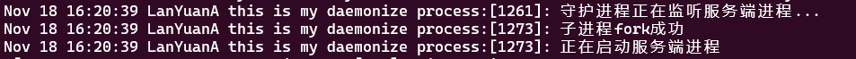
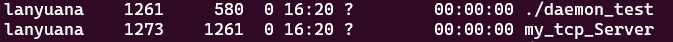
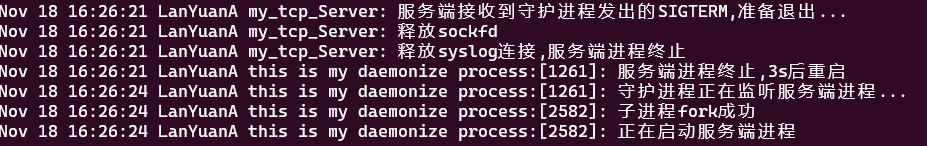
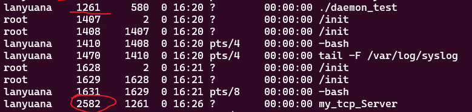
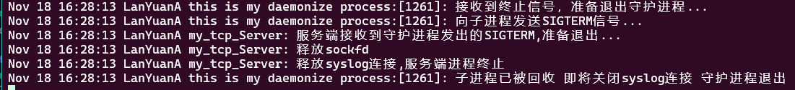
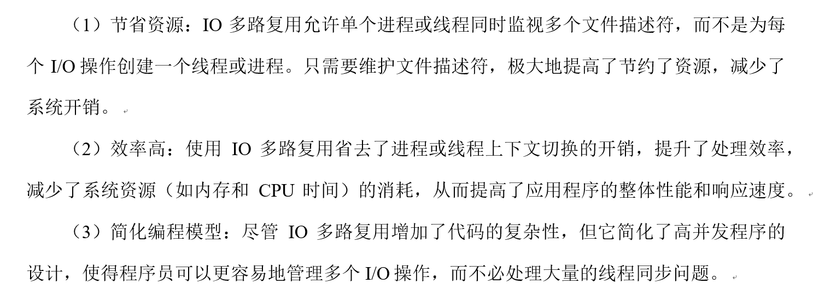
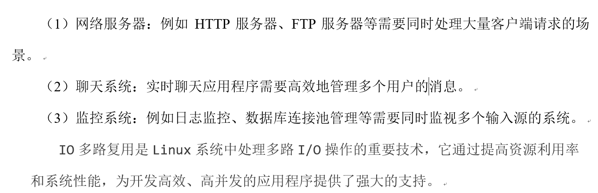
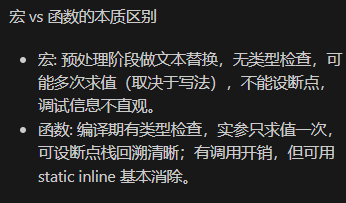

# 守护进程

守护进程是在操作系统后台运行的一种特殊类型的进程，它独立于前台用户界面，不与任何终端设备直接关联。这些进程通常在系统启动时启动，并持续运行直到系统关闭，或者它们完成其任务并自行终止。守护进程通常用于服务请求、管理系统或执行周期性任务。

```c
//setsid
#include <sys/types.h>
#include <unistd.h>

/**
 * @brief 如果调用进程不是进程组的领导者，则创建一个新的会话。创建者是新会话的领导者
 * 
 * @return pid_t 成功则返回调用进程的新会话ID，失败则返回(pid_t)-1，并设置errno以指明错误原因
 */
pid_t setsid(void);

//umask
#include <sys/types.h>
#include <sys/stat.h>

/**
 * @brief 设置调用进程的文件模式创建掩码。
 * 
 * @param mask 掩码。是一个八进制数，它指定哪些权限位在文件或目录创建时应被关闭。我们通过umask(0)确保守护进程创建的文件和目录具有最开放的权限设置。
 * @return mode_t 这个系统调用必然成功，返回之前的掩码值
 */
mode_t umask(mode_t mask);

//chdir
#include <unistd.h>

/**
 * @brief 更改调用进程的工作目录
 * 
 * @param path 更改后的工作路径
 * @return int 成功返回0，失败返回-1，并设置errno
 */
int chdir(const char *path);

//openlog
#include <syslog.h>

/**
 * @brief 为程序开启一个面向系统日志的连接
 * 
 * @param ident 每条消息的字符串前缀，按照惯例通常设置为程序名称
 * @param option option：指定控制 openlog 和后续 syslog 调用的标志。常见标志包括：
 *  LOG_PID：在每条日志消息中包含进程ID。
 *  LOG_CONS：如果无法将消息发送到日志守护进程，则直接将消息写入控制台。
 *  LOG_NDELAY：立即打开与系统日志守护进程的连接。
 *  LOG_ODELAY：延迟打开与系统日志守护进程的连接，直到实际写入日志时。
 *  LOG_PERROR：将日志消息同时输出到标准错误输出。
 * @param facility facility：指定日志消息的来源类别，用于区分系统不同部分的日志消息。包括：
 *  LOG_AUTH：认证系统
 *  LOG_CRON：cron 和 at 调度守护进程
 *  LOG_DAEMON：系统守护进程
 *  LOG_KERN：内核消息
 *  LOG_LOCAL0 至 LOG_LOCAL7：本地使用
 *  LOG_MAIL：邮件系统
 *  LOG_SYSLOG：syslog 自身的消息
 *  LOG_USER：用户进程
 *  LOG_UUCP：UUCP 子系统
 */
void openlog(const char *ident, int option, int facility);

//syslog
#include <syslog.h>

/**
 * @brief 生成一条日志消息
 * 
 * @param priority 由一个facility和一个level值或操作得到，如果未指定facility，则使用openlog指定的默认值，如果上文没有调用openlog()，则将使用默认值LOG_USER。level取值如下
 *  LOG_EMERG（系统无法使用）表示系统已经不可用，通常用于严重的紧急情况。例如：系统崩溃或关键硬件故障。
 *  LOG_ALERT（必须立即采取行动）表示必须立即采取措施解决的问题。例如：磁盘空间用尽或数据库崩溃。
 *  LOG_CRIT（严重条件）表示严重的错误或问题，但不需要立即采取行动。例如：应用程序的某个重要功能失败。
 *  LOG_ERR（错误条件）表示一般错误情况，需要注意和修复。例如：无法打开文件或网络连接失败。
 *  LOG_WARNING（警告条件）表示潜在问题或警告，建议检查，但不会立即影响系统功能。例如：磁盘空间接近用尽或配置文件缺失。
 *  LOG_NOTICE（正常但重要的情况）表示正常运行过程中需要特别注意的事件。例如：系统启动或关闭成功。
 *  LOG_INFO（信息性消息）表示一般信息，用于记录正常操作的事件。例如：用户登录或定时任务完成。
 *  LOG_DEBUG（调试级别消息）表示详细的调试信息，通常用于开发和调试阶段。例如：函数调用跟踪或变量值变化。
 * @param format 类似于printf()的格式化字符串
 * @param ... 可变参数，可以传递给格式化字符串
 */
void syslog(int priority, const char *format, ...);


//closelog
#include <syslog.h>

/**
 * @brief 关闭用于写入系统日志的文件描述符
 * 
 */
void closelog(void);

//sysconf
#include <unistd.h>

/**
 * @brief 获取运行时配置信息
 * 
 * @param name 配置名称，取值太多，可以通过 man 3 sysconf 自行查阅，我们只用到_SC_OPEN_MAX，记录了当前进程可以打开的文件描述符的最大数量
 * @return long 配置的值
 */
long sysconf(int name);
```

例程后补

守护进程和僵尸进程的区别：

他们都脱离了控制终端 但是僵尸进程是已经结束了的但是残留表项 等待父进程wait() 是已死未收尸 守护进程是脱离控制终端一直运行的进程 即活着的进程

守护进程通过fork setsid 第二次fork确保不获得控制TTY的机会 具体流程如下：

启动(shell/systemd)-->fork(1)-->父（退出）子（继续）-->setsid()-->新会话/无TTY 子进程成为新会话的组长 -->fork(2)-->父（退出）孙（daemon）-->umask 关闭fd openlog

注意当创建新会话的时候 第一次fork的子进程会成为会话组长 这个时候需要第二次fork并退出子进程创建孙进程 这个时候该会话会保留会话但无组长 孙进程无法重新获得控制终端

```c
#include <stdio.h>
#include <stdlib.h>
#include <unistd.h>
#include <sys/types.h>
#include <sys/stat.h>
#include <sys/wait.h>
#include <syslog.h>
#include <string.h>
#include <fcntl.h>
#include <signal.h>
#include <string.h>
#include <errno.h>

pid_t pid;
int is_shutdown =0;

void signal_handler(int sig)
{
    switch (sig)
    {
    case SIGHUP://SIGHUB = 1
        syslog(LOG_WARNING,"收到signal信号...");
        break;
    
    case SIGTERM://SIGTERM = 15 //kill信号
        syslog(LOG_NOTICE,"接收到终止信号，准备退出守护进程...");
        syslog(LOG_NOTICE,"向子进程发送SIGTERM信号...");
        is_shutdown =1;
        kill(pid,SIGTERM);
        break;
    default:
        syslog(LOG_INFO,"Received unhandled signal");
    }
}

void mydaemonize()
{
    pid_t pid;
    //fork off the parent process
    pid = fork();
    if(pid<0) exit(EXIT_FAILURE);
    else if(pid>0)  exit(EXIT_SUCCESS);
    if (setsid()<0) exit(EXIT_FAILURE);//子进程创建一个新会话 创建者是新会话的领导者
    //处理SIGHUB SIGTERM信号
    signal(SIGHUP,signal_handler);
    signal(SIGTERM,signal_handler);

    pid = fork();
    if(pid<0) exit(EXIT_FAILURE);
    else if(pid>0)  exit(EXIT_SUCCESS);
    //重置umasl
    umask(0);
    //将工作目录切换为根目录
    chdir("/");
    //关闭所有打开的文件描述符
    for(int x=0 ;x<= sysconf(_SC_OPEN_MAX);x++)
    {
        close(x);
    }
    openlog("this is my daemonize process:",LOG_PID,LOG_DAEMON);
}

int main()
{
    mydaemonize();

    while(1)
    {
        pid = fork();
        if(pid >0)
        {
            syslog(LOG_INFO,"守护进程正在监听服务端进程...");
            waitpid(-1,NULL,0);//等待任意进程返回 服务端已经终止
            if(is_shutdown)
            {
                syslog(LOG_NOTICE,"子进程已被回收 即将关闭syslog连接 守护进程退出");
                closelog();
                exit(EXIT_SUCCESS);
            }
            syslog(LOG_ERR,"服务端进程终止,3s后重启");
            sleep(3);
        }
        else if(pid ==0)
        {
            syslog(LOG_INFO,"子进程fork成功");
            syslog(LOG_INFO,"正在启动服务端进程");
            char *path = "/home/lanyuana/code/daemon_and_multiplex/tcp_server";
            char *argv[] = {"my_tcp_Server",NULL};
            errno =0;
            execve(path,argv,NULL);
            //不应该进行到这里 进行到这里说明跳转失败了
            char buf[1024];
            sprintf(buf,"errno: %d",errno);
            syslog(LOG_ERR,"%s",buf);

            syslog(LOG_ERR,"服务端启动失败");
            exit(EXIT_FAILURE);
        }
        else
        {
            syslog(LOG_ERR,"子进程fork失败");
        }

    }
    return EXIT_SUCCESS;
}
```

```c
#include <sys/socket.h>
#include <sys/types.h>
#include <sys/wait.h>
#include <netinet/in.h>
#include <stdio.h>
#include <stdlib.h>
#include <string.h>
#include <arpa/inet.h>
#include <pthread.h>
#include <unistd.h>
#include <signal.h>
#include <syslog.h>

int sockfd;

void zombie_dealer(int sig)
{
    pid_t pid;
    int status;
    char buf[1024];
    memset(buf,0,1024);
    //一个SIGCHLD可能会对应多个子进程的退出
    //使用while循环回收所有退出的子进程 防止出现僵尸进程
    while((pid = waitpid(-1,&status,WNOHANG) >0))
    {
        if(WIFEXITED(status))
        {
            sprintf(buf,"子进程：%d以%d状态正常退出,已被回收\n",pid,WEXITSTATUS(status));
            syslog(LOG_INFO,"%s",buf);
        }
        else if(WIFSIGNALED(status))
        {
            sprintf(buf,"子进程：%d被%d信号杀死,已被回收\n",pid,WTERMSIG(status));
            syslog(LOG_INFO,"%s",buf);

        }
        else
        {
            sprintf(buf,"子进程：%d因其他原因退出,已被回收\n",pid);
            syslog(LOG_INFO,"%s",buf); 
        }
    }
}

void sigterm_handle(int sig)
{
    syslog(LOG_NOTICE,"服务端接收到守护进程发出的SIGTERM,准备退出...");
    syslog(LOG_NOTICE,"释放sockfd");
    close(sockfd);
    syslog(LOG_NOTICE,"释放syslog连接,服务端进程终止");
    closelog();
    //退出
    exit(EXIT_SUCCESS);
}

void read_from_client_then_write(void *argv)
{
    int client_fd = *(int *)argv;

    ssize_t count = 0, send_count = 0;
    char *read_buf = NULL;
    char *write_buf = NULL;

    char log_buf[1024];
    memset(log_buf, 0, 1024);

    read_buf = malloc(sizeof(char) * 1024);
    // 判断内存是否分配成功
    if (!read_buf)
    {
        sprintf(log_buf, "服务端pid: %d: 读缓存创建异常，断开连接\n", getpid());
        syslog(LOG_ERR, "%s", log_buf);
        shutdown(client_fd, SHUT_WR);
        close(client_fd);
        return;
    }

    // 判断内存是否分配成功
    write_buf = malloc(sizeof(char) * 1024);
    if (!write_buf)
    {
        sprintf(log_buf, "服务端pid: %d: 写缓存创建异常，断开连接\n", getpid());
        syslog(LOG_ERR, "%s", log_buf);
        free(read_buf);
        shutdown(client_fd, SHUT_WR);
        close(client_fd);
        return;
    }

    while ((count = recv(client_fd, read_buf, 1024, 0)))
    {
        if (count < 0)
        {
            syslog(LOG_ERR, "server recv error");
        }
        sprintf(log_buf, "服务端pid: %d: reveive message from client_fd: %d: %s", getpid(), client_fd, read_buf);
        syslog(LOG_INFO, "%s", log_buf);
        memset(log_buf, 0, 1024);

        sprintf(write_buf, "服务端pid: %d: reveived~\n", getpid());
        send_count = send(client_fd, write_buf, 1024, 0);
    }

    sprintf(log_buf, "服务端pid: %d: 客户端client_fd: %d请求关闭连接......\n", getpid(), client_fd);
    syslog(LOG_NOTICE, "%s", log_buf);
    sprintf(write_buf, "服务端pid: %d: receive your shutdown signal\n", getpid());

    send_count = send(client_fd, write_buf, 1024, 0);

    sprintf(log_buf, "服务端pid: %d: 释放client_fd: %d资源\n", getpid(), client_fd);
    syslog(LOG_NOTICE, "%s", log_buf);
    shutdown(client_fd, SHUT_WR);
    close(client_fd);
    free(read_buf);
    free(write_buf);

    return;
}

int main(int argc, char const *argv[])
{
    int temp_result;

    struct sockaddr_in server_addr, client_addr;

    memset(&server_addr, 0, sizeof(server_addr));
    memset(&client_addr, 0, sizeof(client_addr));

    // 声明IPV4通信协议
    server_addr.sin_family = AF_INET;
    // 我们需要绑定0.0.0.0地址，转换成网络字节序后完成设置
    server_addr.sin_addr.s_addr = htonl(INADDR_ANY);
    // 端口随便用一个，但是不要用特权端口
    server_addr.sin_port = htons(6666);

    // 创建server socket
    sockfd = socket(AF_INET, SOCK_STREAM, 0);

    // 绑定地址
    temp_result = bind(sockfd, (struct sockaddr *)&server_addr, sizeof(server_addr));

    // 进入监听模式
    temp_result = listen(sockfd, 128);

    socklen_t cliaddr_len = sizeof(client_addr);

    //注册信号处理函数 处理SIGCHID信号 避免僵尸进程出现
    signal(SIGCHLD,zombie_dealer);
    //处理SIGTERM函数 优雅退出
    signal(SIGTERM,sigterm_handle);

    char log_buf[1024];
    memset(log_buf,0,1024);

    //接受client连接
    while(1)
    {
        int client_fd = accept(sockfd,(struct sockaddr *)&client_addr,&cliaddr_len);
        pid_t pid = fork();
        if(pid >0)
        {
            //父进程不需要处理client_fd 释放掉
            sprintf(log_buf, "this is father, pid is %d, continue accepting...\n", getpid());
            syslog(LOG_INFO, "%s", log_buf);
            memset(log_buf, 0, 1024);
            close(client_fd);
        }
        else if(pid ==0)
        {
            //子进程不需要sockfd
            close(sockfd);
            sprintf(log_buf, "与客户端 from %s at PORT %d 文件描述符 %d 建立连接\n", inet_ntoa(client_addr.sin_addr), ntohs(client_addr.sin_port), client_fd);
            syslog(LOG_INFO, "%s", log_buf);
            memset(log_buf, 0, 1024);

            sprintf(log_buf, "新的服务端pid为: %d\n", getpid());
            syslog(LOG_INFO, "%s", log_buf);
            memset(log_buf, 0, 1024);

            //读取客户端数据 打印到stdout
            read_from_client_then_write((void *)&client_fd);
            close(client_fd);
            exit(EXIT_SUCCESS);
        }
    }
    return 0;
}
```

以上程序的正常流程为：

daemon_test:

- 先创建守护进程（双fork + setsid）,关闭fd openlog
- 循环fork：父进程等待子进程返回 里面有is_shutdown 这个参数用于判断守护进程是否退出 若不退出 则再次创建子进程来重启服务端 子进程运行execve来跳转程序启动服务端

tcp_server:

- socket -->bind--listen 注册信号处理函数 SIGCHILD/SIGTERM
- 循环fork:父进程只使用sockfd来一直accept 放弃client_fd 子进程放弃sockfd 从client_fd来调取运行函数

当控制端kill tcp_server会发生什么：

- 触发信号处理函数 sigterm_handle 接着退出
- daemon_test循环中的子进程返回了 父进程waitpid得到结果 判断自己有没有被退出 没有则sleep(3)后继续循环创建一个子进程 父进程继续监听

当控制端kill daemon_test会发生什么：

- 触发daemon_test的信号处理函数signal_handle 将is_shutdown置1 同时kill(pid,SIGTERM)向自己的子进程发送SIGTERM信号 即tcp_server 服务端很快退出 daemon_test检测到子进程退出 判断自己是否退出 is_shutdown=1 这个时候退出程序

> ./daemon_test



> ps -ef查看进程



> ./tcp_client


> ctrl + d 


> kill 1273





> kill 1261



# I/O多路复用

IO多路复用（I/O Multiplexing）是Linux中用于处理多个I/O操作的机制，使得单个线程或进程可以同时监视多个文件描述符，以处理多路I/O请求。它主要通过以下系统调用实现：select、poll 和 epoll

epoll：epoll 是 Linux 特有的、性能优化的 I/O 多路复用机制。它比 select 和 poll 更高效，特别适用于大规模并发连接。epoll 提供了两种工作模式：水平触发（Level-Triggered, LT）和边沿触发（Edge-Triggered, ET）。ET 模式下，epoll 只在状态变化时通知，因此更高效，但也更复杂。





系统调用

```c
//epoll_data
/**
 * @brief 记录内核需要存储的epoll实例相关数据的联合体。fd可用来存储文件描述符。
 * 
 */
typedef union epoll_data {
void        *ptr;
int          fd;
uint32_t     u32;
uint64_t     u64;
} epoll_data_t;
```

```c
//epoll_event
/**
 * @brief epoll实例维护了一个文件描述符的集合，称为感兴趣列表，这个列表中的文件描述符会被监听，并在就绪时被加入就绪链表。感兴趣列表存储的是文件描述符和struct epoll_event结构体实例组成的entry。
 * events: 需要监听的就绪事件，是由以下0或更多事件类型或操作得到的：EPOLLIN、EPOLLOUT、EPOLLRDHUP、EPOLLPRI、EPOLLERR、EPOLLHUP、EPOLLET、EPOLLONESHOT、EPOLLWAKEUP、EPOLLEXCLUSIVE。下面的案例中我们只会用到EPOLLIN、EPOLLET
 *  EPOLLIN: epoll_event实例相关联的文件描述符可用于读操作
 *  EPOLLET: 将关联的文件描述符设置为边缘触发模式
 * data: 指明内核应该存储并在文件描述符就绪时返回的数据
 */
struct epoll_event {
uint32_t     events;      /* Epoll events */
epoll_data_t data;        /* User data variable */
};
```

```c
//epoll_create
#include <sys/epoll.h>

/**
 * @brief epoll创建一个新的epoll实例。
 * 
 * @param size 从Linux内核2.6.8版本开始（当前Ubuntu系统版本为6.5.0）该参数被忽略，但是必须大于0
 * @return int 成功返回指向新的epoll实例的文件描述符，失败返回-1并设置errno指明错误原因
 */
int epoll_create(int size);
```

```c
//epoll_create1
#include <sys/epoll.h>

/**
 * @brief 如果传入的flags参数为0，则与epoll_create完成的工作相同。
 * 
 * @param flags 标记以获得不同的行为，可以是EPOLL_CLOEXEC，该标记将创建的epoll实例的文件描述符标记为close-on-exec。
 * @return int 成功返回指向新的epoll实例的文件描述符，失败返回-1并设置errno指明错误原因
 */
int epoll_create1(int flags);
```

```c
//epoll_ctl
#include <sys/epoll.h>

/**
 * @brief epoll_ctl提供了对fd和event组成的entry执行增、删、改操作的方式。
 * 
 * @param epfd epoll实例的文件描述符
 * @param op 对文件描述符执行的操作
 *  EPOLL_CTL_ADD: 将fd和event组成的entry添加到感兴趣列表
 *  EPOLL_CTL_MOD: 将感兴趣列表中与fd关联的event替换为此处传入的event
 *  EPOLL_CTL_DEL: 从感兴趣列表删除与fd关联的entry，此时event被忽略
 * @param fd 待处理的文件描述符
 * @param event fd关联的描述信息。
 * @return int 成功返回0，失败返回-1，并设置errno以指明错误原因
 */
int epoll_ctl(int epfd, int op, int fd, struct epoll_event *event);
```

```c
//epoll_wait
#include <sys/epoll.h>

/**
 * @brief 等待epfd指向的epoll实例感兴趣列表中的事件发生。
 * 
 * @param epfd epoll实例文件描述符
 * @param events 提供给内核，用于返回已就绪的文件描述符信息
 * @param maxevents 可以返回的最大文件描述符数量
 * @param timeout 超时时间，指明epoll_wait()在事件触发前阻塞等待的最大毫秒数。
 *                -1表示一直等待至有事件发生，0表示无论是否有事件发生立即返回。
 * @return int 成功返回就绪的文件描述符数量，超时时间耗尽仍没有就绪事件返回0。失败则返回-1，并设置errno指明错误原因
 */
int epoll_wait(int epfd, struct epoll_event *events, int maxevents, int timeout);
```

```c
//fcntl
#include <unistd.h>
#include <fcntl.h>

/**
 * @brief 对fd指向的文件描述符执行cmd指明的操作。
 * 
 * @param fd 文件描述符
 * @param cmd 执行的操作，很多，此处不一一列出，常用的有F_GETFL和F_SETFL
 *  F_GETFL: 返回文件的权限模式和状态标记，不需要额外的参数
 *  F_SETFL: 将文件的状态标记设置为第三个参数指定的值
 * @param ... cmd需要的参数，可以没有
 * @return int 如果是F_GETFL，成功则返回文件状态标记值，如果是F_SETFL成功返回0。失败均返回-1，同时设置errno指明错误原因
 */
int fcntl(int fd, int cmd, ...);
```



```c
#include <sys/socket.h>
#include <sys/types.h>
#include <netinet/in.h>
#include <stdio.h>
#include <stdlib.h>
#include <string.h>
#include <arpa/inet.h>
#include <pthread.h>
#include <unistd.h>
#include <sys/epoll.h>
#include <fcntl.h>
#include <errno.h>

#define SEVER_PORT 6666
#define BUFFER_SIZE 1024
#define MAX_EVENTS 10

#define handle_error(cmd, result) \
    if (result < 0)               \
    {                             \
        perror(cmd);              \
        exit(EXIT_FAILURE);       \
    }
char *read_buf = NULL;
char *write_buf = NULL;

void init_buf()
{
    read_buf = malloc(sizeof(char)*BUFFER_SIZE);
    // 判断内存是否分配成功
    if (!read_buf)
    {
        printf("服务端读缓存创建异常，断开连接\n");
        perror("malloc sever read_buf");
        exit(EXIT_FAILURE);
    }
    write_buf = malloc(sizeof(char)*BUFFER_SIZE);
    if (!write_buf)
    {
        printf("服务端写缓存创建异常，断开连接\n");
        free(read_buf);
        perror("malloc server write_buf");
        exit(EXIT_FAILURE);
    }
    memset(read_buf, 0, BUFFER_SIZE);
    memset(write_buf, 0, BUFFER_SIZE);
}

void clear_buf(char *buf)
{
    memset(buf,0,BUFFER_SIZE);
}

//把传入的文件描述符设置为非阻塞模式
//避免单次读/写/accept阻塞事件循环
void set_nonblocking(int sockfd)
{
    int opts=fcntl(sockfd,F_GETFL);//读取当前标志位
    if(opts<0)
    {
        perror("fcntl(F_GETFL)");
        exit(EXIT_FAILURE);
    }
    opts |= O_NONBLOCK;
    int res = fcntl(sockfd,F_SETFL,opts);//写回标志位
    if(res<0)
    {
        perror("fcntl(F_SETFL)");
        exit(EXIT_FAILURE);
    }
}

int main(int argc, char const *argv[])
{
    init_buf();

    // 声明sockfd、clientfd和函数返回状态变量
    int sockfd, client_fd, temp_result;

    // 声明服务端和客户端地址
    struct sockaddr_in server_addr, client_addr;

    memset(&server_addr, 0, sizeof(server_addr));
    memset(&client_addr, 0, sizeof(client_addr));

    // 声明IPV4通信协议
    server_addr.sin_family = AF_INET;
    // 我们需要绑定0.0.0.0地址，转换成网络字节序后完成设置
    server_addr.sin_addr.s_addr = htonl(INADDR_ANY);
    // 端口随便用一个，但是不要用特权端口
    server_addr.sin_port = htons(SEVER_PORT);

    // 创建server socket
    sockfd = socket(AF_INET, SOCK_STREAM, 0);
    handle_error("socket", sockfd);

    // 绑定地址
    temp_result = bind(sockfd, (struct sockaddr *)&server_addr, sizeof(server_addr));
    handle_error("bind", temp_result);

    // 进入监听模式
    temp_result = listen(sockfd, 128);
    handle_error("listen", temp_result);

    //将sockfd设为非阻塞模式
    set_nonblocking(sockfd);

    int epollfd,nfds;
    struct epoll_event ev,events[MAX_EVENTS];//10

    epollfd = epoll_create1(0);
    handle_error("epoll_createl",epollfd);
    ev.data.fd=sockfd;
    ev.events=EPOLLIN;

    temp_result = epoll_ctl(epollfd,EPOLL_CTL_ADD,sockfd,&ev);
    handle_error("epoll_ctl",temp_result);

    socklen_t cliaddr_len = sizeof(client_addr);

    while (1)
    {
        /* code */
        nfds = epoll_wait(epollfd,events,MAX_EVENTS,-1);//返回就绪的文件描述符
        handle_error("epoll_wait",nfds);

        for(int i=0;i<nfds;i++)
        {
            if(events[i].data.fd==sockfd)
            {
                client_fd = accept(sockfd,(struct sockaddr *)&client_addr,&cliaddr_len);
                handle_error("accept",client_fd);
                set_nonblocking(client_fd);
                printf("与客户端 from %s at PORT %d 文件描述符 %d 建立连接\n",inet_ntoa(client_addr.sin_addr), ntohs(client_addr.sin_port), client_fd);
                ev.data.fd = client_fd;
                ev.events = EPOLLIN | EPOLLET;
                epoll_ctl(epollfd,EPOLL_CTL_ADD,client_fd,&ev);
            }
            else if(events[i].events&EPOLLIN)
            {
                int cnt =0,send_cnt = 0;
                client_fd = events[i].data.fd;
                while((cnt = recv(client_fd,read_buf,BUFFER_SIZE,0))>0)
                {
                    printf("reveive message from client_fd: %d: %s\n",client_fd, read_buf);
                    clear_buf(read_buf);
                    strcpy(write_buf,"received~");
                    send_cnt = send(client_fd,write_buf,strlen(write_buf),0);
                    handle_error("send",send_cnt);
                    clear_buf(write_buf);
                }
                if(cnt == -1&&errno == EAGAIN)
                {
                     printf("来自客户端client_fd: %d当前批次的数据已读取完毕,继续监听文件描述符集\n", client_fd);
                }
                else if(cnt ==0)
                {
                    printf("客户端client_fd:%d请求关闭连接...\n",client_fd);
                    strcpy(write_buf, "receive your shutdown signal\n");
                    send_cnt = send(client_fd, write_buf, strlen(write_buf), 0);
                    handle_error("send", send_cnt);
                    clear_buf(write_buf);
                    //从epoll文件描述符集中移除client_fd
                    printf("从epoll文件描述符集中移除client_fd:%d\n",client_fd);
                    epoll_ctl(epollfd,EPOLL_CTL_DEL,client_fd,NULL);
                    printf("释放client_fd:%d资源\n",client_fd);
                    shutdown(client_fd,SHUT_WR);
                    close(client_fd);
                }
            }
        }
    }
    
    printf("释放资源\n");
    close(epollfd);
    close(sockfd);
    free(read_buf);
    free(write_buf);
    return 0;
}
```

主要实现流程：

- 全局缓冲区 所有连接共用同一块缓冲区 单线程循环下临时可行 但并发拓展会冲突

- set_nonblocking 通过fcntl获取标志位 并将O_NONBLOCK写回 非阻塞方式是epoll边缘触发EPOLLET的工作前提 避免单次阻塞

- epoll_create1(0)创建实例 将sockfd以EPOLLIN水平触发加入 后续对client_fd以EPOLLET边缘触发加入 加入方式为：

    - struct epoll_event ev
    - ev.data.fd = sockfd ;ev.events =EPOLLIN
    - epoll_ctl(epollfd,EPOLL_CTL_ADD,sockfd,&ev)

- 主事件循环：

    - epoll_wait 等待就绪事件
    - 遍历nfds即所有就绪事件
        
        - 若是监听fd（sockfd），则accept一个连接 并设置非阻塞 将 EPOLLIN | EPOLLET加入到epoll

        - 若是客户端fd且EPOLLIN：则获取当前client_fd 并循环rece直到返回-1 且errno==EAGAIN (边缘触发下必须读空) 则当前批次读完 继续循环遍历nfds直到感兴趣的事件发生

边缘触发只在状态变化的时候通知

处理逻辑必须循环读取直到recv返回-1且errno=EAGAIN（在非阻塞模式下调用了阻塞操作）;循环acceot

