# Linux中断

每个中断都有一个中断号 类型是int

```c
/*
在 Linux 内核中要想使用某个中断是需要申请的，request_irq 函数用于申请中断，request_irq 函数可能会导致睡眠，因此不能在中断上下文或者其他禁止睡眠的代码段中使用 request_irq函数。
request_irq 函数会激活(使能)中断，所以不需要我们手动去使能中断，request_irq 函数原型如下：
*/
int request_irq(unsigned int irq,
                irq_handler_t handler,
                unsigned long flags,
                const char *name,
                void *dev)
/*
函数参数和返回值含义如下：
irq：要申请中断的中断号。
handler：中断处理函数，当中断发生以后就会执行此中断处理函数。
flags：中断标志，可以在文件 include/linux/interrupt.h 里面查看所有的中断标志
name：中断名字，设置以后可以在/proc/interrupts 文件中看到对应的中断名字。
dev ：如果将 flags 设置为 IRQF_SHARED 的话，dev 用来区分不同的中断，一般情况下将dev 设置为设备结构体，dev 会传递给中断处理函数 irq_handler_t 的第二个参数。
返回值：0 中断申请成功，其他负值 中断申请失败，如果返回-EBUSY 的话表示中断已经
被申请了
*/
```

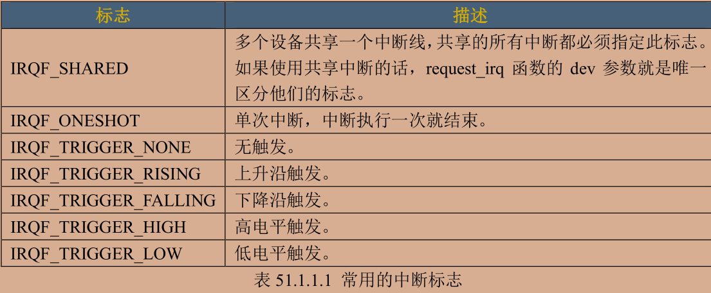

```c
/*
使用中断的时候需要通过 request_irq 函数申请，使用完成以后就要通过 free_irq 函数释放掉相应的中断。
如果中断不是共享的，那么 free_irq 会删除中断处理函数并且禁止中断。free_irq 函数原型如下所示：
*/
void free_irq(unsigned int irq,
              void *dev)
/*
函数参数和返回值含义如下：
irq ：要释放的中断。
dev：如果中断设置为共享(IRQF_SHARED)的话，此参数用来区分具体的中断。共享中断只有在释放最后中断处理函数的时候才会被禁止掉。
返回值：无。
*/

/*
使用 request_irq 函数申请中断的时候需要设置中断处理函数，中断处理函数格式如下所示：
*/
irqreturn_t (*irq_handler_t) (int, void *)
/*
第一个参数是要中断处理函数要相应的中断号。第二个参数是一个指向 void 的指针，也就是个通用指针，需要与 request_irq 函数的 dev 参数保持一致。用于区分共享中断的不同设备，
dev 也可以指向设备数据结构。
返回值为 irqreturn_t 类型
enum irqreturn {
                IRQ_NONE = (0 << 0),
                IRQ_HANDLED = (1 << 0),
                IRQ_WAKE_THREAD = (1 << 1),
                };

typedef enum irqreturn irqreturn_t;

一般都是return IRQ_RETVAL(IRQ_HANDLED)
*/

/*常用的中断使用和禁止函数如下所示：*/
void enable_irq(unsigned int irq)
void disable_irq(unsigned int irq)//该函数需要等待当前中断处理函数结束后返回
void disable_irq_nosync(unsigned int irq)//该函数会立刻返回

local_irq_enable()//这两个用于开启和关闭全局中断
local_irq_disable()//若用于多任务中 不可随意开启全局中断 可能导致系统崩溃

local_irq_save(flags)//该函数用于禁止中断 并把状态保存在flags中
local_irq_restore(flags)//用于恢复中断 到flags状态
```

---

## 上半部与下半部

有些中断处理函数就是会执行很久 为了缩短中断处理函数的时间 可以把中断操作分为上半部和下半部

上半部：就是中断处理函数 把处理时间比较快的操作放在上半部执行

下半部：把比较耗时的代码放到下半部执行 这样中断处理函数就可以快进快出

比如上半部将数据保存在内存中 下半部去做数据的具体处理 可以参考以下几点：

- 要处理的内容不想被其他中断打断 放到上半部
- 任务对时间敏感 上半部
- 与硬件有关 上半部
- 除了上面三点 下半部

以下为下半部的处理方法

### 软中断

Linux 内核使用结构体 softirq_action 表示软中断

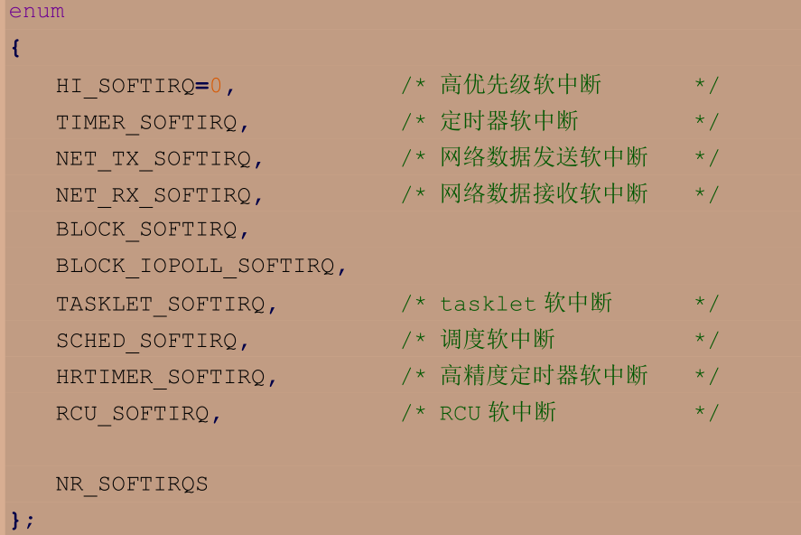

以上定义了十钟软中断

要想使用软中断 需要先注册对应的软中断处理函数

```c
void open_softirq(int nr, void (*action)(struct softirq_action *))
/*
函数参数和返回值含义如下：
nr：要开启的软中断，在示例代码 51.1.2.3 中选择一个。
action：软中断对应的处理函数。
返回值：没有返回值。
*/

/*
注册好软中断以后需要通过 raise_softirq 函数触发，raise_softirq 函数原型如下：
*/
void raise_softirq(unsigned int nr)
/*
函数参数和返回值含义如下：
nr：要触发的软中断，在示例代码 51.1.2.3 中选择一个。
返回值：没有返回值。
*/
```

软中断必须在编译的时候静态注册！Linux 内核使用 softirq_init 函数初始化软中断

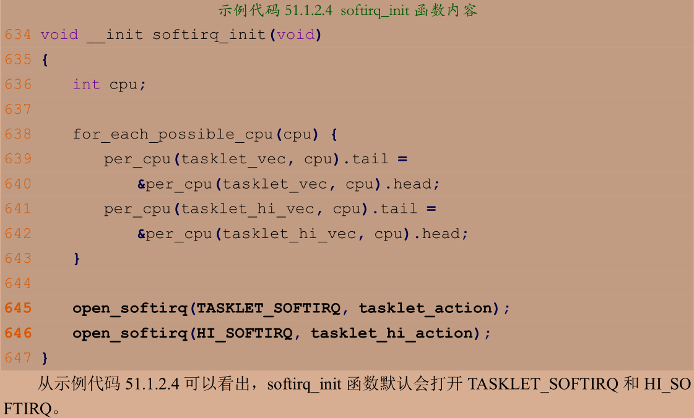

---

tasklet 是利用软中断来实现的另外一种下半部机制，在软中断和 tasklet 之间 更推荐使用tasklet

Linux 内核使用 tasklet_struct 结构体来表示 tasklet：

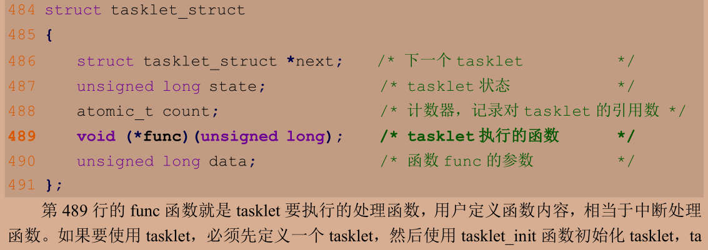

```c
void tasklet_init(struct tasklet_struct *t,
                void (*func)(unsigned long),
                unsigned long data);
/*
函数参数和返回值含义如下：
t：要初始化的 tasklet
func：tasklet 的处理函数。
data ：要传递给 func 函数的参数
返回值：没有返回值。
*/

/* 也可以用宏来一次性完成对tasklet的定义和初始化 */
DECLARE_TASKLET(name, func, data)
/*
其中 name 为要定义的 tasklet 名字，这个名字就是一个 tasklet_struct 类型的时候变量，func 就是 tasklet 的处理函数，data 是传递给 func 函数的参数
*/
```

在上半部调用 tasklet_schedule 函数就能使 tasklet 在合适的时间运行

```c
void tasklet_schedule(struct tasklet_struct *t)
/*
函数参数和返回值含义如下：
t：要调度的 tasklet，也就是 DECLARE_TASKLET 宏里面的 name。
返回值：没有返回值。
*/
```

tasklet的使用示例如下

```c
/* 定义tasklet */
struct tasklet_struct testtasklet;
/* tasklet处理函数 */
void testtasklet_func(unsigned long data)
{
    /*具体内容*/
}
/* 中断处理函数 */
irqreturn_t test_handler(int irq,void *dev_id)
{
    /**************/
    /* 调度tasklet */
    tasklet_schedule(&testtasklet);
}
/* 驱动入口 */
static int __init ..._init(void)
{
    /***********/
    /* 初始化tasklet */
    tasklet_init(&testtasklet,testtasklet_func,data);
    /* 注册中断 */
    request_irq(xxx_irq,test_handler,0,"xxx",&xxx_dev);
}
```

---

工作队列是另外一种下半部执行方式，工作队列在进程上下文执行 因此工作队列允许睡眠或重新调度 若要推后的工作可以睡眠那么就可以选择工作队列 否则的话就只能选择软中断或 tasklet

Linux 内核使用 work_struct 结构体表示一个工作

这些工作组织成工作队列，工作队列使用 workqueue_struct 结构体表示

Linux 内核使用工作者线程(worker thread)来处理工作队列中的各个工作 worker 结构体表示工作者线程

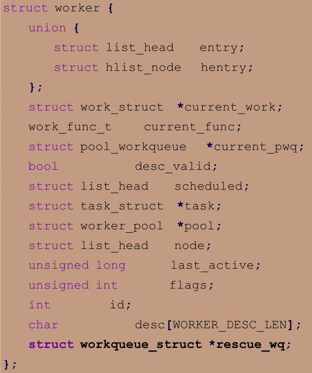

每个 worker 都有一个工作队列，工作者线程处理自己工作队列中的所有工作

实际的驱动开发中，我们只需要定义工作(work_struct)即可

```c
#define INIT_WORK(_work, _func)
/*
_work 表示要初始化的工作，_func 是工作对应的处理函数。
*/

#define DECLARE_WORK(n, f)
/*
n 表示定义的工作(work_struct)，f 表示工作对应的处理函数。
*/

bool schedule_work(struct work_struct *work)
/*
函数参数和返回值含义如下：
work ：要调度的工作。
返回值：0 成功，其他值 失败。
*/
```

工作队列的使用示例如下

```c
/* 定义work */
struct work_struct testwork;
/* tasklet处理函数 */
void testwork_func(unsigned long data)
{
    /*具体内容*/
}
/* 中断处理函数 */
irqreturn_t test_handler(int irq,void *dev_id)
{
    /**************/
    /* 调度tasklet */
    schedule_work(&testwork);
}
/* 驱动入口 */
static int __init ..._init(void)
{
    /***********/
    /* 初始化tasklet */
    INIT_WORK(&testwork,testwork_func);
    /* 注册中断 */
    request_irq(xxx_irq,test_handler,0,"xxx",&xxx_dev);
}
```

---

在设备树设置中断信息节点

在dtsi文件有intc节点 即中断控制器节点

> #interrupt-cells = <3>;

对于ARM处理器的GIC来说 一共有3个cells

- 中断类型 0为SPI中断 1为PPI中断
- 中断号 SPI范围是0~987 PPI中断范围0~15
- 标志 bit[3:0]是中断触发类型 1表示上升沿触发 2表示下降沿触发 4表示高电平触发 8表示低电平触发 bit[15:8]为PPI中断的CPU掩码

interrupt-controller 节点为空，表示当前节点是中断控制器

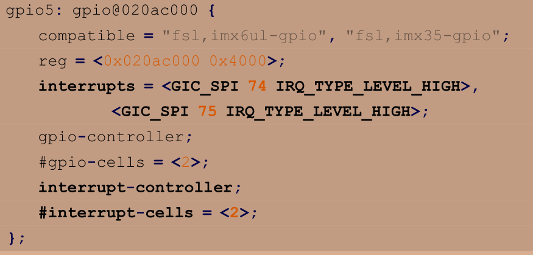


interrupt-parent 属性设置中断控制器，这里使用 gpio5 作为中断控制器

interrupts 设置中断信息，0 表示 GPIO5_IO00，8 表示低电平触发

从设备树中获取中断号

```c
unsigned int irq_of_parse_and_map(struct device_node *dev,
int index)
/*
函数参数和返回值含义如下：
dev ：设备节点。
index：索引号，interrupts 属性可能包含多条中断信息，通过 index 指定要获取的信息。
返回值：中断号。
*/

int gpio_to_irq(unsigned int gpio)
/*
函数参数和返回值含义如下：
gpio ：要获取的 GPIO 编号。
返回值：GPIO 对应的中断号。
*/
```

```c
#define IMX6UIRQ_CNT   1               /*设备号个数*/
#define IMX6UIRQ_NAME  "imx6uirq"    /*设备名*/

/*定义按键值*/
#define KEY0VALUE 0x01/*按键值*/
#define INVAKEY 0x00/*无效按键值*/
#define KEY_NUM 1 /* 按键数量 */

/* 中断IO描述结构体 */
struct irq_keydesc
{
    int gpio;/* gpio编号 */
    int irqnum;/* 中断号 */
    unsigned char value;/* 按键对应的键值 */
    char name[10];/*名字*/
    irqreturn_t (*handler)(int ,void *);/*中断服务函数*/
};

/*key设备结构体*/
struct key_dev
{
    dev_t devid;    /*设备号*/
    struct cdev cdev;   /*cdev*/
    struct class *class;    /*类*/
    struct device *device;  /*设备*/
    int major;  /*主设备号*/    
    int minor;  /*次设备号*/
    struct device_node *nd; /*设备节点*/
    int key_gpio;/*key所使用的GPIO编号*/
    atomic_t keyvalue;/*有效的按键键值*/
    atomic_t releasekey;/*标记是否完成一次完成按键*/
    struct timer_list timer;/*定义一个定时器*/
    struct irq_keydesc irqkeydesc[KEY_NUM];/*按键描述数组*/
    unsigned char curkeynum;/*当前的按键号*/
};

/*
* @description : 中断服务函数 开启定时器 延时10ms 定时器用于按键消抖
* @param – irq : 中断号
* @param - dev_id : 设备结构
* @return : 中断执行结果
*/
static irqreturn_t key0_handler(int irq,void *dev_id)
{
    struct key_dev *dev = (struct key_dev *)dev_id;

    dev->curkeynum = 0;//设置当前的按键号
    dev->timer.data = (volatile long)dev_id;//把设备结构体作为参数传入timer
    mod_timer(&dev->timer,jiffies + msecs_to_jiffies(10));
    return IRQ_RETVAL(IRQ_HANDLED);
}

/*
* @description : 定时器服务程序 用于按键消抖 
*    定时器到了之后再次读取按键值 若按键还是处于按下状态就表示按键有效
* @param – arg : 设备结构变量
* @return : 中断执行结果
*/
void timer_function(unsigned long arg)
{
    struct irq_keydesc keydesc;
    unsigned char num;
    unsigned char value;
    struct key_dev *dev = (struct key_dev *)arg;

    num = dev->curkeynum;//获取当前按键号
    keydesc = dev->irqkeydesc[num];//启用当前按键号对应的结构体
    value = gpio_get_value(keydesc.gpio);/*读取IO值*/
    if(value == 0)
    {
        //如果按下
        atomic_set(&dev->keyvalue,keydesc.value);//把IO写入到dev的键值 但最高位不是1
    }
    else/*按键松开*/
    {
        atomic_set(&dev->keyvalue, 0x80 | keydesc.value);//keyvalue = 0x80 | keydesc->value = 0x81
        atomic_set(&dev->releasekey,1);/*标记松开按键*/
    }
}

/*按键io初始化*/
static int keyio_init(void)
    //申请中断
    key.irqkeydesc[0].handler = key0_handler;//中断到了就设置定时器
    key.irqkeydesc[0].value = KEY0VALUE;

    for(i=0;i<KEY_NUM;i++)
    {
        ret = request_irq(
            key.irqkeydesc[i].irqnum,
            key.irqkeydesc[i].handler,
            IRQF_TRIGGER_FALLING|IRQF_TRIGGER_RISING,//上升沿或下降沿都触发
            key.irqkeydesc[i].name,
            &key
        );
        if(ret < 0 )
        {
            printk("irq %d request failed!\r\n",key.irqkeydesc[i].irqnum);
            return -EFAULT;
        }
    }
    /*创建定时器*/
    init_timer(&key.timer);
    key.timer.function = timer_function;
    return 0;


static ssize_t key_read(struct file *filp,char __user *buf,size_t cnt,loff_t *offt)
{
    
    int retvalue=0;
    unsigned char keyvalue =0;
    unsigned char releasekey = 0;
    struct key_dev *dev = (struct key_dev *)filp->private_data;

    keyvalue = atomic_read(&dev->keyvalue);
    releasekey = atomic_read(&dev->releasekey);

    if(releasekey)//有按键按下
    {
        if(keyvalue & 0x80)//检查最高位是否为1
        {
            keyvalue &= ~0x80;//若按键松开 则清除最高位 得到0x01
            retvalue = copy_to_user(buf,&keyvalue,sizeof(keyvalue));
        }
        else
        {
            goto data_error;
        }

        atomic_set(&dev->releasekey,0);/*按下标志清0*/
    }
    else
    {
        goto data_error;
    }
    return 0;
    
    data_error:
        return -EINVAL;
}

static int __init mykey_init(void)
{
    /*注册字符设备驱动*/

    /*初始化按键*/
    atomic_set(&key.keyvalue,INVAKEY);
    atomic_set(&key.releasekey,0);    
    keyio_init();
    return 0;
}

static void __exit mykey_exit(void)
{
    unsigned int i=0;
    /*注销字符设备*/
    for(i=0;i<KEY_NUM;i++)
    {
        free_irq(key.irqkeydesc[i].irqnum,&key);
        gpio_free(key.irqkeydesc[i].gpio);
    }
    /*********************/
}
```

以上代码是思路为：

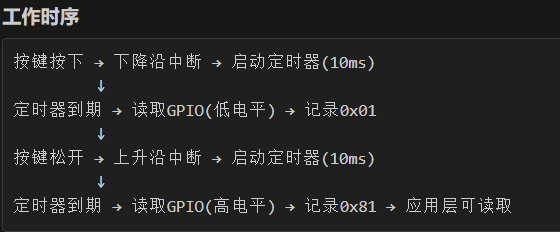

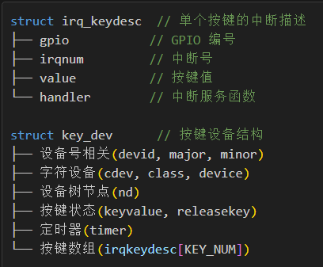

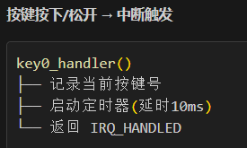

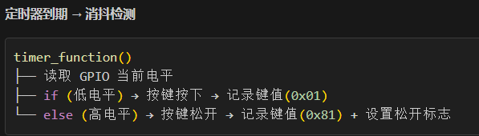

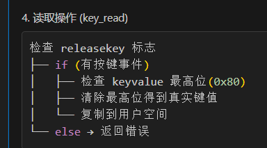

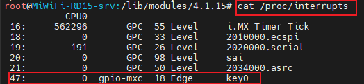

中断是上半部(快速响应)，定时器是下半部(延迟处理)

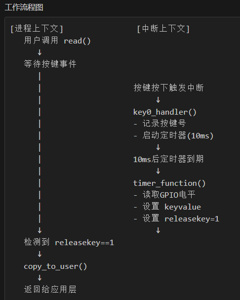