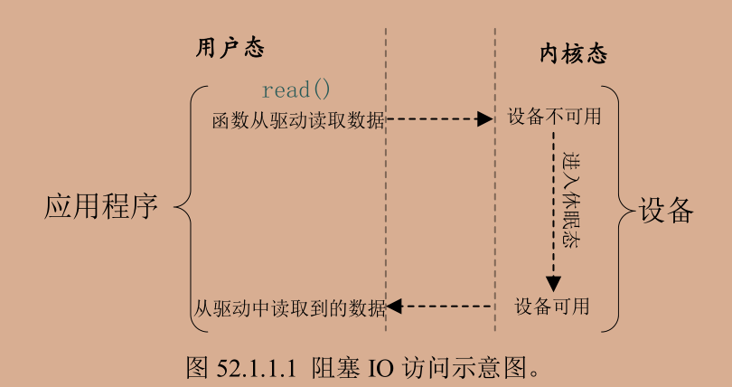
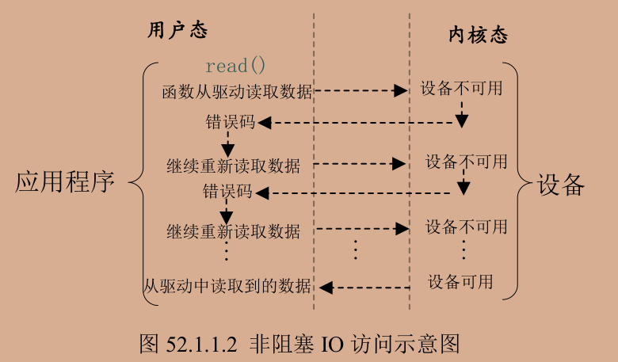
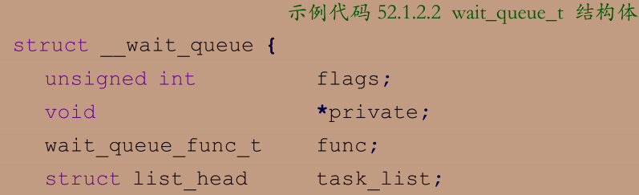
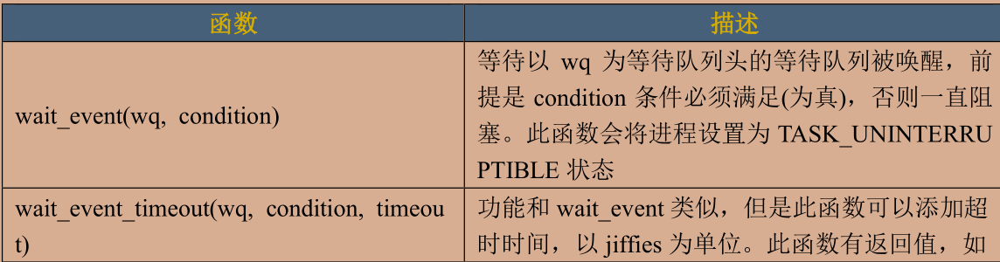
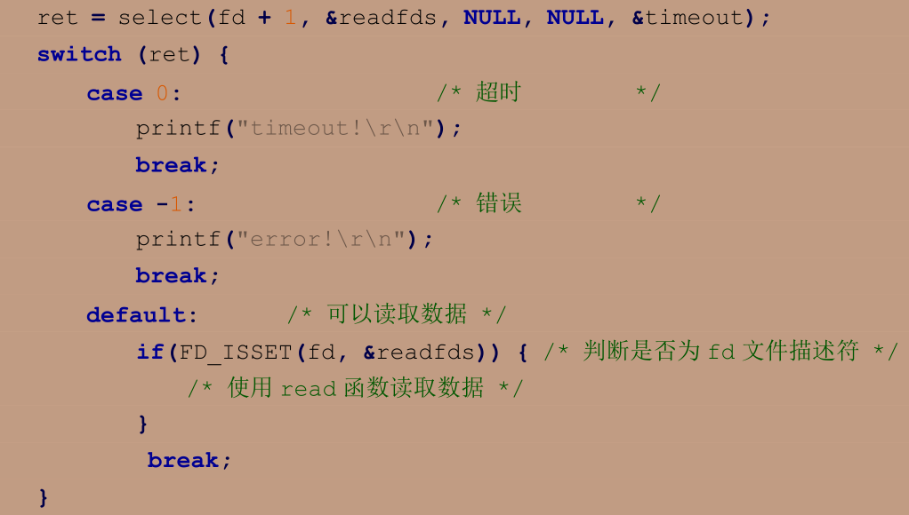
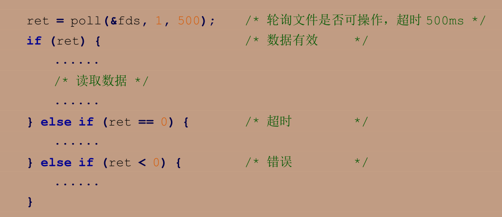

# 阻塞IO和非阻塞IO

IO指输入输出 若获取不到设备资源 阻塞性IO就会把应用程序对应的线程挂起 直到获得资源 非阻塞IO要么一直轮询 要么直接放弃





```c
fd = open("/dev/xxx_dev", O_RDWR); /* 阻塞方式打开 */
fd = open("/dev/xxx_dev", O_RDWR | O_NONBLOCK); /* 非阻塞方式打开 */
```

## 阻塞IO

进入休眠态后若设备可用要唤醒进程 一般在中断里完成唤醒 Linux内核提供了等待队列wait queue来实现阻塞进程的唤醒工作

先创建并初始化一个等待队列头 wait_queue_head_t

> void init_waitqueue_head(wait_queue_head_t *q)

结构体wait_queue_t表示等待队列项



使用宏 DECLARE_WAITQUEUE 定义并初始化一个等待队列项，宏的内容如下：

>DECLARE_WAITQUEUE(name, tsk)

name 就是等待队列项的名字，tsk 表示这个等待队列项属于哪个任务(进程)，一般设置为 current，在 Linux 内核中 current 相当于一个全局变量，表示当前进程。

当设备不可访问的时候就需要将进程对应的等待队列项添加到前面创建的等待队列头中，只有添加到等待队列头中以后进程才能进入休眠态。当设备可以访问以后再将进程对应的等待队列项从等待队列头中移除即可，等待队列项添加 API 函数如下：

```c
void add_wait_queue(wait_queue_head_t *q,
wait_queue_t *wait)
/*函数参数和返回值含义如下：
q ：等待队列项要加入的等待队列头。
wait：要加入的等待队列项。
返回值：无。*/

void remove_wait_queue(wait_queue_head_t *q,
wait_queue_t *wait)
/*函数参数和返回值含义如下：
q ：要删除的等待队列项所处的等待队列头。
wait：要删除的等待队列项。
返回值：无。*/

void wake_up(wait_queue_head_t *q)
void wake_up_interruptible(wait_queue_head_t *q)
/*参数 q 就是要唤醒的等待队列头，这两个函数会将这个等待队列头中的所有进程都唤醒。
wake_up 函数可以唤醒处于 TASK_INTERRUPTIBLE 和 TASK_UNINTERRUPTIBLE 状态的进程
而 wake_up_interruptible 函数只能唤醒处于 TASK_INTERRUPTIBLE 状态的进程。/*
```

除了主动唤醒 也可以等待事件




---

## 非阻塞IO

对于非阻塞IO 要提供非阻塞的处理方式 也就是轮询 poll epoll和select可以用于轮询

### select

```c
int select(int nfds,
            fd_set *readfds,
            fd_set *writefds,
            fd_set *exceptfds,
            struct timeval *timeout)

/*
*nfds ：所要监视的这三类文件描述集合中，最大文件描述符加 1。
readfds 用于监视指定描述符集的读变化，也就是监视这些文件是否
可以读取，只要这些集合里面有一个文件可以读取那么 seclect 就会返回一个大于 0 的值表示文件可以读取。
如果没有文件可以读取，那么就会根据 timeout 参数来判断是否超时。可以将 readfs 设置为 NULL，表示不关心任何文件的读变化。
writefds 和 readfs 类似，只是 writefs 用于监视这些文件是否可以进行写操作。exceptfds 用于监视这些文件的异常。
*/

/*timeout:超时时间，当我们调用 select 函数等待某些文件描述符可以设置超时时间，超时时间使用结构体 timeval 表示，结构体定义如下所示：*/
struct timeval {
long tv_sec; /* 秒 */
long tv_usec; /* 微妙 */
};
/*当 timeout 为 NULL 的时候就表示无限期的等待。
返回值：0，表示的话就表示超时发生，但是没有任何文件描述符可以进行操作；
-1，发生错误；其他值，可以进行操作的文件描述符个数。*/

void FD_ZERO(fd_set *set)//所有位清零
void FD_SET(int fd, fd_set *set)//添加一个文件描述符
void FD_CLR(int fd, fd_set *set)//删去一个文件描述符
int FD_ISSET(int fd, fd_set *set)//测试文件是否属于一个集合
```



---

### poll

单个线程中，select 函数能够监视的文件描述符数量有最大的限制，一般为 1024  poll 函数没有最大文件描述符限制

```c
int poll(struct pollfd *fds,
        nfds_t nfds,
        int timeout)
/*函数参数和返回值含义如下：
fds ：要监视的文件描述符集合以及要监视的事件,为一个数组，数组元素都是结构体 pollfd
nfds：poll 函数要监视的文件描述符数量。
timeout ：超时时间，单位为 ms
返回值：返回 revents 域中不为 0 的 pollfd 结构体个数，也就是发生事件或错误的文件描述符数量；0，超时；-1，发生错误，并且设置 errno 为错误类型。
类型的，pollfd 结构体如下所示：*/
struct pollfd {
            int fd; /* 文件描述符 */
            short events; /* 请求的事件 */
            short revents; /* 返回的事件 */
};
/*
fd 是要监视的文件描述符，如果 fd 无效的话那么 events 监视事件也就无效，并且 revents
返回 0。events 是要监视的事件，可监视的事件类型如下所示：
*/
/*
POLLIN 有数据可以读取。
POLLPRI 有紧急的数据需要读取。
POLLOUT 可以写数据。
POLLERR 指定的文件描述符发生错误。
POLLHUP 指定的文件描述符挂起。
POLLNVAL 无效的请求。
POLLRDNORM 等同于 POLLIN
*/
```



### epoll

传统的 selcet 和 poll 函数都会随着所监听的 fd 数量的增加，出现效率低下的问题 poll 函数每次必须遍历所有的描述符来检查就绪的描述符，这个过程很浪费时间 epoll 就是为处理大并发而准备的，一般常常在网络编程中使用 epoll 函数

先使用 epoll_create 函数创建一个 epoll 句柄，epoll_create 函数原型如下:

```c
int epoll_create(int size)
/*
函数参数和返回值含义如下：
size ：从 Linux2.6.8 开始此参数已经没有意义了，随便填写一个大于 0 的值就可以。
返回值：epoll 句柄，如果为-1 的话表示创建失败。
*/
//epoll 句柄创建成功以后使用 epoll_ctl 函数向其中添加要监视的文件描述符以及监视的事件，epoll_ctl 函数原型如下所示：
int epoll_ctl(int epfd,
        int op,
        int fd,
        struct epoll_event *event)
/*
函数参数和返回值含义如下：
epfd ：要操作的 epoll 句柄，也就是使用 epoll_create 函数创建的 epoll 句柄。
op ：表示要对 epfd(epoll 句柄)进行的操作，可以设置为：
    EPOLL_CTL_ADD 向 epfd 添加文件参数 fd 表示的描述符。
    EPOLL_CTL_MOD 修改参数 fd 的 event 事件。
    EPOLL_CTL_DEL 从 epfd 中删除 fd 描述符。
fd：要监视的文件描述符
event ：要监视的事件类型，为 epoll_event 结构体类型指针，epoll_event 结构体类型如下所示：
*/
struct epoll_event {
        uint32_t events; /* epoll 事件 */
        epoll_data_t data; /* 用户数据 */
};
/*
结构体 epoll_event 的 events 成员变量表示要监视的事件，可选的事件如下所示：
    EPOLLIN 有数据可以读取。
    EPOLLOUT 可以写数据。
    EPOLLPRI 有紧急的数据需要读取。
    EPOLLERR 指定的文件描述符发生错误。
    EPOLLHUP 指定的文件描述符挂起。
    EPOLLET 设置 epoll 为边沿触发，默认触发模式为水平触发。
    EPOLLONESHOT 一次性的监视，当监视完成以后还需要再次监视某个 fd，那么就需要将fd 重新添加到 epoll 里面。
    上面这些事件可以进行“或”操作，也就是说可以设置监视多个事件。
返回值：0，成功；-1，失败，并且设置 errno 的值为相应的错误码。
*/

/*
一切都设置好以后应用程序就可以通过 epoll_wait 函数来等待事件的发生，类似 select 函数。epoll_wait 函数原型如下所示
*/
int epoll_wait(int epfd,
            struct epoll_event *events,
            int maxevents,
            int timeout)
/*
epfd ：要等待的 epoll。
events ：指向 epoll_event 结构体的数组，当有事件发生的时候 Linux 内核会填写 events，调用者可以根据 events 判断发生了哪些事件。
maxevents：events 数组大小，必须大于 0。
timeout ：超时时间，单位为 ms。
返回值：0，超时；-1，错误；其他值，准备就绪的文件描述符数量。
*/
```

---

驱动下的poll操作函数

当应用程序调用select和poll函数的时候 驱动操作集中poll函数就会执行 所以需要提供对应的poll函数 

```c
unsigned int (*poll) (struct file *filp, struct poll_table_struct *wait)
/*函数参数和返回值含义如下：
filp ：要打开的设备文件(文件描述符)。
wait ：结构体 poll_table_struct 类型指针，由应用程序传递进来的。一般将此参数传递给 poll_wait 函数。
返回值:向应用程序返回设备或者资源状态，可以返回的资源状态如下：
    POLLIN 有数据可以读取。
    POLLPRI 有紧急的数据需要读取。
    POLLOUT 可以写数据。
    POLLERR 指定的文件描述符发生错误。
    POLLHUP 指定的文件描述符挂起。
    POLLNVAL 无效的请求。
    POLLRDNORM 等同于 POLLIN，普通数据可读
*/

/*
驱动程序的 poll 函数中调用 poll_wait 函数，poll_wait 函数不会引起阻塞，
将应用程序添加到 poll_table 中，poll_wait 函数原型如下：

参数 wait_address 是要添加到 poll_table 中的等待队列头，
参数 p 就是 poll_table，就是 file_operations 中 poll 函数的 wait 参数。
*/
void poll_wait(struct file * filp, wait_queue_head_t * wait_address, poll_table *p)
```

```c
//程序大意


/*
* @description : poll函数 应用程序调用poll会同时调用该函数
* @param - filp : 要打开的设备文件(文件描述符)
* @param - wait : 等待列表(poll_table)
* @return : 设备或者资源状态
*/
unsigned int key_poll(struct file *filp, struct poll_table_struct *wait)
{
    unsigned int mask =0;
    struct key_dev *dev = (struct key_dev *)filp->private_data;
    poll_wait(filp,&dev->r_wait,wait);// 把状态传入poll_table

    if(atomic_read(&dev->releasekey))//有按键按下
    {
        mask = POLLIN | POLLRDNORM;//返回pollin
    }
    return mask;
}

//非阻塞io应用程序
    fds.fd = fd;
    fds.events = POLLIN | POLLRDNORM;
#if 0//poll
    while(1)
    {
        ret = poll(&fds,1,500);
        if(ret)//数据有效
        {
            ret = read(fd,&data,sizeof(data));
            if(ret < 0 )
            {
             /*数据读取错误*/
            }
            else
            {
                /*成功读取到数据*/
                if(data)
                {
                    printf("data get!:%#X\r\n",data);
                }
            }
        }
        else if(ret == 0)//超时
        {
            printf("timeout!\r\n");
        }
        else if (ret < 0 )
        {
            printf("error!\r\n");
        }
    }
#endif

#if 1//select
    while(1)
    {
        FD_ZERO(&readfds);//将所有位清零
        FD_SET(fd,&readfds);//加入描述符集
        /*构造超时时间*/
        timeout.tv_sec = 0;
        timeout.tv_usec = 500000;/*500ms*/
        ret = select(fd+1,&readfds,NULL,NULL,&timeout);
        switch (ret)
        {
        case 0://超时
            /* code */
            printf("timeout!\r\n");
            break;
        case -1://错误
            printf("error!\r\n");
            break;
        default://可以读取数据
            if(FD_ISSET(fd,&readfds))//属于描述符集
            {
                ret = read(fd,&data,sizeof(data));
                if(ret < 0 )
                {
                /*数据读取错误*/
                }
                else
                {
                    /*成功读取到数据*/
                    if(data)
                    {
                        printf("data get!:%#X\r\n",data);
                    }
                }
            }
            break;
        }
    }
#endif

//阻塞io
wait_queue_head_t r_wait;/*读等待队列头*/

//在init函数中
init_waitqueue_head(&key.r_wait);

//在read函数中 若未检测到按键按下 则进入休眠 等待中断
    #if 0
    wait_event_interruptible(dev->r_wait,atomic_read(&dev->releasekey))
    #endif
    DECLARE_WAITQUEUE(wait, current);/*定义一个等待队列*/
    if(atomic_read(&dev->releasekey) == 0)//没有按键按下
    {
        add_wait_queue(&dev->r_wait,&wait);/*添加到等待队列头*/
        __set_current_state(TASK_INTERRUPTIBLE);/*设置任务状态*/
        schedule(); /*进行一个任务切换*/
        if(signal_pending(current))//判断是否为信号引起的唤醒
        {
            retvalue = -ERESTARTSYS;
            goto wait_error;
        }
    }
    __set_current_state(TASK_RUNNING);/*设置为运行态*/
    remove_wait_queue(&dev->r_wait,&wait);/*移除出等待队列*/

//在中断函数中 该历程在中断的下半段 即定时器中唤醒等待队列
    /*唤醒进程*/
    if(atomic_read(&dev->releasekey))
    {
        /*完成一次按键操作*/
        /*wake_up(&dev->r_wait)*/
        wake_up_interruptible(&dev->r_wait);
    }

```