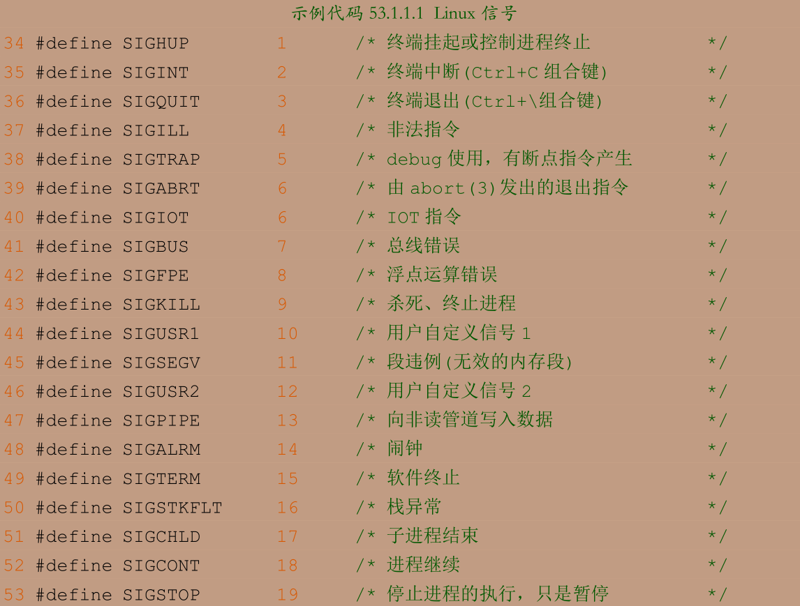
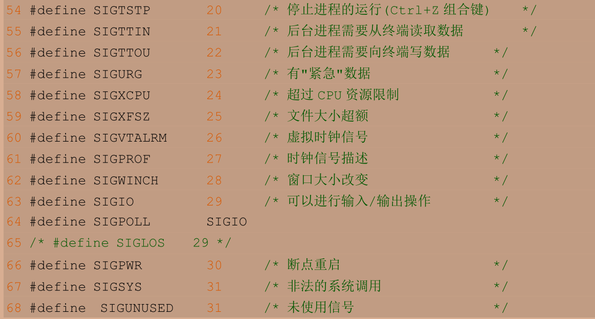
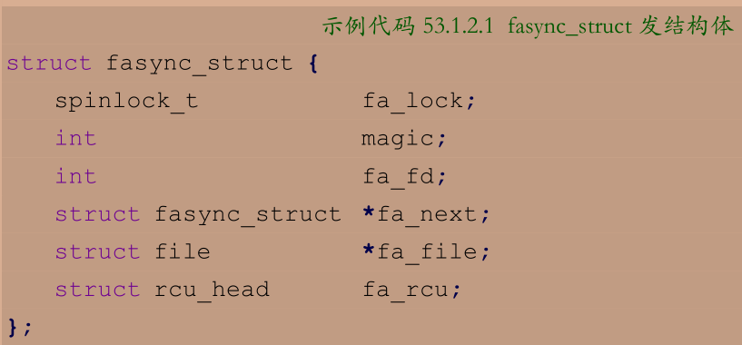
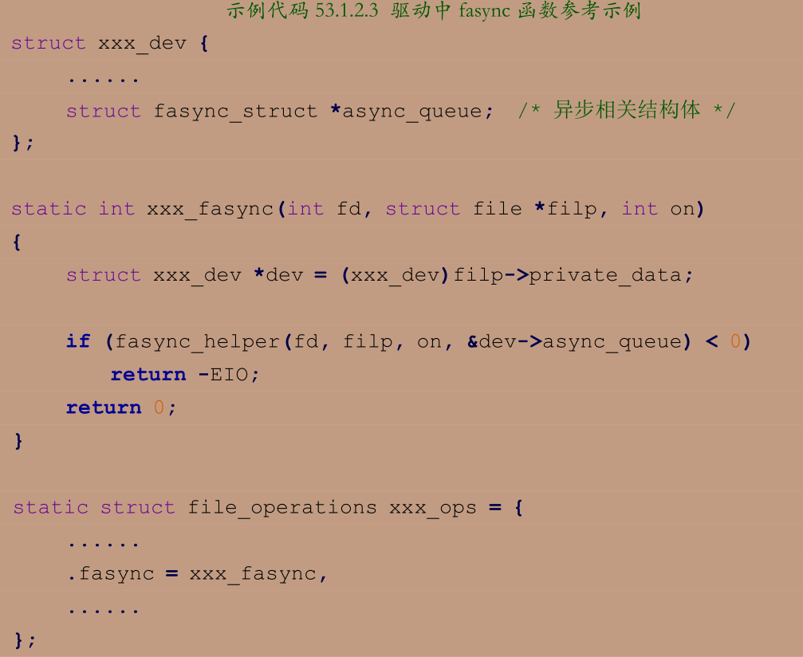
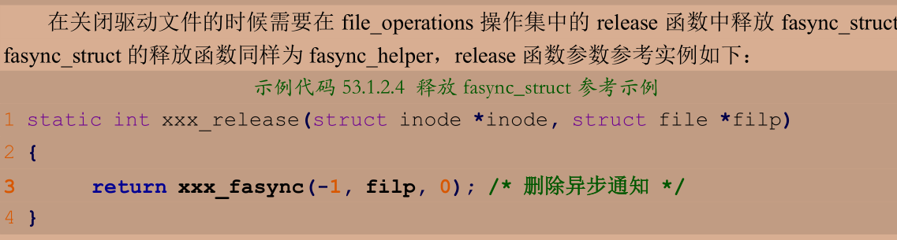

# 异步通知

在上一节中 按键值都是应用程序主动读取的 对于非阻塞模式还需要poll不断轮询 最好是驱动能主动向应用发出通知 报告自己可以读取 然后应用再读取或者写入 类似与中断

## 信号

信号类似于硬件上的中断 只不过是软件层面的 相当于应用收到了驱动发来的一个中断 然后应用去响应中断

arch/xtensa/include/uapi/asm/signal.h中定义了所有信号





信号处理函数

```c
sighandler_t signal(int signum, sighandler_t handler)
/*
函数参数和返回值含义如下：
signum：要设置处理函数的信号。
handler ：信号的处理函数。
返回值：设置成功的话返回信号的前一个处理函数，设置失败的话返回 SIG_ERR。
*/
//信号处理函数原型如下所示：
typedef void (*sighandler_t)(int)
```

---

## 驱动中的信号处理

首先我们需要在驱动程序中定义一个 fasync_struct 结构体指针变量



一般将这个变量放入到设备结构体当中

要使用异步通知 就要在驱动中实现fasync函数 格式如下：

> int (*fasync) (int fd, struct file *filp, int on)

fasync 函数里面一般通过调用 fasync_helper 函数来初始化前面定义的 fasync_struct 结构体指针，fasync_helper 函数原型如下：

> int fasync_helper(int fd, struct file * filp, int on, struct fasync_struct **fapp)

fasync_helper 函数的前三个参数就是 fasync 函数的那三个参数 第四个参数就是要初始化的 fasync_struct 结构体指针变量

当应用程序通过“fcntl(fd, F_SETFL, flags | FASYNC)”改变 fasync 标记的时候，驱动程序 file_operations 操作集中的 fasync 函数就会执行





当设备可以访问的时候 驱动向应用程序发出信号 kill_fasync函数负责发送指定的信号

```c
void kill_fasync(struct fasync_struct **fp, int sig, int band)
/*
函数参数和返回值含义如下：
fp：要操作的 fasync_struct。
sig ：要发送的信号。
band ：可读时设置为 POLL_IN，可写时设置为 POLL_OUT。
返回值：无。
*/
```

应用程序对异步通知的处理：

- 注册信号 signal
- fcntl(fd, F_SETOWN, getpid())将本应用程序的进程号发送给内核
- 开启异步通知
    - flags = fcntl(fd, F_GETFL); /* 获取当前的进程状态 */
    - fcntl(fd, F_SETFL, flags | FASYNC); /* 开启当前进程异步通知功能 */
    - 经过这一步，驱动程序中的 fasync 函数就会执行。