# Platform

## 隔离与分层

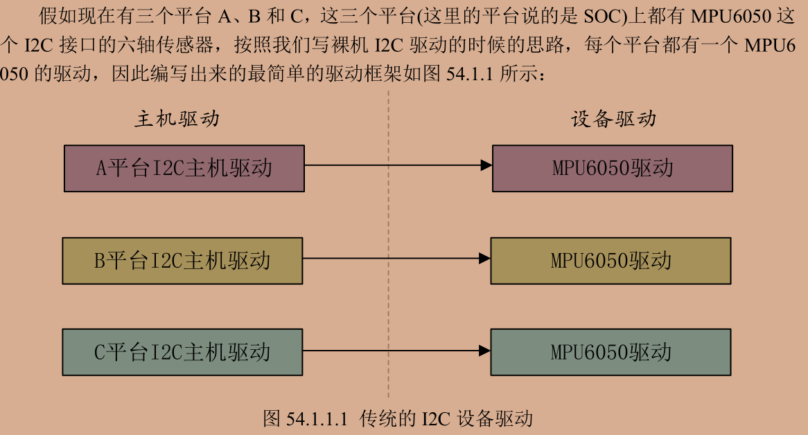

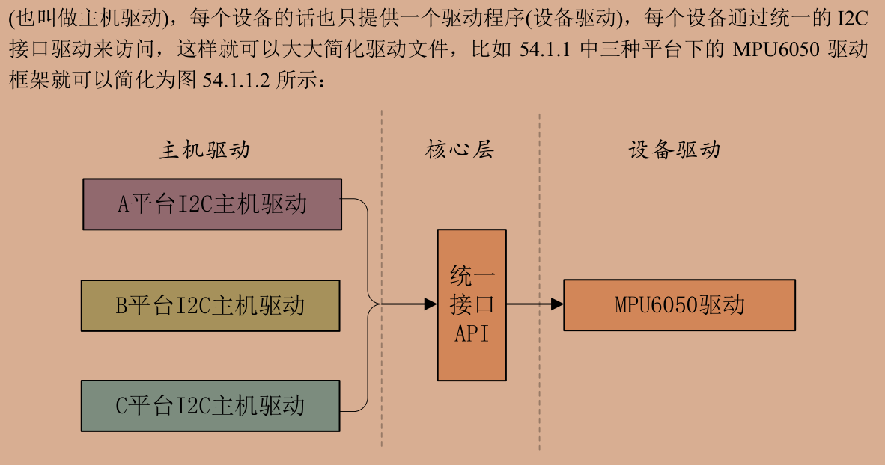

这个就是驱动的分隔，也就是将主机驱动和设备驱动分隔开来 比如 I2C、SPI 等等 将设备信息从设备驱动中剥离开来，驱动使用标准方法去获取到设备信息 然后根据获取到的设备信息来初始化设备  相当于驱动只负责驱动， 设备只负责设备，想办法将两者进行匹配即可。这个就是 Linux 中的总线(bus)、驱动(driver)和设备(device)模型，也就是常说的驱动分离

## platform总线

bus_type 结构体表示总线 这个定义里面match函数就是用来完成设备与驱动之间的匹配的 每一个总线都要实现这个函数 有两个参数dev drv 即设备和驱动

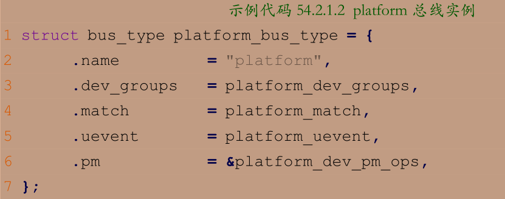

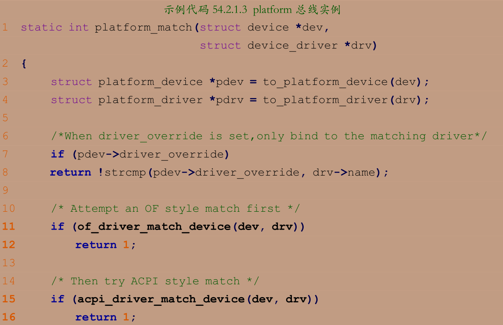

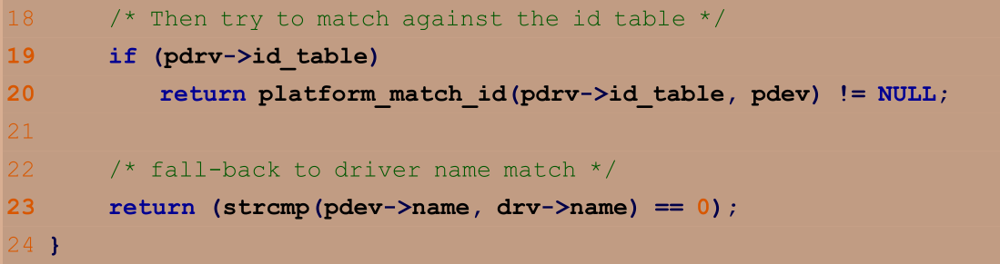

可以看到match函数里面有4种匹配方式：

- OF 设备树采用的匹配方式 compatible
- ACPI匹配方式
- id_table匹配 每个platform_driver结构体有一个id_table成员变量
- 直接比较驱动和设备的name字段

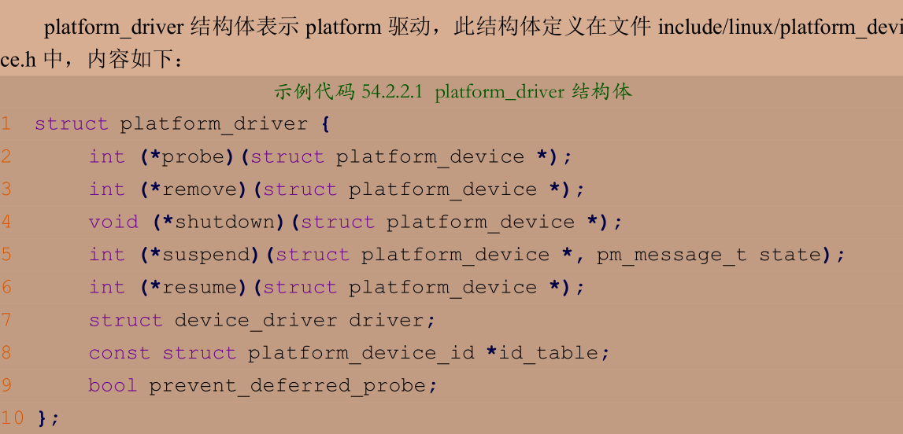

probe 函数，当驱动与设备匹配成功以后 probe 函数就会执行，非常重要的函数！！

对于device_driver结构体 of_match_table 就是采用设备树的时候驱动使用的匹配表，同样是数组，每个匹配项都为 of_device_id 结构体类型，此结构体定义在文件 include/linux/mod_devicetable.h 中

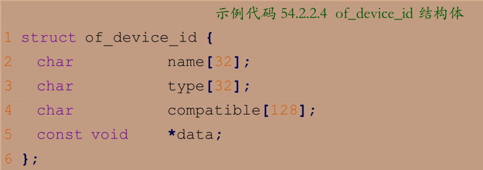  compatible 非常重要，因为对于设备树而言，就是通过设备节点的 compatible 属性值和 of_match_table 中每个项目的 compatible 成员变量进行比较

在编写 platform 驱动的时候，首先定义一个 platform_driver 结构体变量，然后实现结构体中的各个成员变量，重点是实现匹配方法以及 probe 函数。具体的驱动程序在 probe 函数里面编写，比如字符设备驱动等等

定义并初始化好 platform_driver 结构体变量以后，需要在驱动入口函数里面调用 platform_driver_register 函数向 Linux 内核注册一个 platform 驱动

> int platform_driver_register (struct platform_driver *driver)
>driver：要注册的 platform 驱动。
> 返回值：负数，失败；0，成功。

还需要在驱动卸载函数中通过 platform_driver_unregister 函数卸载 platform 驱动

> void platform_driver_unregister(struct platform_driver *drv)
> drv：要卸载的 platform 驱动
> 返回值：无

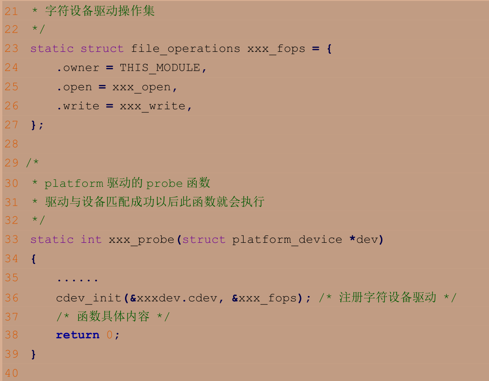

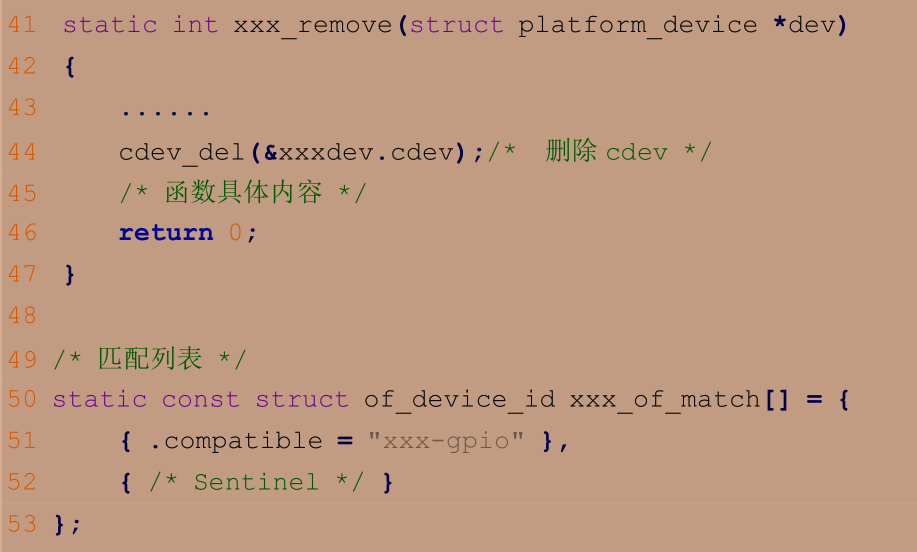

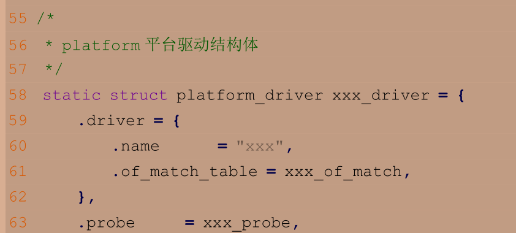

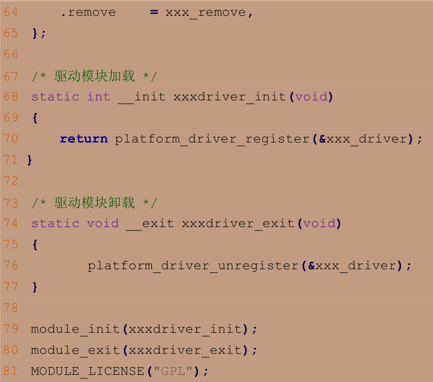

其整个流程大致为：

- probe函数 之前在init里面编写的字符设备驱动程序放到probe里
- remove函数 之前在exit函数里面执行的操作放到该函数中
- of_match匹配表 设备树匹配方式 最后一个of_device_id必须为空
- platform_driver结构体 主要设备.driver（name .of_match_table） .probe .remove
- init调用注册函数 exit调用注销函数

如果内核支持设备树就不要用platform_device来描述设备了 若要描述也可

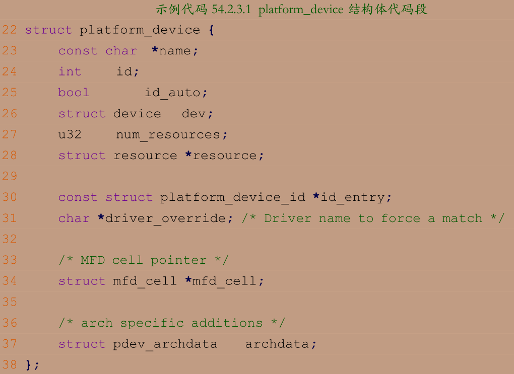

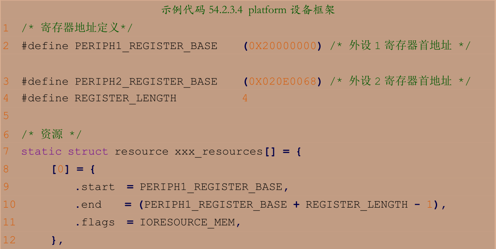

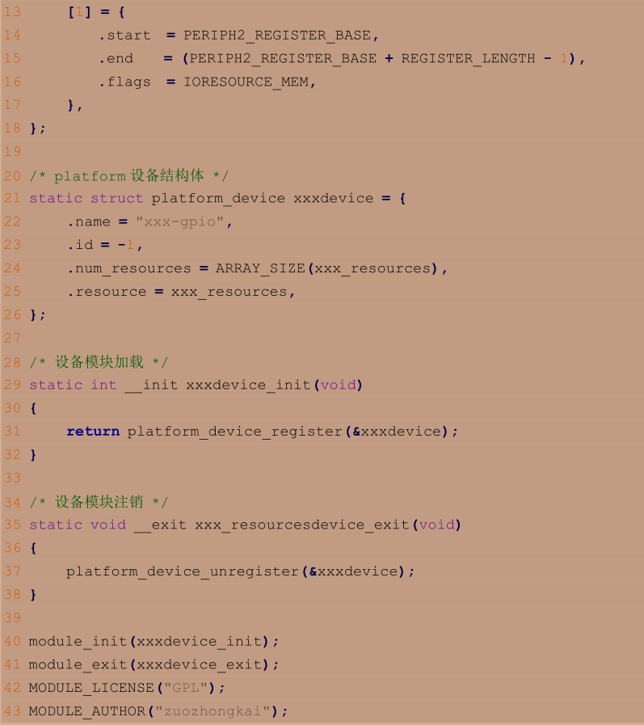

根文件系统中/sys/bus/platform/目录下保存着当前板子 platform 总线下的设备和驱动，其中devices 子目录为 platform 设备，drivers 子目录为 plartofm 驱动。查看/sys/bus/platform/devices/

查看/sys/bus/platform/drivers/目录，看一下驱动是否存在

## linux自带的led驱动

/drivers/leds/leds-gpio.c 中可以查看驱动文件 会采用module_platform_driver 函数向 Linux 内核注册

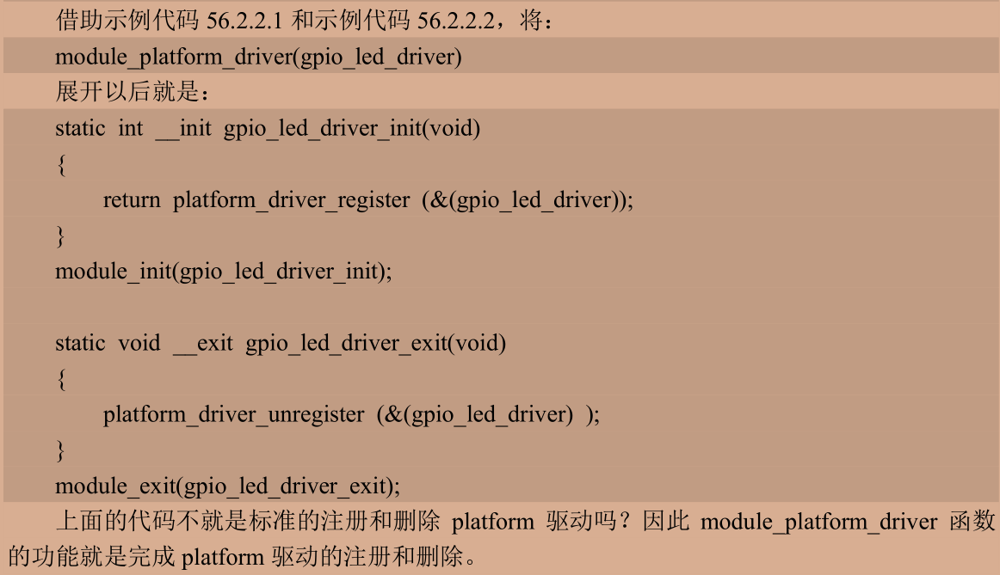

打开文档 Documentation/devicetree/bindings/leds/leds-gpio.txt，此文档详细的讲解了 Linux自带驱动对应的设备树节点该如何编写

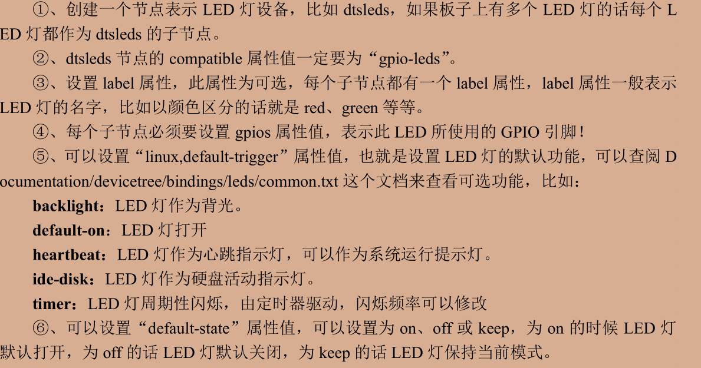

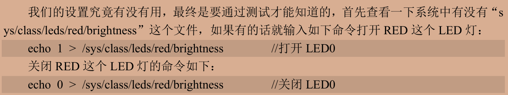