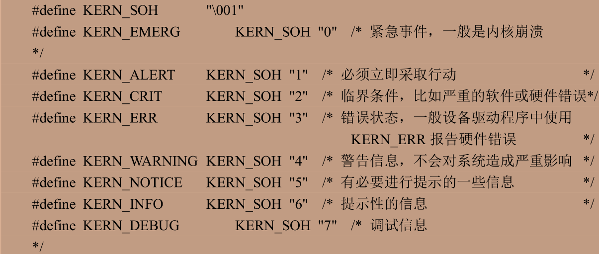

# Linux驱动一般知识

Linux驱动有两种运行方式 一种是编译进内核中 第二种是将驱动编译成模块（.ko） 内核启动后使用insmod命令加载模块即可

字符设备就是按照字节流进行读写操作的设备 分先后顺序

注册模块加载函数 之后可以调用insmod和modprobe

区别在于insmod启动指定模块 但是不能解决依赖关系 modprobe会分析模块的依赖关系 然后将依赖模块加载进内核

> module_init(xxx_init);

注册模块卸载函数 使用命令rmmod即可 也可以使用modprobe -r xx.ko 可以卸载该驱动模块依赖的其他模块 前提是这些依赖没有被其他模块使用

> module_exit(xxx_exit);

当驱动假造成功后都需要注册字符设备 卸载的时候也要注销字符设备

```c
/*
    major是主设备号 
    name：设备名称 指向一串字符串 
    fops：结构体file_operations类型指针 指向设备的操作函数集合变量
*/
static inline int register_chrdev(unsigned int major, const char *name,const struct file_operations *fops)
static inline void unregister_chrdev(unsigned int major, const char *name)
```

在写完驱动虚假接入LICENSE信息 作者可加也可不加

> MODULE_LICENSE()

> MODULE_AUTHOR()

```c
#include <linux/types.h>
#include <linux/kernel.h>
#include <linux/delay.h>
#include <linux/ide.h>
#include <linux/init.h>
#include <linux/module.h>
/***************************************************************
Copyright © ALIENTEK Co., Ltd. 1998-2029. All rights reserved.
文件名 : chrdevbase.c
作者 : lanyuana
版本 : V1.0
描述 : chrdevbase 驱动文件。
其他 : 无
日志 : 初版 V1.0 2025/11/17 lanyuana创建
***************************************************************/

#define CHRDEVBASE_MAJOR 200    /*主设备号*/
#define CHRDEVBASE_NAME "chrdevbase"    /*设备名*/

static char readbuf[100];   /*读缓冲区*/
static char writebuf[100];  /*写缓冲区*/
static char kerneldata[]={"kernel data!"};


/*
* @description : 打开设备
* @param – inode : 传递给驱动的 inode
* @param - filp : 设备文件，file 结构体有个叫做 private_data 的成员变量
*                 一般在 open 的时候将 private_data 指向设备结构体。
* @return : 0 成功;其他 失败
*/
static int chrdevbase_open(struct inode *inode,struct file *filp)
{
    /*用户实现具体功能*/
    return 0;
}

/*
* @description : 从设备读取数据
* @param - filp : 要打开的设备文件(文件描述符)
* @param - buf : 返回给用户空间的数据缓冲区
* @param - cnt : 要读取的数据长度
* @param - offt : 相对于文件首地址的偏移
* @return : 读取的字节数，如果为负值，表示读取失败
*/
static ssize_t chrdevbase_read(struct file *filp,char __user *buf,size_t cnt,loff_t *offt)
{
    /*用户实现具体功能*/
    int retvalue = 0;
    /*向用户空间发送数据*/
    memcpy(readbuf,kerneldata,sizeof(kerneldata));
    retvalue = copy_to_user(buf,readbuf,cnt);//从readbuf中发送数据给buf
    if(retvalue ==0)
    {
        printk("kernal senddata ok!\r\n");//printk常用于内核环境
    }
    else
    {
        printk("kernal senddata failed!\r\n");
    }
    return 0;
}

/*
* @description : 向设备写数据
* @param - filp : 设备文件，表示打开的文件描述符
* @param - buf : 要写给设备写入的数据
* @param - cnt : 要写入的数据长度
* @param - offt : 相对于文件首地址的偏移
* @return : 写入的字节数，如果为负值，表示写入失败
*/
static ssize_t chrdevbase_write(struct file *filp,const char __user *buf,size_t cnt,loff_t *offt)
{
    /*用户实现具体功能*/
    int retvalue =0;
    retvalue = copy_from_user(writebuf,buf,cnt);//从传入的buf写入到writebuf 个数为cnt
    if(retvalue ==0)
    {
        printk("kernal recevdata:%s\r\n",writebuf);//printk常用于内核环境
    }
    else
    {
        printk("kernal recevdata failed!\r\n");
    }
    return 0;
}


/*
* @description : 关闭/释放设备
* @param - filp : 要关闭的设备文件(文件描述符)
* @return : 0 成功;其他 失败
*/
static int chrdevbase_release(struct inode *inode,struct file *filp)
{
    /*用户实现具体功能*/
    return 0;
}

/*
*   设备操作函数结构体
*/
static struct  file_operations chrdevbase_fops ={
    .owner = THIS_MODULE,
    .open = chrdevbase_open,
    .read = chrdevbase_read,
    .write = chrdevbase_write,
    .release = chrdevbase_release,
};

/*
* @description : 驱动入口函数
* @param：       无
* @return : 0 成功;其他 失败
*/
static int __init chrdevbase_init(void)
{
    /*入口函数具体内容*/
    int retvalue = 0;
    /*注册字符设备驱动*/
    retvalue = register_chrdev(CHRDEVBASE_MAJOR,CHRDEVBASE_NAME,&chrdevbase_fops);
    if(retvalue <0)
    {
        /*字符设备注册失败*/
        printk("chrdevbase driver register failed\r\n");
    }
    else
    {
        printk("chrdevbase_init()\r\n");
    }
    return 0;
}

/*
* @description : 驱动出口函数
* @param：       无
* @return : 0 成功;其他 失败
*/
static void __exit chrdevbase_exit(void)
{
    /*注销字符设备驱动*/
    unregister_chrdev(CHRDEVBASE_MAJOR,CHRDEVBASE_NAME);
    printk("chrdevbase_exit()\r\n");
}

/*
*将上述函数指定为驱动的入口和出口函数
*/
module_init(chrdevbase_init);
module_exit(chrdevbase_exit);
/*
*LICENSE和作者信息
*/
MODULE_LICENSE("GPL");
MODULE_AUTHOR("LanYuanA");
```

以上可作为字符设备驱动开发模版

---

```c
#include "stdio.h"
#include "unistd.h"
#include "sys/types.h"
#include "sys/stat.h"
#include "fcntl.h"
#include "stdlib.h"
#include "string.h"

/***************************************************************
Copyright © ALIENTEK Co., Ltd. 1998-2029. All rights reserved.
文件名 : chrdevbaseapp.c
作者 : lanyuana
版本 : V1.0
描述 : chrdevbase 驱动测试app。
其他 : 使用方式：./chrdevbaseapp filename <1>|<2>
        <1> 读数据并打印在控制台
        <2> 发送userdata到驱动文件
日志 : 初版 V1.0 2025/11/17 lanyuana创建
***************************************************************/

static char userdata[]={"user data!"};

int main(int argc,char *argv[])
{
    int fd,retvalue;
    char *filename;
    char readbuf[100],writebuf[100];
    if(argc != 3)
    {
        perror("输入参数错误");
        exit(EXIT_FAILURE);
    }
    filename = argv[1];
    /*打开驱动文件*/
    fd = open(filename,O_RDWR);
    if(fd<0)
    {
        perror("open");
        exit(EXIT_FAILURE);
    }
    /*从驱动文件中读取数据*/
    if(atoi(argv[2]) == 1)
    {
        retvalue = read(fd,readbuf,50);
        if(retvalue<0)
        {
            perror("read");
            exit(EXIT_FAILURE);
        }
        else
        {
            /*读取成功打印成功数据*/
            printf("read data:%s\r\n",readbuf);
            if(retvalue<0)
            {
                perror("write");
                exit(EXIT_FAILURE);
            }
        }
    }
    if(atoi(argv[2]) == 2)
    {
        /*写设备驱动写数据*/
        memcpy(writebuf,userdata,sizeof(userdata));
        retvalue = write(fd,writebuf,50);
        if(retvalue<0)
        {
            perror("write to chrdev");
            exit(EXIT_FAILURE);
        }
    }
    /*关闭设备*/
    retvalue = close(fd);
    if(retvalue<0)
    {
        perror("close");
        exit(EXIT_FAILURE);
    }
    return 0;    
}
```

Linux中每个设备都有设备号 有主设备号和次设备号之分。主设备号表示某一个具体的驱动 次设备号表示使用这个驱动的各个设备  用dev_t 实际是unsigned int类型的别名 是一个32位的数据类型 高12位是主设备号0~4095 低20号是次设备号

建议使用动态分配设备号 在开源社区内使用

```c
/*
    dev:保存申请到的设备号
    baseminor:次设备号起始地址 这个函数可以申请一段连续的多个设备号 这些设备的主设备一样但次设备号不同 一般为0
    count:要申请的数量
    name:设备名称
*/
int alloc_chrdev_region(dev_t *dev, unsigned baseminor, unsigned count, const char *name)
/*
    from:要释放的设备号
    count:从from开始释放的设备号数量
*/
void unregister_chrdev_region(dev_t from, unsigned count)
```

要注意的：

- 当应用程序调用open函数的时候就会调用chrdevbase_open
- 在驱动程序中使用printk 内核没有printf这个函数 printf在用户态 printk在内核态 可以根据日志级别对消息进行分类



有个宏CONSOLE_LOGLEVEL_DEFAULT控制那些级别的信息可以显示在控制台上 默认是7 意思为只有在7以上的信息才可以打印在控制台上

- 因为内核空间不能直接操作用户空间的内存 需要copy_to_user和copy_from_user来完成内核和用户空间的复制

> static inline long copy_to_user(void __user *to, const void *from, unsigned long n)

参数 to 表示目的，参数 from 表示源，参数 n 表示要复制的数据长度。如果复制成功，返回值为 0，如果复制失败则返回负数

```Makefile
KERNELDIR := /home/lanyuana/linux/IMX6ULL/alientek_linux
CURRENT_PATH := $(shell pwd)
obj-m := chrdevbase.o

build : kernel_modules

kernel_modules:
	$(MAKE) -C $(KERNELDIR) M=$(CURRENT_PATH) modules
clean:
	$(MAKE) -C $(KERNELDIR) M=$(CURRENT_PATH) clean
```

kernel_modules 后面的modules表示编译模块 -C表示将当前的工作目录切换到指定目录 即linux源码目录 M表示模块源码目录

编译完成后将.ko文件和app放入到开发板的/lib/modules/4.1.15 这里的4.1.15是内核版本 根据实际修改

之后启动驱动insmod chrdevbase.ko或者modprobe chrdevbase.ko注意modprobe命令可能因bustbox不同而报错 需要重新修改

启用驱动之后 cat /proc/devices查看当前设备

创建设备节点文件 app就是通过控制这个设备节点文件来实现对具体设备的操作 mknod /dev/chrdevbase c 200 0

其中mknod是创建节点命令 c表示这是个字符设备 200是主设备号 0是次设备号

创建完成就可以使用 ls /dev/chrdevbase -l来查看

注意 若是用SSH连接则无法看到printk的输出 需要手动查看dmesg |tail