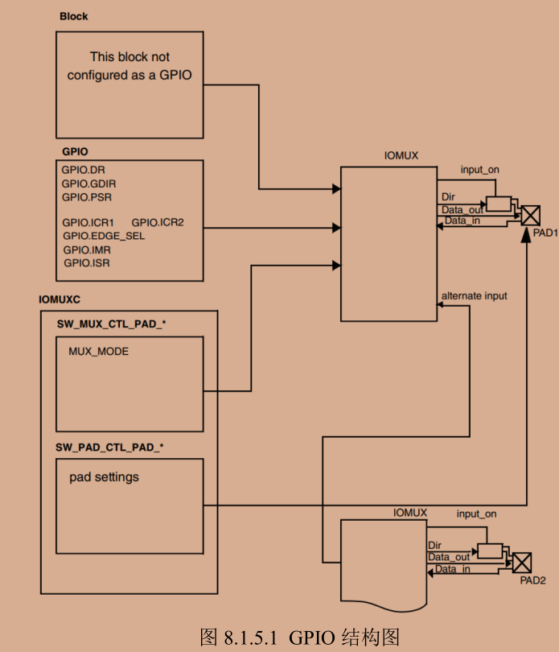
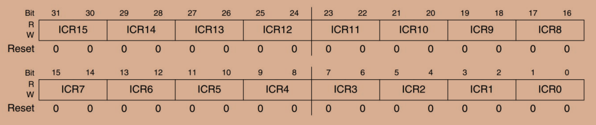
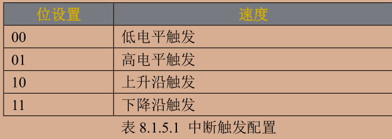
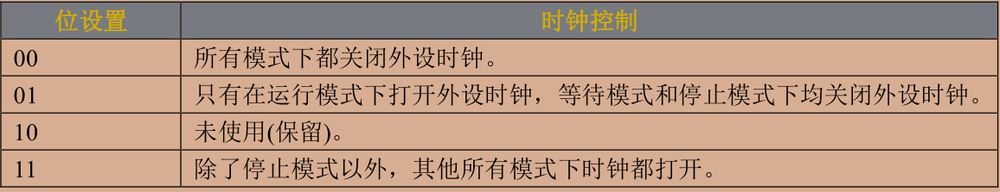
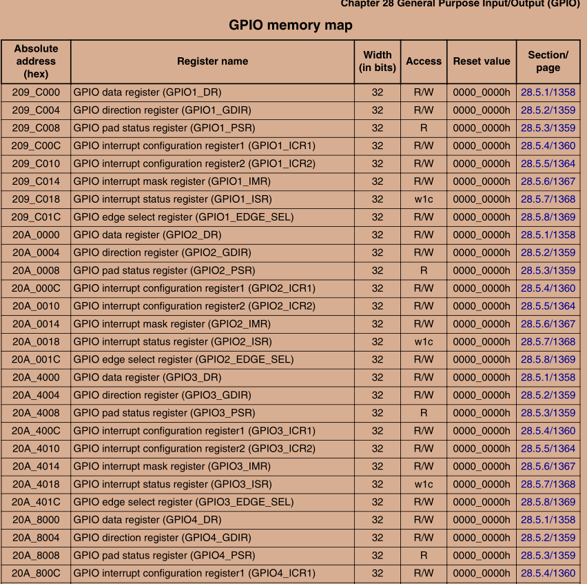
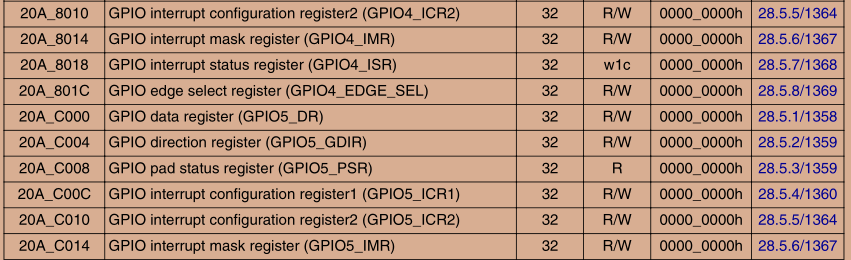
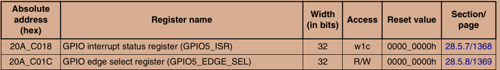

# led驱动

物理内存与虚拟内存之间的转换

> ioremap(cookie,size)

用于获取指定物理地址对应的虚拟空间 cookie指物理地址的首地址 size指要映射的内存空间大小 返回值是__iomem类型的指针 指向映射后的虚拟空间首地址

> iounmap(addr)

卸载驱动的时候也需要iounmap来释放ioremap的映射 参数是虚拟空间的首地址

外部寄存器或内存映射到 IO 空间时，称为 I/O 端口

外部寄存器或内存映射到内存空间时，称为 I/O 内存

对于 ARM 来说没有 I/O 空间这个概念，因此 ARM 体系下只有 I/O 内存(可以直接理解为内存)

- u8 readb(const volatile void __iomem *addr)
- u16 readw(const volatile void __iomem *addr)
- u32 readl(const volatile void __iomem *addr)

使用ioremap完成物理地址到虚拟地址后建议使用这些函数对映射后的内存进行读写 分别对应8bit 16bit 32bit 参数addr就是要读取写内存地址 返回值是读取到的数据

- void writeb(u8 value, volatile void __iomem *addr)
- void writew(u16 value, volatile void __iomem *addr)
- void writel(u32 value, volatile void __iomem *addr)

value为要写入的数值 addr是要写入的地址

IOMUXC_SW_MUX_CTL_PAD_XX_XX 和IOMUXC_SW_PAD_CTL_PAD_XX_XX 这两种寄存器都是配置 IO 的，注意是 IO！不是 GPIO，这只是IO众多复用功能中的其中一种



- SW_MUX_CTL_PAD_* 用于设置IO的复用功能
- SW_PAD_CTL_PAD_* 用于设置IO的属性
- 当IO作为GPIO使用的时候需要设置上述8个寄存器DR、GDIR、PSR、ICR1、ICR2、EDGE_SEL、IMR 和 ISR
- DR的32位寄存器每一位对应一个GPIO 当设置为输出功能后 向对应位写入数据就会输出对应的高低电平；当设置为输入模式后 该寄存器就对印IO的电平值
- GDIR 是32位方向寄存器 用来设置GPIO的工作模式 输入/输出 0：输入 1：输出 每一位都对应某个IO的工作方向
- PSR寄存器也是32位的 如上 读取对应位可以获取对应GPIO状态 即高低电平
- ICR1 ICR2是中断控制寄存器 分别用来配置低16个和高16个GPIO





- IMR 32位中断屏蔽寄存器 使能中断置位1 禁止中断置位0
- ISR 32位中断状态寄存器 中断发生对应位就会置1 处理完中断必须清除中断标志位 方法为向ISR对应位写1 写1清零
- EDGE_SEL 32位边沿中断寄存器 会覆盖ICR1和ICR2的设置 对应位为1的话就设置了GPIO是上升沿和下降沿爽出发

## 使能时钟

CCM有7个寄存器  CCM_CCGR0~CCM_CCGR6 控制着所有外设时钟的开关

以CCM_CCGR0为例 这是个32为寄存器 每2位控制一个外设的时钟



根据图中所示 要开GPIO2的时钟的话CCM_CCGR0= 3<<30;即11左移30位 设置31:30位 即打开时钟 反之，关闭时钟为CCM_CCGR0= 00<<30

总结：

- 使能GPIO对应时钟
- 设置 IOMUXC_SW_MUX_CTL_PAD_XX_XX 复用为GPIO功能
- 设置IOMUXC_SW_PAD_CTL_PAD_XX_XX 设置IO的上下拉 速度等
- 配置 GPIO，设置输入/输出、是否使用中断、默认输出电平等
- 配置GDIR方向寄存器







```c
#include <linux/types.h>
#include <linux/kernel.h>
#include <linux/delay.h>
#include <linux/ide.h>
#include <linux/init.h>
#include <linux/module.h>
#include <linux/errno.h>
#include <linux/gpio.h>
#include <asm/mach/map.h>
#include <asm/uaccess.h>
#include <asm/io.h>
/***************************************************************
Copyright © ALIENTEK Co., Ltd. 1998-2029. All rights reserved.
文件名 : led.c
作者 : lanyuana
版本 : V1.0
描述 : led 驱动文件。
其他 : 无
日志 : 初版 V1.0 2025/11/21 lanyuana创建
***************************************************************/

#define LED_MAJOR 200    /*主设备号*/
#define LED_NAME "led"    /*设备名*/

#define LEDOFF 0;/*关灯*/
#define LEDON 1;/*开灯*/

/*寄存器物理地址*/
#define CCM_CCGR1_BASE          (0x020C406C) // 27:26 对应gpio1 clock
#define SW_MUX_GPIO1_IO03_BASE  (0x020E0068)
#define SW_PAD_GPIO1_IO03_BASE  (0x020E02F4)
#define GPIO1_DR_BASE           (0x0209C000)
#define GPIO1_GDIR_BASE         (0x0209C004)

/*映射后的寄存器虚拟地址指针*/
static void __iomem *IMX6U_CCM_CCGR1;
static void __iomem *SW_MUX_GPIO1_IO03;
static void __iomem *SW_PAD_GPIO1_IO03;
static void __iomem *GPIO1_DR;
static void __iomem *GPIO1_GDIR;

/*
* @description : LED打开/关闭
* @param – inode : 传递给驱动的 inode
* @param - filp : 设备文件，file 结构体有个叫做 private_data 的成员变量
*                 一般在 open 的时候将 private_data 指向设备结构体。
* @return : 0 成功;其他 失败
*/
void led_switch(u8 sta)
{   //LED是低电平触发
    u32 val =0;
    if(val == LEDON)
    {
        val = readl(GPIO1_DR);//读取DR寄存器的值 
        val &=~(1<<3);//将val的第3位 bit3清零 保持其他位不动 &是按位与 都为1时才为1
        writel(val,GPIO1_DR);
    }
    else if(val == LEDOFF)
    (
        val = readl(GPIO1_DR);//读取DR寄存器的值 
        val |=(1<<3);//将val的第4位 bit3清零 保持其他位不动 |是按位或 都为0时才为0
        writel(val,GPIO1_DR);   
    )
}


/*
* @description : 打开设备
* @param – inode : 传递给驱动的 inode
* @param - filp : 设备文件，file 结构体有个叫做 private_data 的成员变量
*                 一般在 open 的时候将 private_data 指向设备结构体。
* @return : 0 成功;其他 失败
*/
static int led_open(struct inode *inode,struct file *filp)
{
    /*用户实现具体功能*/
    return 0;
}

/*
* @description : 从设备读取数据
* @param - filp : 要打开的设备文件(文件描述符)
* @param - buf : 返回给用户空间的数据缓冲区
* @param - cnt : 要读取的数据长度
* @param - offt : 相对于文件首地址的偏移
* @return : 读取的字节数，如果为负值，表示读取失败
*/
static ssize_t led_read(struct file *filp,char __user *buf,size_t cnt,loff_t *offt)
{
    return 0;
}

/*
* @description : 向设备写数据
* @param - filp : 设备文件，表示打开的文件描述符
* @param - buf : 要写给设备写入的数据
* @param - cnt : 要写入的数据长度
* @param - offt : 相对于文件首地址的偏移
* @return : 写入的字节数，如果为负值，表示写入失败
*/
static ssize_t led_write(struct file *filp,const char __user *buf,size_t cnt,loff_t *offt)
{
    /*用户实现具体功能*/
    int retvalue =0;
    unsigned char databuf[1];
    unsigned char ledtat;
    retvalue = copy_from_user(databuf,buf,cnt);//从传入的buf写入到databuf 个数为cnt
    if(retvalue)
    {
        printk("kernal recevdata failed!\r\n");
        return -EFAULT;
    }
    ledtat = databuf[0];/*从用户输入的指令中获得控制值 获取状态值*/
    if(ledtat == LEDON)
    {
        led_switch(LEDON);
    }
    else if(ledtat == LEDOFF)
    {
        led_switch(LEDOFF);
    }
    return 0;
}


/*
* @description : 关闭/释放设备
* @param - filp : 要关闭的设备文件(文件描述符)
* @return : 0 成功;其他 失败
*/
static int led_release(struct inode *inode,struct file *filp)
{
    /*用户实现具体功能*/
    return 0;
}

/*
*   设备操作函数结构体
*/
static struct  file_operations led_fops ={
    .owner = THIS_MODULE,
    .open = led_open,
    .read = led_read,
    .write = led_write,
    .release = led_release,
};

/*
* @description : 驱动入口函数
* @param：       无
* @return : 0 成功;其他 失败
*/
static int __init led_init(void)
{
    /*入口函数具体内容*/
    int retvalue = 0;
    /*初始化LED*/
    /*1.寄存器地址映射*/
    IMX6U_CCM_CCGR1 = ioremap(CCM_CCGR1_BASE,4)
    SW_MUX_GPIO1_IO03 = ioremap(SW_MUX_GPIO1_IO03_BASE,4);
    SW_PAD_GPIO1_IO03 = ioremap(SW_PAD_GPIO1_IO03_BASE,4);
    GPIO1_DR = ioremap(GPIO1_DR_BASE,4);
    GPIO1_GDIR = ioremap(GPIO1_GDIR_BASE,4);

    /*2.使能GPIO1时钟 0+26 1+26*/
    val = readl(IMX6U_CCM_CCGR1);
    val &= ~(3<<26);//清除之前的设置 将26 27位清零
    val |=(3<<26);//将26 27为置1
    writel(val,IMX6U_CCM_CCGR1);

    /*设置GPIO1_IO03的复用功能 复用为GPIO1_IO03 最后设置IO属性*/
    //mux_mode alt5 0101 5 
    writel(5,SW_MUX_GPIO1_IO03);
    //设置PAD IO属性
    /*
        0001 0000 1011 0000
        bit 12 PKE 使能keeper功能
        bit 11 ODE 开漏输出关闭 推挽输出模式
        bit 7-6 10 100Mhz
        bit 5-3 110 驱动能力R0/6 较大的驱动电流
    */
    writel(0x10B0,SW_PAD_GPIO1_IO03);

    /*4.设置GPIO1_IO03输出功能 GDIR方向寄存器*/
    val = readl(GPIO1_GDIR);
    val &= ~(1<3);//将第4位清0
    val |= (1<3);//将第4位置1
    writel(GPIO1_GDIR);
    /*注册字符设备驱动*/
    retvalue = register_chrdev(LED_MAJOR,LED_NAME,&led_fops);
    if(retvalue <0)
    {
        /*字符设备注册失败*/
        printk("chrdevbase driver register failed\r\n");
        return -EIO;
    }
    else
    {
        printk("chrdevbase_init()\r\n");
    }
    return 0;
}

/*
* @description : 驱动出口函数
* @param：       无
* @return : 0 成功;其他 失败
*/
static void __exit led_exit(void)
{
    /*取消映射*/
    iounmap(IMX6U_CCM_CCGR1);
    iounmap(SW_MUX_GPIO1_IO03);
    iounmap(SW_PAD_GPIO1_IO03);
    iounmap(GPIO1_DR);
    iounmap(GPIO1_GDIR);
    /*注销字符设备驱动*/
    unregister_chrdev(LED_MAJOR,LED_NAME);
    printk("chrdevbase_exit()\r\n");
}

/*
*将上述函数指定为驱动的入口和出口函数
*/
module_init(led_init);
module_exit(led_exit);
/*
*LICENSE和作者信息
*/
MODULE_LICENSE("GPL");
MODULE_AUTHOR("LanYuanA");
```

通过读虚拟内存的值 只改变指定位的值 先通过 &=~()将原先值清零 后面|=置1 写入值

```c
    /*2.使能GPIO1时钟 0+26 1+26*/
    val = readl(IMX6U_CCM_CCGR1);
    val &= ~(3<<26);//清除之前的设置 将26 27位清零
    val |=(3<<26);//将26 27为置1
    writel(val,IMX6U_CCM_CCGR1);
```

以上完整代码中led_open可以将设备结构体作为参数filp的私有数据file->private_data

led_read可以增加读取led的状态 即读取GPIO1_DR的值 然后返回给应用程序

```c
static ssize_t led_read(struct file *filp,char __user *buf,size_t cnt,loff_t *offt)
{
    int retvalue=0;
    u32 val =0;
    unsigned char status =0;//存放发送给用户的数据
    val = readl(GPIO1_DR);//读DR寄存器的值 看第四位 io_03
    if(val & (1<<3))//高电平是关闭
    {
        status = LEDOFF;
    }
    else 
    {
        status = LEDON;
    }
    retvalue = copy_to_user(buf,&status,1);
    if(retvalue)
    {
        printk("send to user failed!\r\n");
        return -EFAULT;
    }
    //read成功通常返回读取的字节数
    return 1;
}
```