# 设备树

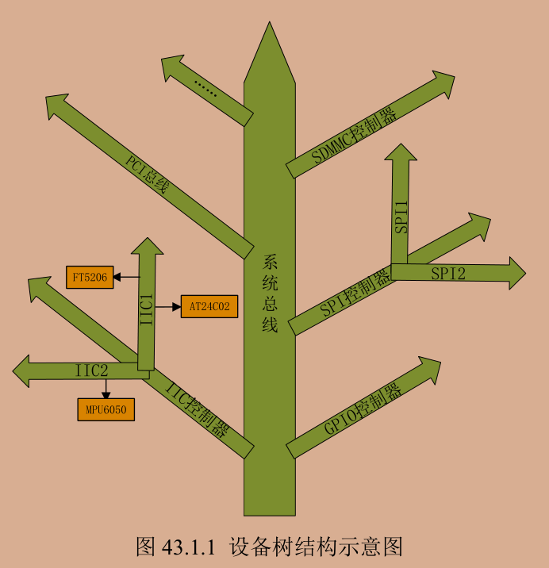

- DTS 是设备树源码
- DTB 是编译后的二进制文件
- DTC 编译工具

一般.dts描述板级信息（有多少IIC设备 SPI设备） .dtsi描述SOC级信息（SOC有多少CPU 主频是多少 各个外设控制器等信息）

设备树是采用树形结构来描述板子上的设备信息的文件，每个设备都是一个节点，叫做设备节点，每个节点都通过一些属性信息来描述节点信息，属性就是键—值对

节点命名如下

> node-name@unit-address

> label: node-name@unit-address

每个节点都有不同属性 不同的属性又有不同的内容 属性都是键值对 值可以为空或任意的字节流：

- 字符串 compatible = "arm,cortex-a7";
- 32位无符号整数 reg = <0>;
- 字符串列表 compatible = "fsl,imx6ull-gpmi-nand", "fsl, imx6ul-gpmi-nand";

常用的标准属性：

- compatible属性：兼容性属性 将设备和驱动绑定起来 字符串列表用于选择设备要使用的驱动程序 如"manufacturer,model" 厂商,驱动名字
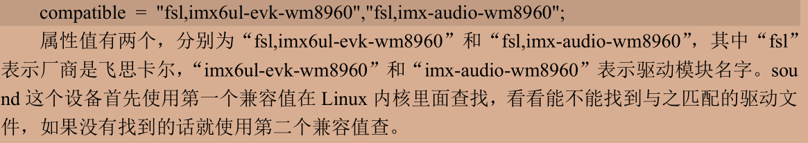

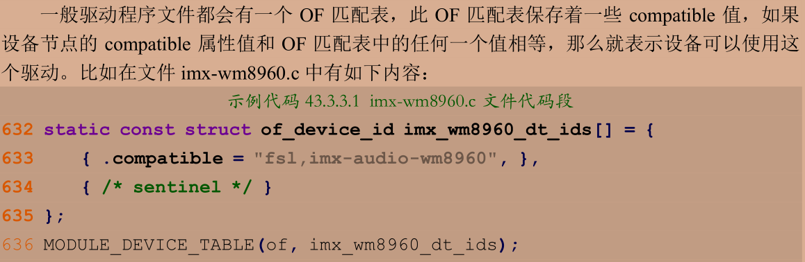

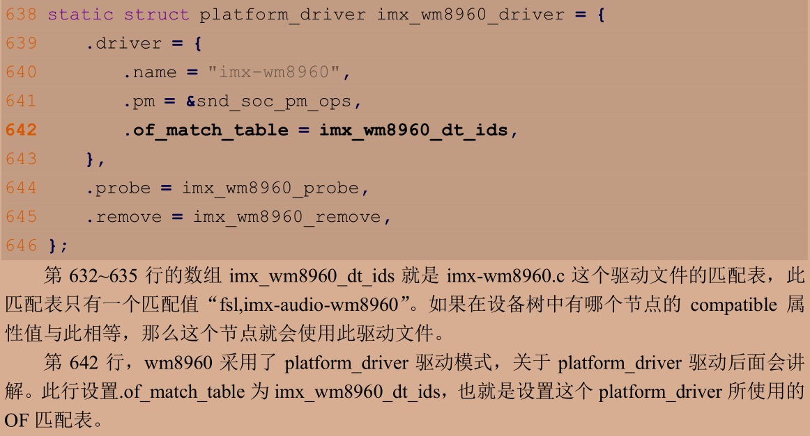

- model属性 用于描述设备模块信息 比如名字等 model= "wm8960-audio"
- status属性 可选的状态如表所示

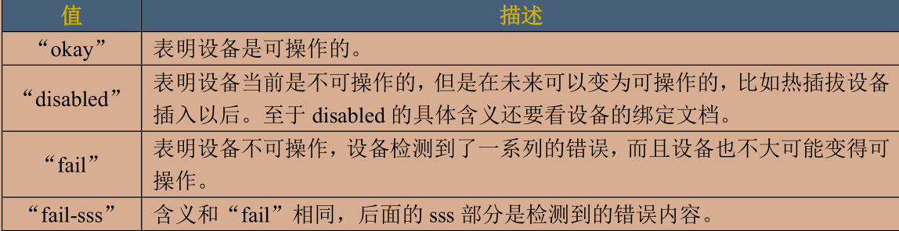

- #address-cells #size-cells属性 无符号32位整型 描述地址信息 表明了如何编写reg属性值 一般格式为reg = <address1 length1 address2 length2 address3 length3……>每个“address length”组合表示一个地址范围，其中 address 是起始地址，length 是地址长度 #address-cells 表明 address 这个数据所占用的字长，#size-cells 表明 length 这个数据所占用的字长

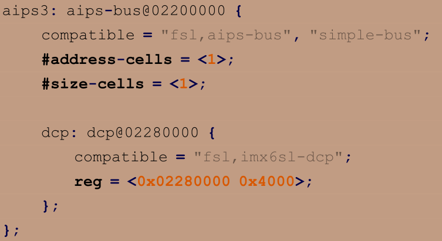

如上图 起始地址为0x02280000 长度是0x4000

- reg属性 用于描述设备地址空间资源信息 某个外设寄存器地址范围信息
- ranges属性 可以为空或者按照(child-bus-address,parent-bus-address,length)格式编写数字矩阵 是一个地址映射/转换表 

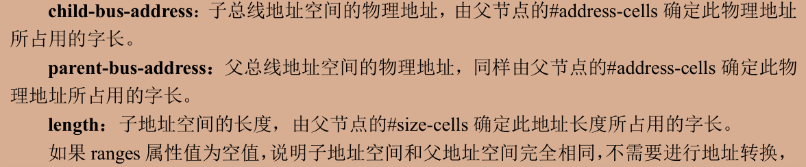

- name属性 用于记录节点名字 已经被弃用
- device_type属性 描述设备的FCode 被弃用 只能用于cpu阶段或者memory节点

根节点的compatile可以知道我们使用的设备 一般第一个值描述所使用的硬件设备名字 第二个值描述设备所使用的SOC

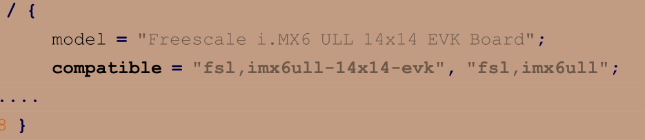

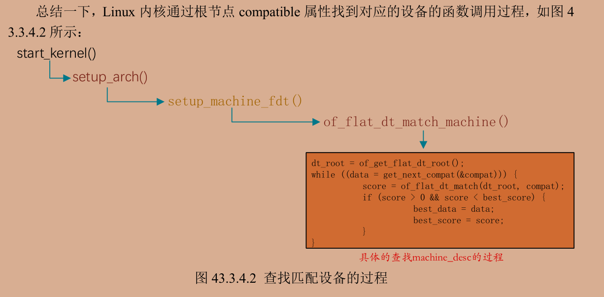

---

向设备树增加节点 imx6ull-alientek-emmc.dts文件中写入增加的内容 例如在i2c1节点下增加子节点ap3216c

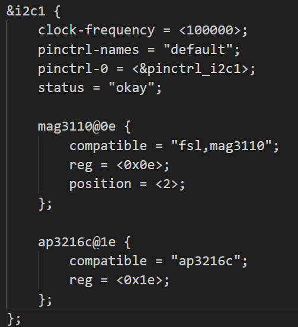

---

创建小型模版设备树

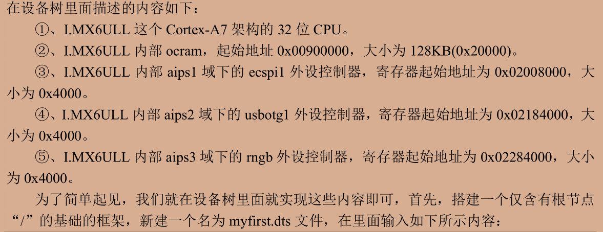

```.dts
/ {
    compatible = "fsl,imx6ull-alientek-evk","fsl,imx6ull";

    //增加cpu节点
    cpus{
        #address-cells = <1>;
        #size-cells = <0>;
        //cpu0节点
        cpu0:cpu@0{
            compatible = "arm,cortex-a7";
            device_type = "cpu";
            reg = <0>
        };
    };

    //soc节点 内部外设
    soc{
        #address-cells = <1>;
        #size-cells = <1>;
        compatible = "simple-bus";
        ranges;     

        //ocram节点 ram
        ocram :sram@0x00900000{
            compatible = "fsl,lpm-sram";
            reg = <0x00900000,0x20000>//起始地址0x00900000 长度0x20000
        }; 
        //aips1节点 用于分管不同的外设控制器
        asips1 :aips-bus@02000000{
            compatible = "fsl,aips-bus","simple-bus";
            #address-cells = <1>;
            #size-cells = <1>;     
            reg = <0x02000000 0x100000>
            ranges;    

            //ecspil节点
            ecspil:ecspi@02008000{
                #address-cells = <1>;
                #size-cells = <1>;       
                compatible = "fsl,imx6ul-ecspi","fsl,imx51-ecspi";  
                reg = <0x02008000 0x4000>
                status = "disabled";        
            };   
        } 
        //aips2节点
        asips2 :aips-bus@02100000{
            compatible = "fsl,aips-bus","simple-bus";
            #address-cells = <1>;
            #size-cells = <1>;     
            reg = <0x02100000 0x100000>
            ranges;   

            //usbotg1节点
            usbotg1:usb@02184000{      
                compatible = "fsl,imx6ul-usb","fsl,imx27-usb";  
                reg = <0x02184000 0x4000>
                status = "disabled";        
            };      
        } 
        //aips3节点
        asips3 :aips-bus@02200000{
            compatible = "fsl,aips-bus","simple-bus";
            #address-cells = <1>;
            #size-cells = <1>;     
            reg = <0x02200000 0x100000>
            ranges;    

            //rngb节点
            rngb:rngb@02284000{      
                compatible = "fsl,imx6ul-rng","fsl,imx-rng","imx-rng";  
                reg = <0x02284000 0x4000>    
            };     
        } 
    }
}
```

在系统中的体现 在根目录的/proc/device-tree下根据节点创建不同文件夹

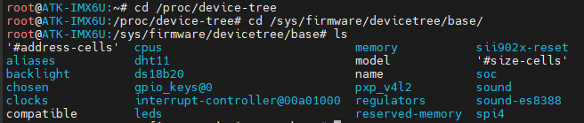

可以看到目录的属性是按文件存放的 通过cat指令查看对应的值

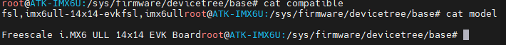

特殊节点 aliases节点的功能是定义别名 方便访问节点

chosen节点 uboot向linux内核传递数据 

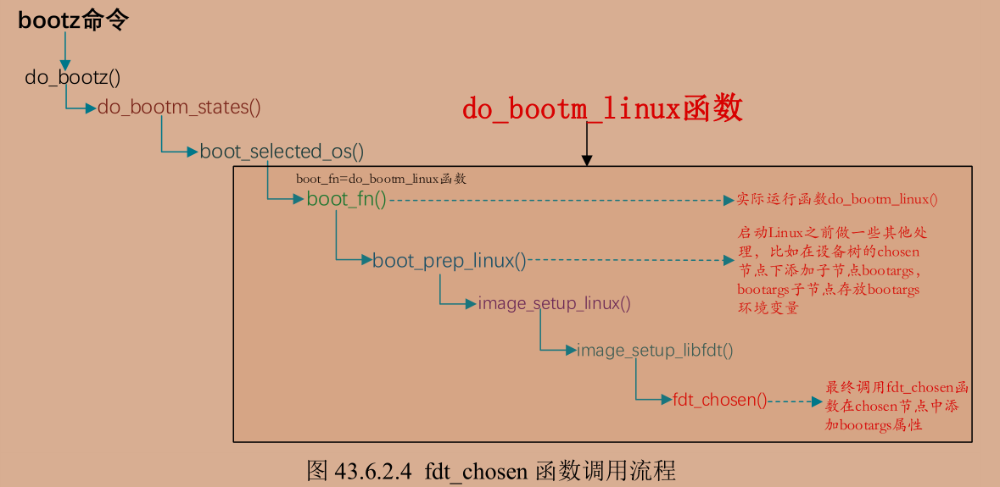

通过以下步骤解析DTB文件

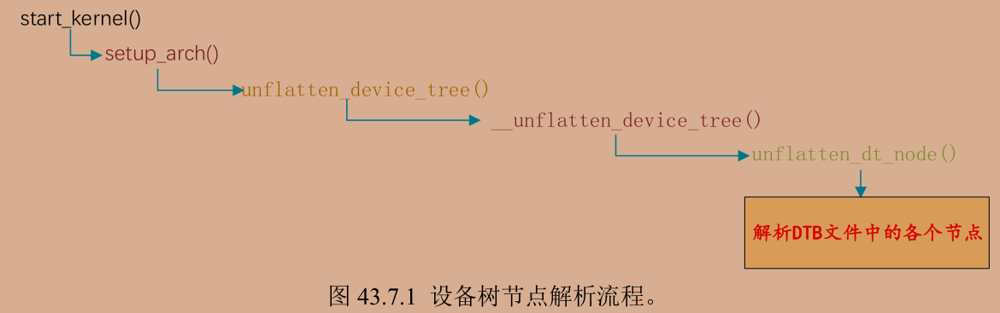

要在设备树中增加一个节点查看相关说明 在/Documentation/devicetree/bindings有详细的txt文档

---

查找节点的of函数 用device_node来描述一个节点

```c
/*
   通过节点名字查找指定的节点
    from:开始查找的节点 NULL从根节点开始
    name:要查找的节点名字
    返回值：找到的节点 如果为NULL表示查找失败
*/
struct device_node *of_find_node_by_name(struct device_node *from,
                                         const char *name);

/*
    通过device_type查找指定的节点
    from:开始查找的节点 NULL从根节点开始
    type:要查找的device_type
    返回值：找到的节点 如果为NULL表示查找失败
*/
struct device_node *of_find_node_by_type(struct device_node *from, const char *type)

/*
    通过device_type 和 compatible查找指定的节点
    from:开始查找的节点 NULL从根节点开始
    type:要查找的device_type
    compatible ：要查找的节点所对应的 compatible 属性列表。
    返回值：找到的节点 如果为NULL表示查找失败
*/
struct device_node *of_find_compatible_node(struct device_node *from,
                    const char *type,
                    const char *compatible)

/*
    通过 of_device_id查找指定的节点
    from:开始查找的节点 NULL从根节点开始
    matches：of_device_id 匹配表，也就是在此匹配表里面查找节点。
    match ：找到的匹配的 of_device_id。
    返回值：找到的节点 如果为NULL表示查找失败
*/
struct device_node *of_find_matching_node_and_match(struct device_node *from,
            const struct of_device_id *matches,
            const struct of_device_id **match)

/*
    通过路径查找指定的节点
    path：带有全路径的节点名，可以使用节点的别名，比如“/backlight”就是 backlight 这个节点的全路径。
    返回值：找到的节点 如果为NULL表示查找失败
*/
inline struct device_node *of_find_node_by_path(const char *path)
```

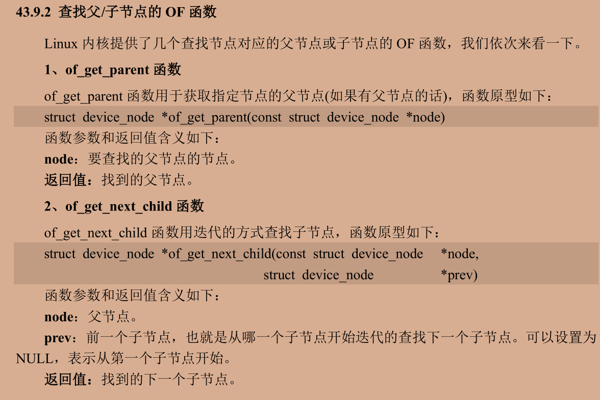

节点的属性保存了所需的内容 用结构体property表示属性

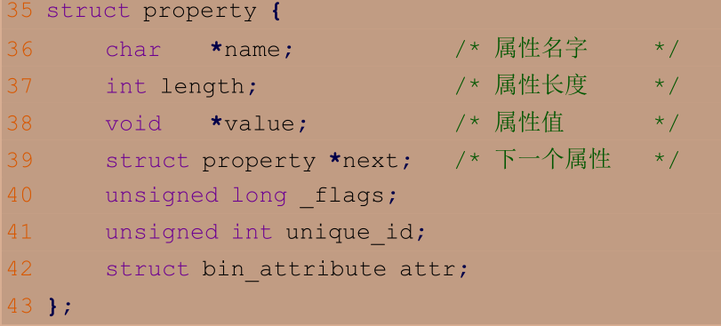

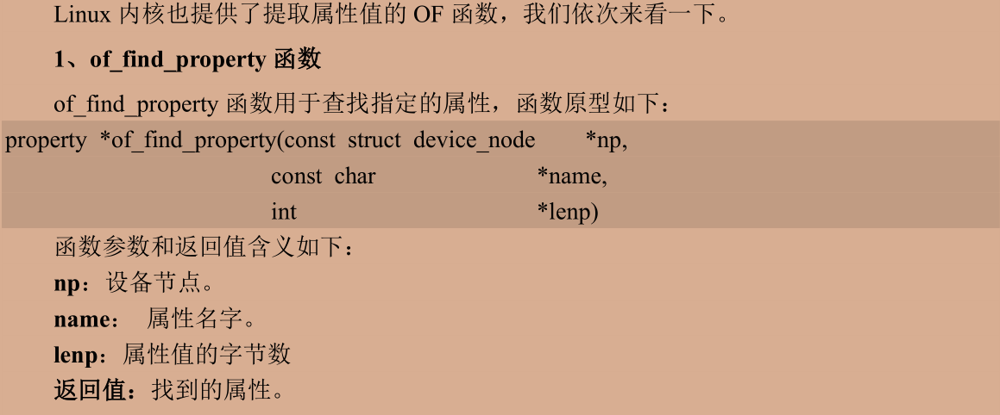

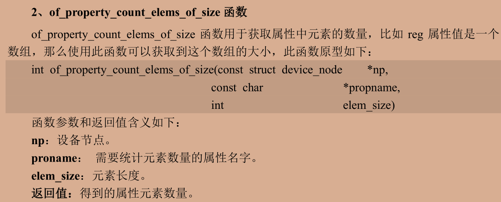


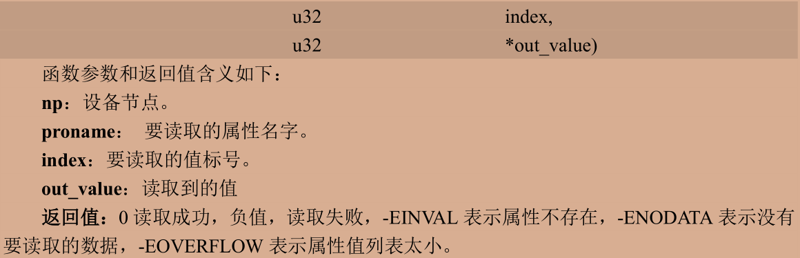

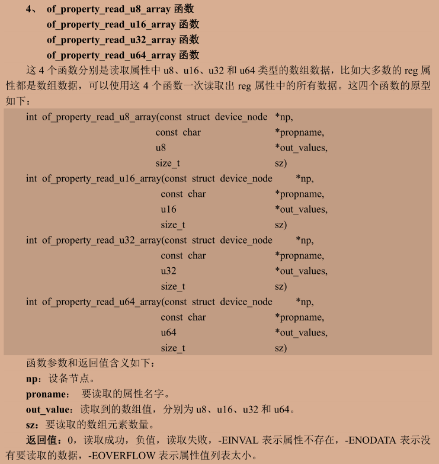

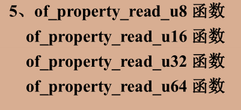


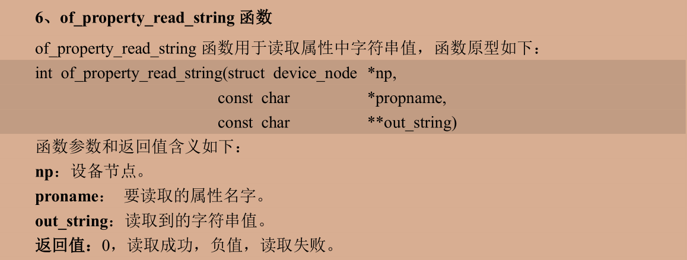

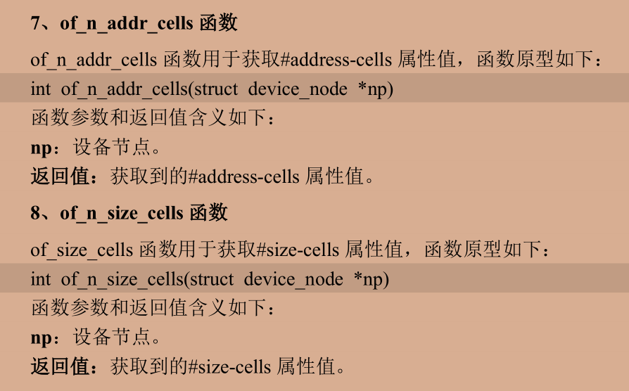

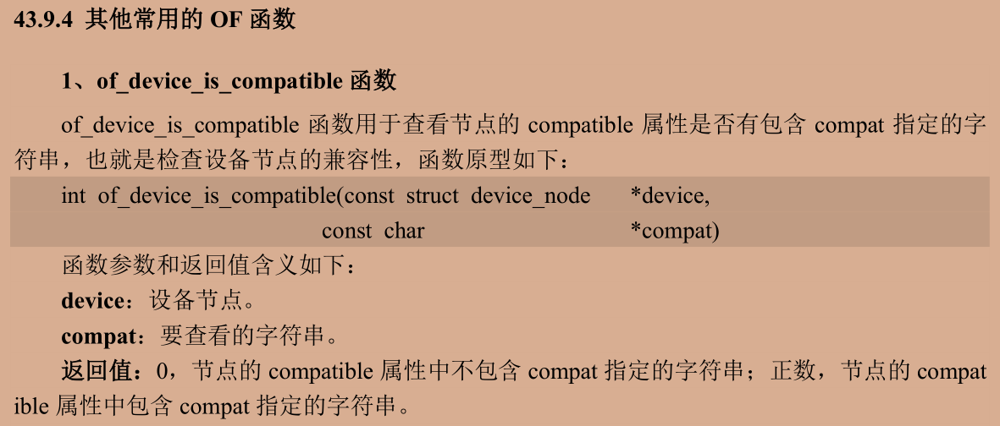

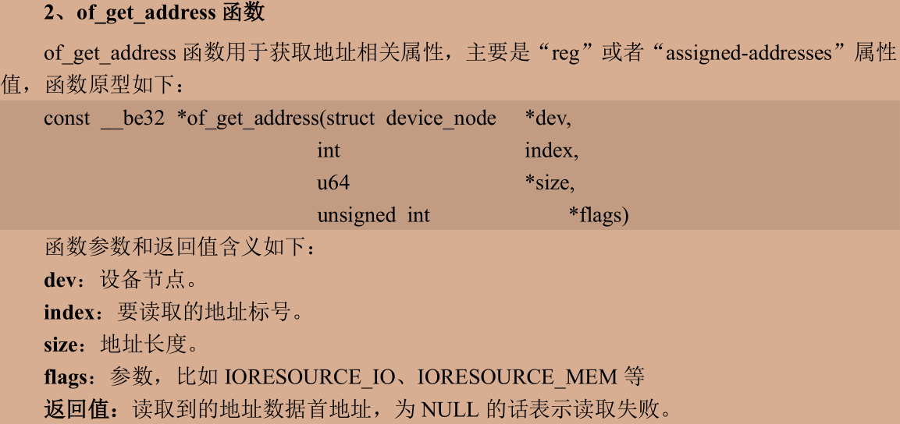

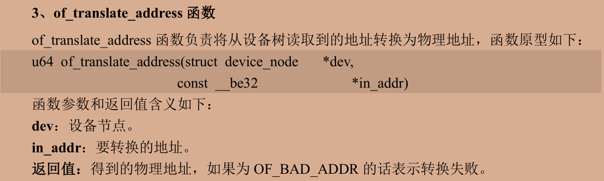

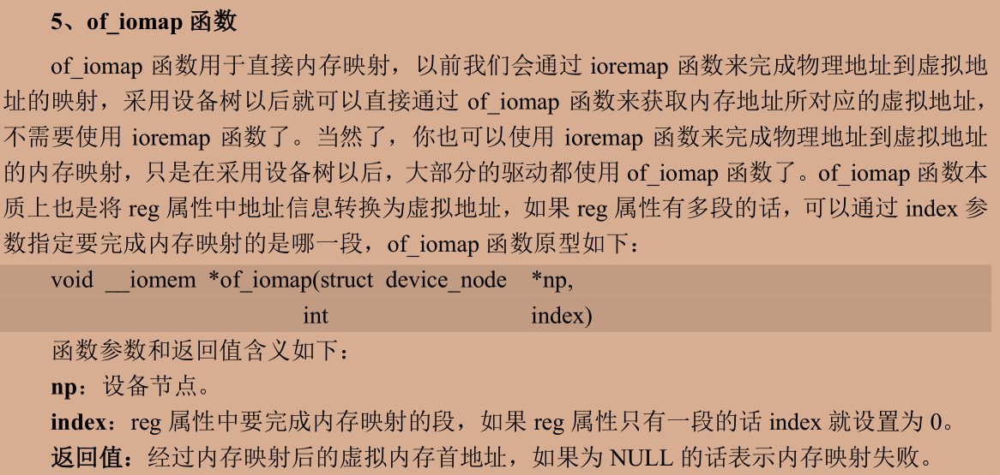

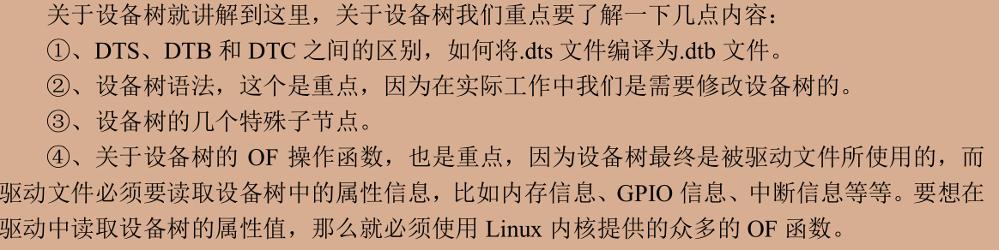

```c
//dts新增节点
    alphaled {
	#address-cells = <1>;
	#size-cells = <1>;
	compatible = "atkalpha-led";
	status = "okay";
	reg = < 0X020C406C 0X04 /* CCM_CCGR1_BASE */
			0X020E0068 0X04 /* SW_MUX_GPIO1_IO03_BASE */
			0X020E02F4 0X04 /* SW_PAD_GPIO1_IO03_BASE */
			0X0209C000 0X04 /* GPIO1_DR_BASE */
			0X0209C004 0X04 >; /* GPIO1_GDIR_BASE */
	};
```

```c
//在init函数中
/*1.获取设备树中属性数据*/
    dtsled.nd = of_find_node_by_path("/alphaled");//是在设备结构体里面定义的device_nd *nd类型
/* 获取属性内容 这里只看存不存在compile struct property *proper*/
    proper = of_find_property(dtsled.nd,"compatible",NULL); 
/*查找当前节点状态并打印*/
    int ret = of_property_read_string(dtsled.nd,"status",&str);
/*获取reg的值 将reg的值保存在u32类型的数组里面*/
    ret = of_property_read_u32_array(dtsled.nd,"reg",regdata,10);

    IMX6U_CCM_CCGR1 = of_iomap(dtsled.nd, 0);
    SW_MUX_GPIO1_IO03 = of_iomap(dtsled.nd, 1);
    SW_PAD_GPIO1_IO03 = of_iomap(dtsled.nd, 2);
    GPIO1_DR = of_iomap(dtsled.nd, 3);
    GPIO1_GDIR = of_iomap(dtsled.nd, 4);
    /*0~4编号指的是reg第几组数据 <地址 地址长度>直接映射到虚拟地址*/
```