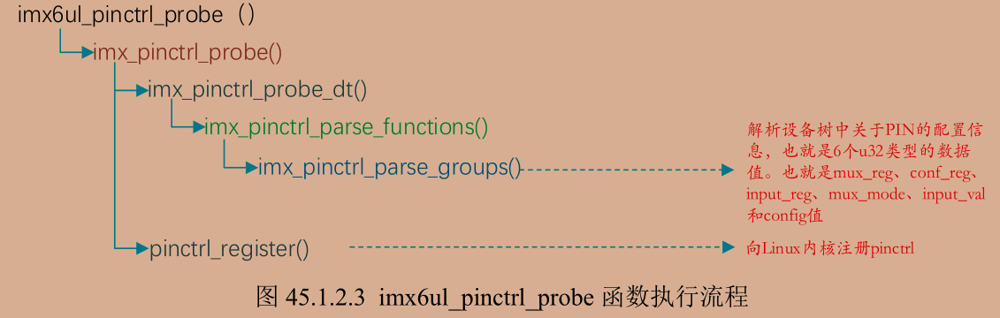
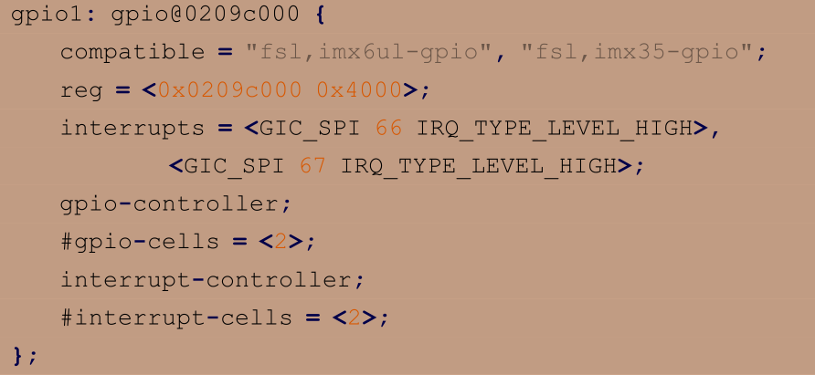

# pinctrl和gpio子系统

Linux 内核针对 PIN 的配置推出了 pinctrl 子系统，对于 G
PIO 的配置推出了 gpio 子系统

## pinctrl

设备树里面创建一个节点来描述 PIN 的配置信息。打开 imx6ull.dtsi 文件，找到一个叫做 iomuxc 的节点 这里面内容很少 但是在.dts文件中查找iomuxc节点 发现外设的PIN配置都在里面

> <mux_reg conf_reg input_reg mux_mode input_val conf_mode>;
> mux_reg是MUX寄存器偏移地址 conf_reg是PAD地址 input_reg有则设置 无则不设置 mux_mode设置MUX寄存器的值 input_val设置值
conf_mode是PAD寄存器的值

imx6ul_pinctrl_probe 函数为SOC的pin配置的入口函数 以下为调用路径



由图可见 probe函数同时调用两个函数 一个register向linux内核注册pinctrl 一个通过一系列调用最终到一个groups函数 解析6个u32类型的数据

在group函数中将 mux_reg 和 conf_reg 值会保存在 info 参数中 其他值放入到grp参数中 后面在通过结构体读取

在register函数值中有一个pctldesc参数 就是pin控制器 用于配置SOC复用功能和电气特性 这是一个pinctrl_desc类型的指针 其中重要的是三个ops结构体


这里面包含很多操作函数 完成PIN的配置 有时间再看

---

 pinctrl 设备树绑定信息可以参考文档 Documentation/devicetree/bindings/pinctrl/fsl,imx-pinctrl.txt

```dts
		pinctrl_test:testgrp{
			fsl,pins = <
			MX6UL_PAD_GPIO1_IO00__GPIO1_IO00 config
			>
		}
```

在iomuxc节点下的imx6ul-evk子节点下创建新节点 属性名一定要是fsl,pins 写入要配置的值

## gpio子系统

pinctrl 子系统重点是设置 PIN(有的 SOC 叫做 PAD)的复用
和电气属性

如果 pinctrl 子系统将一个 PIN 复用为 GPIO 的话，那么接下来就要用到 gpio 子系统了



可以看到要关注的#gpio-cells有两个参数 第一个是&gpio1 3表示是gpio1_io03这个pin 第二个是0（GPIO_ACTIVE_HIGH）高电平有效、1（GPIO_ACTIVE_LOW）低电平有效

gpio驱动程序同样也是个平台设备驱动，当设备节点与of表匹配后就会执行probe函数 重点工作是维护gpio_port 对GPIO的抽象 该结构体的bgpio_chip bgc成员变量很重要 

将gpio的寄存器组结构赋给mxc_gpio_hwdata通过该全局变量来访问对应的寄存器

接着获取设备树中的内存资源信息 platform_get_resource reg属性值即gpio1控制器的寄存器基地址 配合之前的mxc_gpio_hwdata就可以访问gpio1的所有寄存器。

调用dev_ioremap_resource进行内存映射 获取基地址对应的虚拟地址

调用platform_get_irq获取中断号 操作imr和isr寄存器 关闭所有io中断 清除状态寄存器

设置中断服务函数 接着调用bgpio_init函数第一个参数就是bgc 里面有个gc参数 即gpio_chip类型的结构体 是抽象出来的gpio控制器 内部后大量的gpio操作函数 所有gc通过获得寄存器地址的值操作函数写入到bgc参数 就可以对gpio进行操作

回到probe函数 调用函数gpiochip_add向内核注册gpio_chip 就是port->bgc.gc 注册之后就可以使用gpiolib提供的api函数

---

GPIO子系统的API函数

设置好设备树之后就可以使用API函数来指定GPIO

```c
/*
gpio_request 函数用于申请一个 GPIO 管脚，在使用一个 GPIO 之前一定要使用 gpio_request 进行申请，函数原型如下：
*/
int gpio_request(unsigned gpio, const char *label)
/*函数参数和返回值含义如下：
gpio：要申请的 gpio 标号，使用 of_get_named_gpio 函数从设备树获取指定 GPIO 属性信
息，此函数会返回这个 GPIO 的标号。
label：给 gpio 设置个名字。
返回值：0，申请成功；其他值，申请失败。
*/

/*
如果不使用某个 GPIO 了，那么就可以调用 gpio_free 函数进行释放。函数原型如下：
*/
void gpio_free(unsigned gpio)
/*
函数参数和返回值含义如下：
gpio：要释放的 gpio 标号。
返回值：无。
*/

/*
此函数用于设置某个 GPIO 为输入，函数原型如下所示：
*/
int gpio_direction_input(unsigned gpio)
/*
函数参数和返回值含义如下：
gpio：要设置为输入的 GPIO 标号。
返回值：0，设置成功；负值，设置失败。
*/

/*
此函数用于设置某个 GPIO 为输出，并且设置默认输出值，函数原型如下：
*/
int gpio_direction_output(unsigned gpio, int value)
/*
函数参数和返回值含义如下：
gpio：要设置为输出的 GPIO 标号。
value ：GPIO 默认输出值。
返回值：0，设置成功；负值，设置失败。
*/

/*
此函数用于获取某个 GPIO 的值(0 或 1)，此函数是个宏，定义所示：
*/
#define gpio_get_value __gpio_get_value
int __gpio_get_value(unsigned gpio)
/*
函数参数和返回值含义如下：
gpio：要获取的 GPIO 标号。
返回值：非负值，得到的 GPIO 值；负值，获取失败。
*/

/*
此函数用于设置某个 GPIO 的值，此函数是个宏，定义如下
*/
#define gpio_set_value __gpio_set_value
void __gpio_set_value(unsigned gpio, int value)
/*
函数参数和返回值含义如下：
gpio：要设置的 GPIO 标号。
value ：要设置的值。
返回值：无
*/
```

---

设备树中添加gpio节点模版

```dts
test
{
	pinctrl-names = "default";//此属性描述pinctrl名字
	pinctrl-0 = <&pinctrl_test>;//添加pinctrl-0节点 引用之前的pinctrl节点 表示test设备使用的PIN信息保存在该节点
	/*其他节点内容*/
	gpio = <&gpio1 0 GPIO_ACTIVE_LOW>;//所使用的gpio
};
```

常用的OF函数

```c
/*
	np:设备节点
	propname:要统计的GPIO属性
	返回值：正值 统计到的GPIO数量；负值 失败
*/
int of_gpio_named_count(struct device_node *np, const char *propname)

/*
和 of_gpio_named_count 函数一样，但是不同的地方在于，此函数统计的是“gpios”这个属性的 GPIO 数量，
而 of_gpio_named_count 函数可以统计任意属性的 GPIO 信息
*/
int of_gpio_count(struct device_node *np)

/*
	此函数获取 GPIO 编号
	np:设备节点
	propname:包含要获取GPIO信息的属性名
	index:GPIO 索引，因为一个属性里面可能包含多个 GPIO，此参数指定要获取哪个 GPIO的编号，如果只有一个 GPIO 信息的话此参数为 0。
	返回值：正值 统计到的GPIO数量；负值 失败
*/
int of_get_named_gpio(struct device_node *np,
		const char *propname,
		int index)
```

```c
/*以下内容在iomuxc节点的imx6ul-evk子节点下创建 设置复用信息和电气信息*/
pinctrl_led: ledgrp {
	fsl,pins = <
	MX6UL_PAD_GPIO1_IO03__GPIO1_IO03 0x10B0 /* LED0 */
	>;
};

/*以下内容在/根节点下创建*/
gpioled {
	#address-cells = <1>;
	#size-cells = <1>;
	compatible = "atkalpha-gpioled";
	pinctrl-names = "default";
	pinctrl-0 = <&pinctrl_led>;//设置LED所使用PIN对应的pinctrl节点
	led-gpio = <&gpio1 3 GPIO_ACTIVE_LOW>;//指定LED所使用的GPIO 在驱动程序中会获取该属性的内容来获取GPIO编号
	status = "okay";
};
```

注意PIN是否被其他外设使用 检查pinctrl设置 即搜索MX6UL_PAD_GPIO1_IO03__GPIO1_IO03这个PIN是否被其他pinctrl节点使用 有则屏蔽 接着查看是否有其他外设使用gpio引脚 即搜索gpio1 3 有则屏蔽

```c
/*重要修改*/
void led_switch(struct gpioled_dev *dev,u8 sta)
{   //LED是低电平触发
    if(sta == LEDON)
    {
        gpio_set_value(dev->led_gpio,0);/*打开led*/
    }
    else if(sta == LEDOFF)
    {
        gpio_set_value(dev->led_gpio,1); /*关闭led*/
    }
}

static ssize_t led_read(struct file *filp,char __user *buf,size_t cnt,loff_t *offt){
    struct gpioled_dev *dev = filp->private_data;
    val = gpio_get_value(dev->led_gpio);//读取值
}

static int __init led_init(void)
{
    /*入口函数具体内容*/
    int ret;
    /*设置LED所使用的GPIO*/
    /*1.获取设备树中属性数据*/
    gpioled.nd = of_find_node_by_path("/gpioed");
    if(gpioled.nd == NULL)
    {
        printk("gpioled node cant not found!\r\n");
        return -EINVAL;
    }
    else
    {
        printk("gpioled node has been found!\r\n");
    }
    /*获取设备树中GPIO属性 得到led所使用的led编号*/
    gpioled.led_gpio = of_get_named_gpio(gpioled.nd,"led-gpio",0);
    if(gpioled.led_gpio < 0)
    {
        printk("gpioled.led_gpio cant not found!\r\n");
        return -EINVAL;        
    }
    else
    {
        printk("gpioled.led_gpio has been found!\r\n");
    }
    /*设置GPIO1_IO03为输出 输出高电平 默认关闭LED*/
    ret = gpio_direction_output(gpioled.led_gpio,1);
    if(ret < 0)
    {
        printk("gpio_direction_output failed!\r\n");
        return -EINVAL;        
    }
}
```