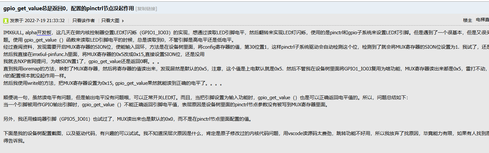

这里有大坑！

在设置pinctrl和gpio子系统后 gpio_get_value无法使用 原因是pinctrl子系统不会被gpio子系统自动调用 除非在字符设备驱动里面手动解析pinctrl节点配置

当一个引脚被用作GPIO输出引脚时，gpio_get_value（）不能正确返回引脚电平值，表层原因是设备树里面的pinctrl节点参数没有被写到MUX寄存器里面。

字符设备+gpio子系统调用的方法，是没法使用pinctrl子系统的，所以pinctrl节点里面的配置并不会生效。

如果想使用pinctrl子系统，是要使用平台驱动的