# 并发与竞争

在临界区 也就是共享数据段内必须保证一次只有一个线程访问 保证原子访问 即不可再分的基本微粒

原子操作 将C语言把代码变成汇编语言的时候可能会导致多线程的时序有问题 从而导致对临界资源异常访问 要保证变成汇编语言的时候必须作为整体运行 作为一个原子存在

以下有2组API 一组对整形变量操作 一组对位操作

```c
//要使用原子操作API函数 首先定义一个atomic_t变量
atomic_t a;
//atomic_t b = ATOMIC_INIT(0); 可以通过该函数向原子变量赋初值

/*
    对于64位数据 即atomic64_t 以下函数前缀变为atomic64_t
*/
```

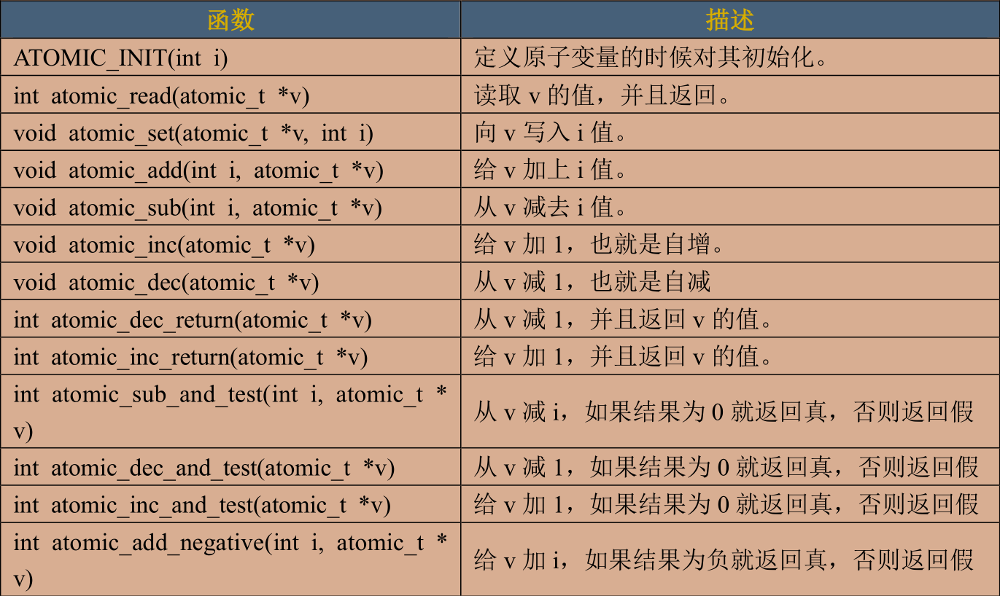

```c
atomic_t v = ATOMIC_INIT(0);
atomic_set(&v,10);//设置v=10
atomic_read(&v);//读取v
atomic_inc(&v);//v+1
```

---

位操作API 直接对内存进行操作

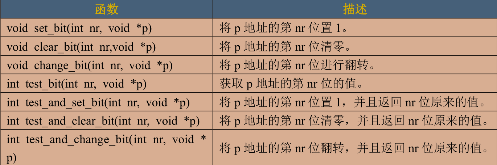

---

自旋锁

原子操作只能对整形或位进行保护 但是对于其他类型的临界区就无法作用

锁只能由一个线程获得 对于其他线程就会处于忙循环-旋转-等待状态，即不会进入休眠状态 而是会在原地等待锁 这会浪费cpu资源 降低性能 所以持有时间不能太长 即适合短时期的轻量级加锁

先定义一个spinlock_t lock；变量 接着使用API函数

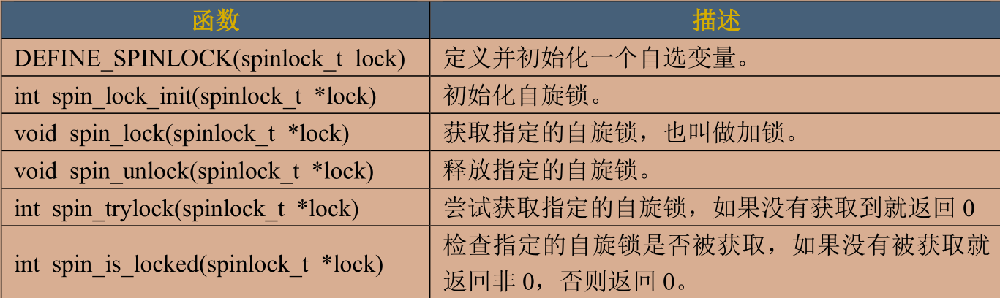

以上函数适用于SMP或支持抢占的单CPU下线程的并发访问 用于线程与线程之间 一定不能调用任何引起睡眠和阻塞的API函数 否则可能导致死锁发生

自旋锁会自动禁止内核抢占 A在持有锁的时候进入休眠状态 主动放弃CPU使用权 B开始运行 开始不断试图获得锁 但是失败 且在禁止内核抢占的情况下 A无法主动获得CPU 导致死锁发生

在中断想要访问共享数据的时候 在中断里面获得锁之前必须禁止本地中断 也就是本CPU中断 否则可能导致锁死发生

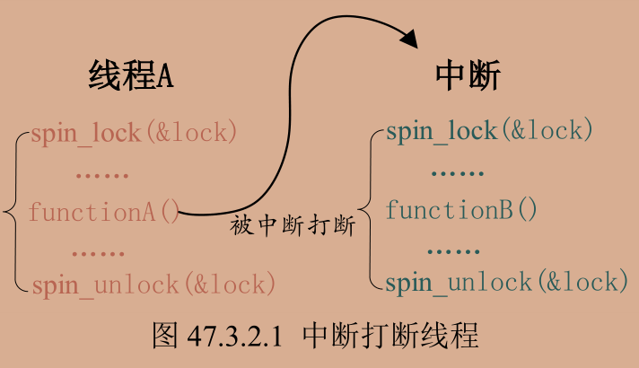

A在运行的时候被中断打断 但是中断无法获取锁 A也无法获取CPU 导致一直锁死 解决方法是关闭本地中断

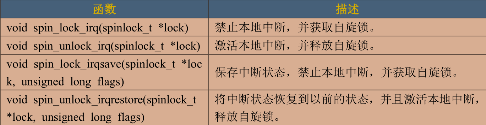

一般使用后两个 使用前两个需要用户确定加锁前的中断状态

一般在线程中使用spin_lock_irqsave/spin_unlock_irqrestore，在中断中使用 spin_lock/spin_unlock

```c
//示例
DEFINE_SPINLOCK(lock);
//线程A
void functionA()
{
    unsigned long flag;//获取中断状态
    spin_lock_irqsave(&lock,flag);//保存中断状态 加锁
    /* 临界区 */
    spin_unlock_irqrestore(&lock,flag);//释放锁
}

void irq()
{
    spin_lock(&lock);
    /* 临界区 */
    spin_unlock(&lock);
}
```

下半部也会竞争共享资源 也叫底半部 要使用自旋锁可以使用以下API

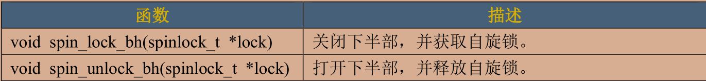

---

在自旋锁的基础上有以下几种特殊场合使用的锁

读写自旋锁 即读和写不能同时进行 可以多人读 只能单人写 API如下

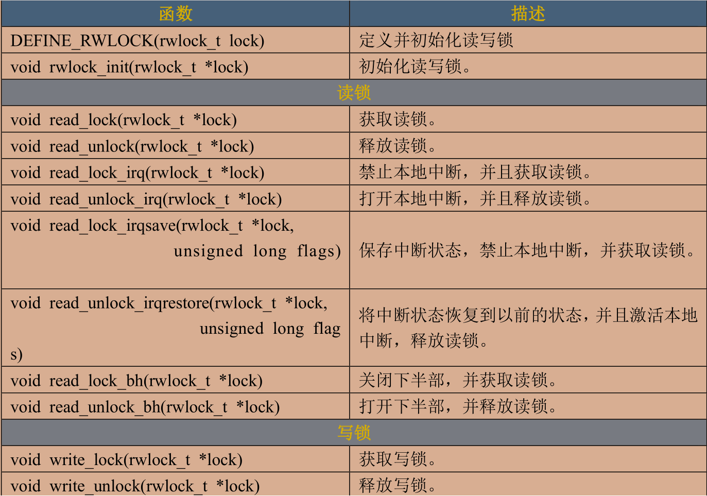


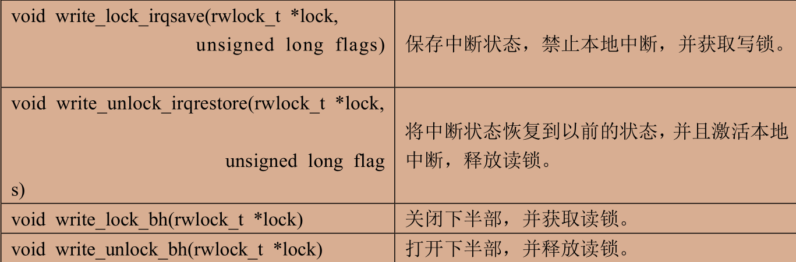

顺序锁 在读写锁的基础之上衍生 使用顺序锁可以在写的时候进行读 实现同时读写 保护的资源不能是指针 在写的时候可能导致指针失效 API如下

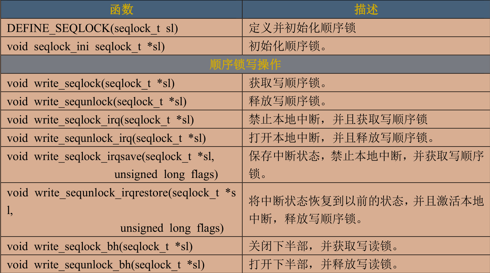


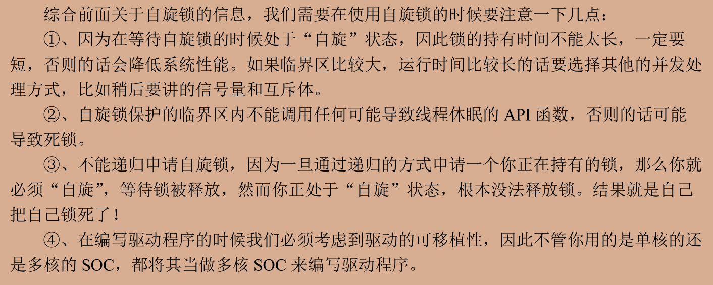

---

## 信号量

相比于自旋锁 信号量可以让进程进入休眠 但开销增大 切换进程需要开销 不能用于中断中 信号量会引起休眠 中断不能休眠 若共享资源的持有时间较短就不适合信号量 频繁的休眠切换线程的开销远大于优势 API如下：

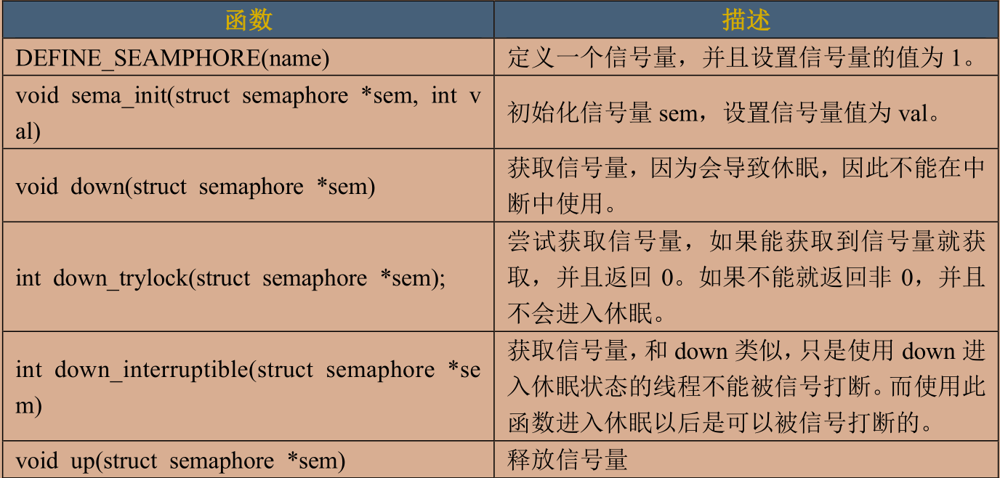

```c
//示例
DEFINE_SEAMPHORE(sem);
down(&sem);
up(&sem);
```

## 互斥量

虽然信号量可以进行互斥访问 提供了一个更为专业的方式 互斥量--mutex 一次只有一个线程可以访问共享资源 不能递归申请互斥体

使用前定义一个mutex变量 注意 mutex可以导致休眠 中断里不可使用 中断里只能使用自旋锁 保护的临界区可以调用引起阻塞的API函数 mutex不能递归上锁和解锁

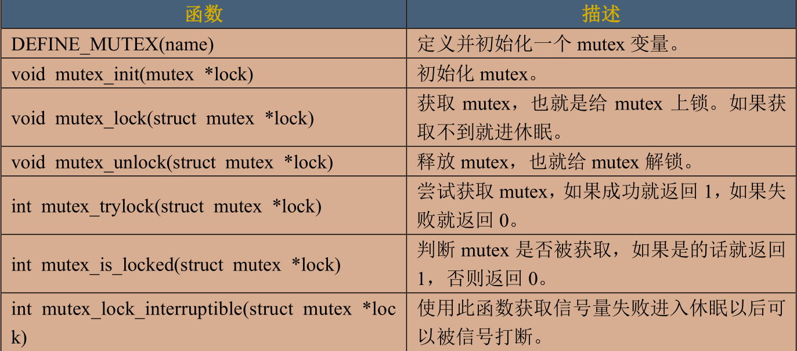

```c
DEFINE_MUTEX(lock);
mutex_lock(&lock);
mutex_unlock(&lock);
```

---

原子操作实现互斥思路：

- 在init里面初始化原子变量
- 调用open的时候先dec原子变量 如果不是负数的话就继续运行；如果返回负数则将原子变量加1 变为0返回忙 EBUSY
- close时调用atomic_inc释放lock

互斥锁实现互斥思路：

```c
//用互斥锁来保护结构体中的状态变量 即每次开锁关锁只修改状态变量
struct gpioled_dev
{
    /****************/
    int dev_stats;/*设备状态，0：设备未使用；>0设备已被使用*/
    spinlock_t lock;/*自旋锁*/
};

static int led_open(struct inode *inode,struct file *filp)
{
    unsigned long flag;
    filp->private_data = &gpioled;/*设置私有数据*/
    spin_lock_irqsave(&gpioled.lock,flag);/*上锁*/
    if(gpioled.dev_stats)/*若设备已经被使用*/
    {
        spin_unlock_irqrestore(&gpioled.lock,flag);/*解锁*/
        return -EBUSY;
    }
    gpioled.dev_stats++;
    spin_unlock_irqrestore(&gpioled.lock,flag);/*解锁*/
    /*用户实现具体功能*/
    return 0;
}

static int led_release(struct inode *inode,struct file *filp)
{
    /*用户实现具体功能*/
    struct gpioled_dev *dev = filp->private_data;
    unsigned long flag;
    spin_lock_irqsave(&dev->lock,flag);/*上锁*/
    if(dev->dev_stats)//设备正在使用
    {   
        dev->dev_stats--;
    }
    spin_unlock_irqrestore(&dev->lock,flag);/*解锁*/
    return 0;
}
```

信号量可以阻塞 因此可以直接用sem在结构体里面 在open和close函数里面分别down和up即可 down_interrupt可以被信号打断 在init函数中对sema_init进行初始化

思路与信号量一样 不可用于中断中 注意API不同