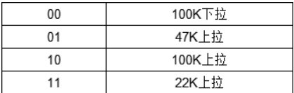
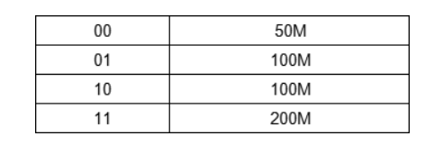
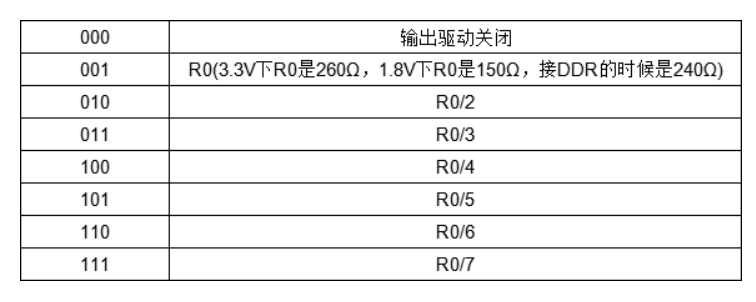

# 按键驱动程序

关于PAD寄存器的配置

HYS bit16 使能迟滞比较器 当IO作为输入功能时有效 可以滤掉一些干扰 0禁止 1开启

PUS bit15:14 设置上下拉电阻 即默认是高还是低

PUE bit13 当IO作为输入的时候 用于设置IO使用上下拉还是状态保持器 0为状态保持器 1为上下拉 当外部电路断电后可以保持以前的状态

PKE bit12 用于使能/禁止上下拉或者状态保持器功能 0禁止 1使能

ODE bit11 开漏使能 IO作为输出的时候 0禁止 1使能 开漏输出只能输出低电平 如要输出高电平需要外接上拉 优点是可以自由选择电压和电阻 常用于i2c

SPEED bit7:6 用于输出的时候 设置IO速度

DSE bit5:3 用作输出的时候 设置IO的驱动能力 简单理解为电阻大小 电阻越小驱动能力越强

SRE bit0 IO翻转速度 为1时电平跳变时间更快 为0更慢一些 波形更平缓