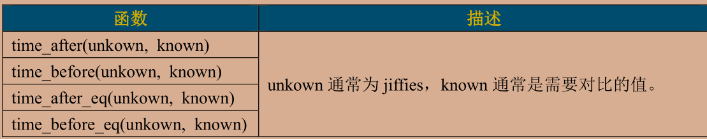
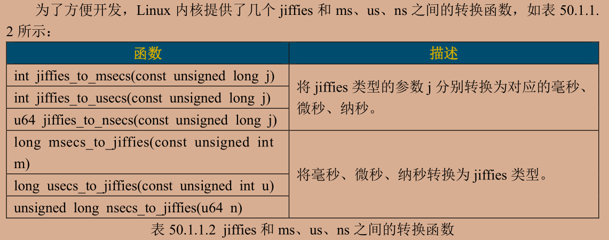
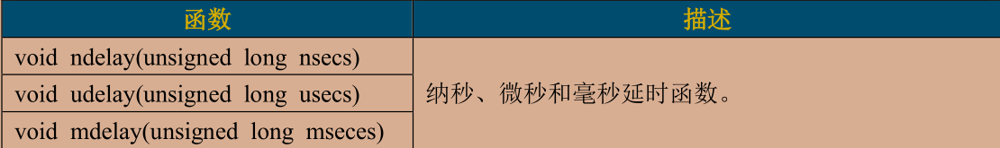

# 定时器

对于32位的jiffies有溢出的风险 49.7天就会发生绕回 以下API来处理绕回



time_after如果unknown超过known的话 就会返回真 否则返回假 如果unkown没有超过know的话time_before就返回真 以下为示例

```c
unsigned long timeout;
timeout = jiffies + (2 * HZ);//超时时间点 判断是不是超过了2s
/***********
***********/

/* 判断有没有超时 */
if(time_before(jiffies,timeout))
{
    /* 超时未发生 */
}
else
{
    /* 超时发生 */
}
```



---

## 内核定时器

只需提供超时时间和定时处理函数即可 需要注意的是内核定时器不是周期性的 若要实现周期性 需要在定时处理函数里面重新设置内核定时器 内核中使用timer_list来表示内核定时器

```c
struct timer_list {
    struct list_head entry;
    unsigned long expires; /* 定时器超时时间，单位是节拍数 */
    struct tvec_base *base;
    void (*function)(unsigned long); /* 定时处理函数 */
    unsigned long data; /* 要传递给 function 函数的参数 */
    int slack;
};
```

以下为API函数

```c
/*init_timer 函数
init_timer 函数负责初始化 timer_list 类型变量，当我们定义了一个 timer_list 变量以后一定要先用 init_timer 初始化一下。init_timer 函数原型如下：*/
void init_timer(struct timer_list *timer)
/*函数参数和返回值含义如下：
timer：要初始化定时器。
返回值：没有返回值。*/

/*add_timer 函数
add_timer函数用于向Linux 内核注册定时器，使用 add_timer函数向内核注册定时器以后，定时器就会开始运行，函数原型如下：*/
void add_timer(struct timer_list *timer)
/*函数参数和返回值含义如下：
timer：要注册的定时器。
返回值：没有返回值。*/

/*del_timer 函数
del_timer 函数用于删除一个定时器，不管定时器有没有被激活，都可以使用此函数删除。
在多处理器系统上，定时器可能会在其他的处理器上运行，因此在调用 del_timer 函数删除定时器之前要先等待其他处理器的定时处理器函数退出。del_timer 函数原型如下：*/
int del_timer(struct timer_list * timer)
/*函数参数和返回值含义如下：
timer：要删除的定时器。
返回值：0，定时器还没被激活；1，定时器已经激活。*/

/*del_timer_sync 函数
del_timer_sync 函数是 del_timer 函数的同步版，会等待其他处理器使用完定时器再删除，del_timer_sync 不能使用在中断上下文中。del_timer_sync 函数原型如下所示：*/
int del_timer_sync(struct timer_list *timer)
/*函数参数和返回值含义如下：
timer：要删除的定时器。
返回值：0，定时器还没被激活；1，定时器已经激活。*/

/*mod_timer 函数
mod_timer 函数用于修改定时值，如果定时器还没有激活的话，mod_timer 函数会激活定时器！函数原型如下：*/
int mod_timer(struct timer_list *timer, unsigned long expires)
/*函数参数和返回值含义如下：
timer：要修改超时时间(定时值)的定时器。
expires：修改后的超时时间。
返回值：0，调用 mod_timer 函数前定时器未被激活；1，调用 mod_timer 函数前定时器已被激活。*/
```

示例如下：

```c
struct timer_list timer;/*定义一个计时器*/

void function(unsigned long arg)
{
    /*
    *   定时器处理代码
    */

    /*
    *   若需要用到周期性运行就要mod_timer重新设置超市值并启用定时器
    */
   mod_timer(&dev->timertest,jiffies + msecs_to_jiffies(2000));
}

/* 初始化函数 */
void init(void)
{
    init_timer(&timer);/*初始化定时器*/

    timer.function = function;
    timer.expires = jiffies + msecs_to_jiffies(2000);/*超时时间2s*/
    time.data = (unsigned long)&dev;/*把设备结构体作为参数传入*/
    add_timer(&timer);/*启用定时器*/
}
void exit(void)
{
    del_timer(&timer);
    //或者
    del_timer_sync(&timer);
}
```

---

短延时函数API如下：



程序示例如下：

```c
#include <linux/timer.h>

#define CLOSE_CMD (_IO(0XEF, 0x1)) /* 关闭定时器 */
#define OPEN_CMD (_IO(0XEF, 0x2)) /* 打开定时器 */
#define SETPERIOD_CMD (_IO(0XEF, 0x3)) /* 设置定时器周期命令 */

    struct timer_list timer;/*定时器*/
    int timeperiod;/*定时周期 单位是ms*/

static int led_open(struct inode *inode,struct file *filp)
{
    /*用户实现具体功能*/
    filp->private_data = &gpioled;/*设置私有数据*/

    gpioled.timeperiod = 1000;/*默认周期是1s*/
    return 0;
}

/*
* @description : timer_unlocked_ioctl作为ioctl 用户态与内核态交互的函数 用户态把参数传给内核态
* @param - filp : 要打开的设备文件(文件描述符)
* @param - cmd : 应用程序发来的命令
* @param - arg : 参数
* @return : 0 成功 ；其他 失败
*/
static long timer_unlocked_ioctl(struct file *filp,unsigned int cmd,unsigned long arg)
{
    struct gpioled_dev *dev = (struct gpioled_dev *)filp->private_data;
    int timerperiod;
    unsigned long flags;

    switch (cmd)
    {
    case CLOSE_CMD:
        /* code */
        del_timer_sync(&dev->timer);
        break;
    case OPEN_CMD:
        spin_lock_irqsave(&dev->lock,flags);/*上锁*/
        timerperiod = dev->timeperiod;
        spin_unlock_irqrestore(&dev->lock,flags);/*解锁*/
        mod_timer(&dev->timer,jiffies + msecs_to_jiffies(timerperiod));/*重新设置定时器*/
    case SETPERIOD_CMD:
        spin_lock_irqsave(&dev->lock,flags);/*上锁*/
        dev->timeperiod = arg;
        spin_unlock_irqrestore(&dev->lock,flags);/*解锁*/
        mod_timer(&dev->timer,jiffies + msecs_to_jiffies(arg));/*重新设置定时器*/        
    default:
        break;
    }
    return 0;
}

/*
*   设备操作函数结构体
*/
static struct  file_operations gpioled_fops ={
    .owner = THIS_MODULE,
    .open = led_open,
    .unlocked_ioctl = timer_unlocked_ioctl,
};

/*定时器回调函数 arg是gpioled_dev的地址*/
/* 这个函数用于实现定时后要执行的操作 */
void timer_function(unsigned long arg)
{
    struct gpioled_dev *dev = (struct gpioled_dev *)arg;
    static int sta = 1;
    int timerperiod;
    unsigned long flags;

    sta =!sta;/*每次翻转*/
    gpio_set_value(dev->led_gpio,sta);
    /*重启定时器*/
    spin_lock_irqsave(&dev->lock,flags);/*上锁*/
    timerperiod = dev->timeperiod;
    spin_unlock_irqrestore(&dev->lock,flags);/*解锁*/
    mod_timer(&dev->timer,jiffies + msecs_to_jiffies(timerperiod));/*重新设置定时器*/
}

static int __init led_init(void)
{
    spin_lock_init(&gpioled.lock);
    /******************/
    /*初始化定时器*/
    init_timer(&gpioled.timer);
    gpioled.timer.function = timer_function;
    gpioled.timer.data = (unsigned long)&gpioled;
}

/* 在app中 */
while(1)
    {
        printf("input cmd:\r\n");
        printf("1:close 2:open 3:remod\r\n");

        ret = scanf("%d",&cmd);//将标准输入放入cmd中
        if(ret != 1)
        {
            printf("input again!\r\n");
        }
        if(cmd == 1)    cmd =CLOSE_CMD;
        else if(cmd ==2)    cmd =  OPEN_CMD;
        else if(cmd == 3)
        {
            cmd = SETPERIOD_CMD;
            printf("input timer period:\r\n");
            ret = scanf("%d",&arg);//将标准输入放入arg中
        }
        ioctl(fd,cmd,arg);   /*调用参数传给驱动 从用户态到内核态*/
    }
```