# 1. 什么是进程？

process是指正在运行的程序

程序是静态的 进程是动态的

```c
int main(int argc,char **argv[])
{
    /*  
        根据传入的命令启动一个进程
        参数：传入可执行的Shell命令 
        return:成功返回0 不支持shell返回-1 失败返回非零
    */
    int ret = system("ping -c  10 www.baidu.com");
    if(ret != 0)
    {
        printf("执行命令失败");
        return 1;
    }
    return 0;
}
```

---
该代码会创建一个进程来执行shell指令
> 通过指令  
> ps-ef 可以查看进程的pid升序排序 越晚创建的进程pid越大

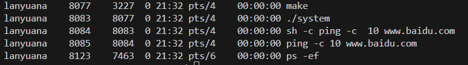

可以看到程序进程会启动子进程8084（sh -c ping -c  10 <http://www.baidu.com）>

这个子进程又会启动子进程（ping -c 10 <http://www.baidu.com）>

---
***system函数用到的系统调用为fork execve waitpid***

main函数有两种形式
> int main(void) 或int main()
>
> int main(int argc,char **argv[])

前者表示main不接受命令行参数

后者：  

1. argc:传递给程序的命令行参数的数量
2. argv是指向字符串的指针，存储了命令行参数

    a. argv[0]通常是程序的名称  
    b. argv[1]到argv[argc-1]是实际命令行参数

---

fork函数

返回值是pid_t类型   实际是int的别名

```c
/**
 * @brief 创建一个子进程(相当于复制,包括内存空间)
 * void: 不需要填写参数
 *  
 * @return pid_t pid_t(int值) 
 *  (1) 在父进程中 返回子进程的PID
 *  (2) 在子进程中 返回0
 *  (3) 发生错误 返回-1
 */
pid_t fork(void);
```

---
getpid

```c
#include <sys/types.h>
#include <unistd.h>

/**
 * @brief 返回调用进程的PID
 * 
 * @return pid_t 不会失败，必然返回进程PID
 */
pid_t getpid(void);
```

---
getppid();

```c
#include <sys/types.h>
#include <unistd.h>

/**
 * @brief 返回调用进程父进程的PID
 * 
 * @return pid_t 不会失败，必然返回父进程PID，即PPID
 */
pid_t getppid(void);
```

示例程序

```c
#include <stdio.h>
#include <sys/types.h>
#include <unistd.h>
int main()
{
    printf("返回调用进程的pid:%d\n",getpid());
    pid_t pid = fork();
    if (pid < 0)
    {
        //创建新进程失败
        printf("新进程创建失败\n");
        return 1;
    }
    else if(pid == 0)
    {
        printf("新进程%d创建成功,他是由父进程%d创建的\n",getpid(),getppid());
    }
    else
    {
        printf("父进程%d继续运行,他的pid是%d\n",getpid(),pid);        
    }
    return 0;
}
```

以上程序的结果为

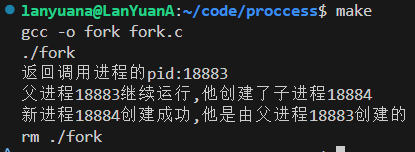

其流程是 先查看父进程的pid，这是子进程的进程ID 该值大于0 所以执行else语句

`printf("父进程%d继续运行,他的pid是%d\n",getpid())`

执行fork语句后 复制父进程代码 从fork()后开始执行子进程pid == 0 执行pid == 0的分支

`printf("新进程%d创建成功,他是由父进程%d创建的\n"`

---

sleep(unsigned int seconds)函数

```c
#include <unistd.h>

/**
 * 整个进程睡眠指定秒数,如果在sleep()期间进程接收到信号,且信号有相应的处理函数,则sleep()可能提前结束,并返回剩余未休眠的时间
 * 
 * int seconds: 暂停的秒数
 * return: unsigned int 如果sleep()函数正常执行且休眠时间结束,则返回0;如果sleep()由于接收到信号而被提前唤醒,则返回剩余的未休眠秒数
 */
unsigned int sleep(unsigned int seconds);
```

```c
#include <sys/stat.h>
#include <stdio.h>
#include <stdlib.h> 
#include <unistd.h>
#include <fcntl.h>
#include <string.h>
int main(int argc, char const *argv[])
{
    //fork之前
    //打开一个文件
    int fd;
    fd = open("io.txt" , O_CREAT | O_WRONLY | O_APPEND,0644);
    if(fd == -1)
    {
        perror("open");
        exit(EXIT_FAILURE);
    }
    //缓存区存放写出的数据
    char buf[1024];
    pid_t pid = fork();
    if(pid < 0 )
    {
        perror("fork");
        exit(EXIT_FAILURE);
    }
    else if(pid == 0)
    {
        //子进程代码
        strcpy(buf,"这是子进程写入的数据\n");
    }
    else
    {
        //父进程代码
        sleep(1);
        strcpy(buf,"这是父进程写入的数据\n");
    }

    //父子进程都要执行的代码
    ssize_t bytes_write = write(fd,buf,strlen(buf));
    if(bytes_write == -1)
    {
        perror("write");
        close(fd);
        exit(EXIT_FAILURE);
    }
    else
    {
        printf("写入数据成功\n");
    }
    //使用结束后关闭
    close(fd);
    if(pid == 0)
    {
        //子进程要执行的代码
        printf("子进程写入完毕 释放了文件描述符\n");
    }
    else
    {
        //父进程要执行的代码
        printf("父进程写入完毕 释放了文件描述符\n");
    }
    return 0;
}
```

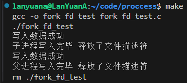

这里子程序先写入是因为父程序休眠了1s

fork会复制父进程的所有资源 同时指向相同f_path

为什么子进程释放了fd后父程序仍然可以继续写入？两者应该是指向同一个struct file结构体

struct file结构体有一项属性是引用计数 记录当前struct file绑定的文件描述符数量 close()系统调用是将当前进程的文件描述符和对应的struct file解绑 使得引用计数值-1 若close()执行后 引用计数变为0 则会释放struct file所有资源

---

***execve()可用于同进程的程序跳转***

```c
#include <stdio.h>
#include <stdlib.h>
#include <unistd.h>
int main(int argc, char *argv[])
{
    /*exec系列函数  父进程跳转进入一个新进程推荐使用execve
    char *__path: 需要执行程序的完整路径名
    char *const __argv[]: 指向字符串数组的指针 需要传入多个参数
        (1) 需要执行的程序命令(同*__path)
        (2) 执行程序需要传入的参数
        (3) 最后一个参数必须是NULL
    char *const __envp[]: 指向字符串数组的指针 需要传入多个环境变量参数
        (1) 环境变量参数 固定格式 key=value
        (2) 最后一个参数必须是NULL
    return: 成功就回不来了 下面的代码都没有意义
            失败返回-1
    int execve (const char *__path, char *const __argv[], char *const __envp[]) 
    */
    char *name = "进程1";
    printf("我是%s,进程号pid是%d 现在在execve程序\n", name ,getpid());
    char *args[]={"/home/lanyuana/code/proccess/erlou",name ,NULL};
    char *envs[]={"PATH=/usr/local/sbin:/usr/local/bin:/usr/sbin:/usr/bin:/sbin:/bin:/usr/games:/usr/local/games:/snap/bin",NULL};
    int re = execve(args[0],args,envs);
    if (re == -1)
    {
        printf("跳转二楼失败\n");
        return -1;
    }
    return 0;
}
```

该程序可以跳转到路径下的程序运行 其结果如下图：

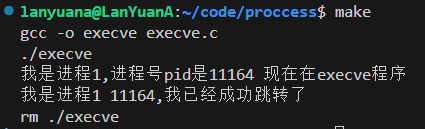

可以看到两个程序用同一个进程

---

***execve和fork一起使用可以让子进程跳转代码 而自身不变***

```c
#include <stdio.h>
#include <unistd.h>
#include <stdlib.h>
#include <sys/types.h>

/*  实现父进程创建一个子进程跳转到erlou 而自己保持不变

*/

int main(int argc, char const *argv[])
{
    char *name="父进程";
    printf("我是%s,%d,现在在父进程\n",name,getpid());
    pid_t pid = fork();
    if(pid < 0 )
    {
        printf("子进程创建失败\n");
        exit(EXIT_FAILURE);
    }
    else if(pid == 0)
    {
        //子进程要执行的代码
        char *name1 = "子进程";
        char *args[]={"/home/lanyuana/code/proccess/erlou",name1 ,NULL};
        char *envs[]={"PATH=/usr/local/sbin:/usr/local/bin:/usr/sbin:/usr/bin:/sbin:/bin:/usr/games:/usr/local/games:/snap/bin",NULL};
        int ret = execve(args[0],args,envs);
        if(ret < 0)
        {
            printf("子进程跳转失败\n");
            exit(EXIT_FAILURE);
        }
        return 0;
    }
    else
    {
        //父进程要执行的代码
        sleep(1);
        printf("我是%s,%d,我仍在父进程\n",name,getpid());
    }
    return 0;
}
```

其结果如下图：

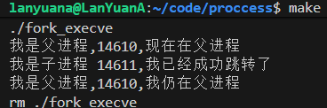

---

***waitpid( )***

父进程要负责对子进程的回收工作 不然子进程就会进入一个僵尸过程--程序执行完毕但是进程未结束 其内核的PCB结构体仍未释放 若父进程在子进程之前结束 其回收工作就会交给父进程的父进程...

```c
#include <sys/types.h>
#include <sys/wait.h>

/** 等待子进程的终止并获取子进程的退出状态
*    功能简单 没有选择
*/
pid_t wait(int *wstatus);
/**
 * 功能灵活 可以设置不同的模式 可以等待特定的子进程
 * 
 * pid: 等待的模式
 *      (1) 小于-1 例如 -1 * pgid，则等待进程组ID等于pgid的所有进程终止
 *      (2) 等于-1 会等待任何子进程终止，并返回最先终止的那个子进程的进程ID -> 儿孙都算
 *      (3) 等于0 等待同一进程组中任何子进程终止（但不包括组领导进程） -> 只算儿子
 *      (4) 大于0 仅等待指定进程ID的子进程终止
 * wstatus: 整数指针，子进程返回的状态码会保存到该int
 * options: 选项的值是以下常量之一或多个的按位或（OR）运算的结果;二进制对应选项,可多选：
 *      (1) WNOHANG 如果没有子进程终止，也立即返回;用于查看子进程状态而非等待
 *      (2) WUNTRACED 收到子进程处于收到信号停止的状态，也返回。
 *      (3) WCONTINUED（自Linux 2.6.10起）如果通过发送SIGCONT信号恢复了一个已停止的子进程，则也返回。
 * return: (1) 成功等到子进程停止 返回pid
 *         (2) 没等到并且没有设置WNOHANG 一直等
 *         (3) 没等到设置WNOHANG 返回0
 *         (4) 出错返回-1
 */
pid_t waitpid(pid_t pid, int *wstatus, int options);

/*
    更加全面的子进程监控和状态报告
*/
int waitid(idtype_t idtype, id_t id, siginfo_t *infop, int options);

```

```c
#include <stdio.h>
#include <unistd.h>
#include <stdlib.h>
#include <sys/types.h>
#include <sys/wait.h>
/*  实现父进程创建一个子进程跳转到erlou 而自己保持不变

*/

int main(int argc, char const *argv[])
{
    int process_status;
    char *name="父进程";
    printf("我是%s,%d,现在在父进程\n",name,getpid());
    pid_t pid = fork();
    if(pid < 0 )
    {
        perror("fork");
        exit(EXIT_FAILURE);
    }
    else if(pid == 0)
    {   
        //子进程要执行的代码
        //char *name1 = "子进程";
        char *args[]={"/usr/bin/ping","-c","5","www.baidu.com",NULL};
        char *envs[]={"PATH=/usr/local/sbin:/usr/local/bin:/usr/sbin:/usr/bin:/sbin:/bin:/usr/games:/usr/local/games:/snap/bin",NULL};
        printf("子进程%d ping5次www.baidu.com\n",getpid());
        int ret = execve(args[0],args,envs);
        if(ret < 0)
        {
            perror("execve");
            exit(EXIT_FAILURE);
        }
        return 0;
    }
    else
    {
        //父进程要执行的代码
        printf("我是%s,%d,我在等待子进程%d结束\n",name,getpid(),pid);
        waitpid(pid,&process_status,WUNTRACED);
    }
    printf("父进程等待子进程结束完毕\n");
    return 0;
}
```

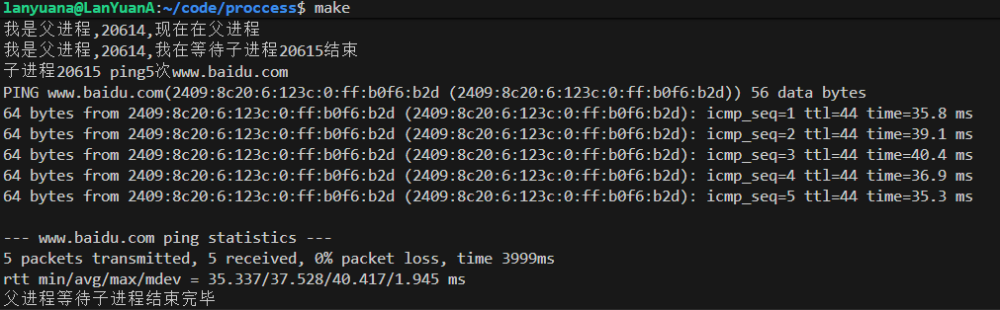

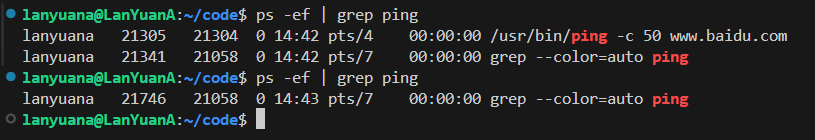

上图可以看到在子程序执行期间父进程一直等待 在子进程运行完毕后全部销毁 运行结束 由其父进程进行回收

---

***1号进程是systemd 由内核创建 是第一个进程 负责初始化系统 是所有进程的祖先***

***在ps -ef命令中 CMD带有[]的属于内核线程 但表现是独立的进程 第一个内核线程pid是2 是其他内核线程的祖先***

pstree -p可以查看当前进程之间的依赖关系

---

---

***孤儿进程***

当父进程已结束或终止 但他仍在运行的进程

即父进程结束之前未等待子进程结束就已经退出 此时子进程就会变成孤儿进程

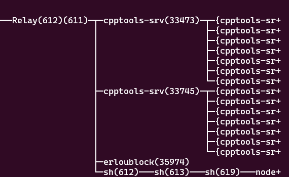

可以看到子进程被祖先自动领养了 因为此时子进程和终端切断了关系就不能再进行标准输入来使其停止运行了 写代码的时候一定要避免孤儿进程的情况出现

---

## 进程间通信

进程的内存是隔离的 要实现多个进程之间的信息交换 方式有以下几种：

- Unix Domain Socket IPC
- 管道(有名管道、无名管道)
- 共享内存
- 消息队列
- 信号量

此处的Unix Domain Socket IPC（Inter-Process Communication 进程间通信）和信号量在后续章节再学习

- 消息队列：允许进程以消息的形式交换数据，这些消息存储在队列中，直到它们被接收。
- 信号量：主要用于进程间的同步，防止多个进程同时访问相同的资源。
- 共享内存：允许多个进程访问同一块内存区域，提供了一种非常高效的数据共享方式。

---

### 匿名管道（Pipe）

perror( )
```c
/**
     * 输出错误信息报告到系统的错误输出
     * char *__s: 自定义的错误信息前缀 会打印在输出的前面 中间补充": " 后面跟errno
     * 隐藏参数: errno 用于保存错误信息的全局变量 系统调用和库函数出错会将信息存储到这里
     * void perror (const char *__s)
    */
```

系统调用pipe( )

```c
#include <unistd.h>

/**
 * 在内核空间创建管道，用于父子进程或者其他相关联的进程之间通过管道进行双向的数据传输。。
 * 
 * pipefd: 用于返回指向管道两端的两个文件描述符。pipefd[0]指向管道的读端。pipefd[1]指向管道的写端。
 * return: 成功   0
 *         不成功 -1，并且pipefd不会改变
 */
int pipe(int pipefd[2]);
```

在读写的时候要关闭另一端

```c
#include <sys/types.h>
#include <sys/wait.h>
#include <stdio.h>
#include <stdlib.h>
#include <unistd.h>
#include <string.h>

int main(int argc, char const *argv[])
{
    /* 父进程将argv[1]写入匿名管道 子进程读取并输出到控制台*/
    //pipefd[0]是读端 pipefd[1]是写端
    int pipefd[2];
    char buf;
    int status;
    if(argc != 2)
    {
        perror("请填写要传递的信息\n");
        exit(EXIT_FAILURE);
    }
    if(pipe(pipefd) == -1) //这边开始创建管道
    {
        perror("创建管道失败\n");
        exit(EXIT_FAILURE);
    }
    pid_t pid = fork();
    if(pid == -1)
    {
        perror("fork");
        exit(EXIT_FAILURE);
    }
    else if(pid == 0)
    {   //子进程要执行的代码 读数据并输出到控制台
        //关闭管道写端
        close(pipefd[1]);
        //从管道里读数据存放到缓冲区
        printf("子进程%d接受到数据\n",getpid());
        ssize_t ret = read(pipefd[0],&buf,strlen(&buf));
        if(ret >= 0)
        {
            printf("成功读取到数据 下面开始打印接受到的数据\n");
        }
        else if(ret == -1)
        {
            perror("read");
            exit(EXIT_FAILURE);
        }
        ssize_t re = write(STDOUT_FILENO,&buf,strlen(&buf));
        if(re < 0)
        {
            perror("输出到控制台\n");
            close(pipefd[0]);
            exit(EXIT_FAILURE);
        }
        write(STDOUT_FILENO,"\n",1);
        printf("数据已全部输出到控制台\n");
        close(pipefd[0]);
        exit(EXIT_SUCCESS);
    }
    else
    {   //父进程要执行的代码 往管道里写数据 要关闭读端
        close(pipefd[0]);
        //写传入的参数到管道的写端 argv[1]是要发送的数据
        printf("父进程%d发送数据\n",getpid());
        write(pipefd[1],argv[1],strlen(argv[1]));
        //写完关闭管道写端
        close(pipefd[1]);
        //等待子进程结束
        waitpid(pid,&status,WUNTRACED);
    }
    return 0;
}
```

上述程序结果如下图：
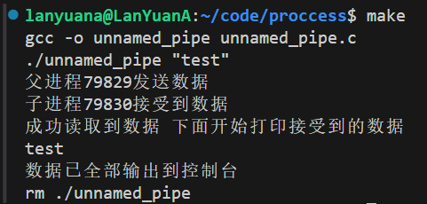

其思路为 父进程往管道内写入数据 子进程读出数据并打印到控制台

要注意的是父进程要等待子进程结束回收子进程 不然控制台只会收到一个字节甚至没有

限制：

- 管道只能实现单向通信 即只能一方读 一方写 如果要实现父进程也要读数据就要另开一个管道
- 读写端要通过文件描述符来实现 要通信的两个进程要通过共同祖先来继承文件描述符 上述例子是父进程把文件描述符传递给了子进程来实现两者通信 也可以父进程fork两次 让两个子进程之间来通信 总之需要fork传递文件描述符来使两个进程都访问同一个管道
- pipe只能在有父子关系的进程间使用

---

### 有名管道（FIFO）

有名管道即FIFO（先进先出队列），提供了双向进程间的通信渠道，和匿名管道一样 只能应用于单向通信 否则可能出现通信混乱（读到自己发的数据）

但是有名管道可以用于任何进程之间的通信 即不依赖相同的文件描述符

库函数mkfifo()

```c
#include <sys/types.h>
#include <sys/stat.h>

/**
 * @brief 用于创建有名管道。该函数可以创建一个路径为pathname的FIFO专用文件，mode指定了FIFO的权限，FIFO的权限和它绑定的文件是一致的。FIFO和pipe唯一的区别在于创建方式的差异。一旦创建了FIFO专用文件，任何进程都可以像操作文件一样打开FIFO，执行读写操作。
 * 
 * @param pathname 有名管道绑定的文件路径
 * @param mode 有名管道绑定文件的权限
 * @return int 
 */
int mkfifo(const char *pathname, mode_t mode);
```

```c
//fifo_write
#include <fcntl.h>
#include <unistd.h>
#include <stdio.h>
#include <sys/stat.h>
#include <stdlib.h>
#include <string.h>
#include <errno.h>
int main()
{
    int fd;
    char *pipe_path = "/tmp/myfifo";
    //创建有名管道 其权限为0644
    if(mkfifo(pipe_path,0644) != 0)
    {
        perror("mkfifo failed");
        if (errno != 17)
        {
            exit(EXIT_FAILURE);
        }
    }
    //管道创建成功 写入数据
    fd = open(pipe_path,O_WRONLY); //fd指向pipe_path
    if(fd == -1)
    {
        perror("发送端open");
        exit(EXIT_FAILURE);
    }

    char buf[100];
    ssize_t ret = read(STDIN_FILENO,buf,sizeof(buf));
    if(ret == -1)
    {
        perror("发送端read");
        exit(EXIT_FAILURE);
        close(fd);
    }
    ssize_t re = write(fd,buf,strlen(buf));
    if(re == -1)
    {
        perror("发送端write");
        exit(EXIT_FAILURE);
        close(fd);
    }

    printf("已经写入pipe_path,等待接收\n");
    close(fd);
    return 0;
}
```

```c
//fifo_read
#include <fcntl.h>
#include <unistd.h>
#include <stdio.h>
#include <sys/stat.h>
#include <stdlib.h>
#include <string.h>
#include <errno.h>
int main()
{
    int fd;
    char *pipe_path = "/tmp/myfifo";
    //打开有名管道 用于读取
    fd = open(pipe_path,O_RDONLY); //fd指向pipe_path
    if(fd == -1)
    {
        perror("接收端open");
        exit(EXIT_FAILURE);
    }

    char buf[100];
    ssize_t ret = read(fd,buf,sizeof(buf));
    if(ret == -1)
    {
        perror("接收端read");
        exit(EXIT_FAILURE);
        close(fd);
    }
    ssize_t re = write(STDOUT_FILENO,buf,strlen(buf));
    if(re == -1)
    {
        perror("接收端write");
        exit(EXIT_FAILURE);
        close(fd);
    }

    printf("已经写入到控制台\n");
    close(fd);
    return 0;
}
```

发送端会在pipe_path目录下创建一个有名管道 只要发送端和接收端连接到该目录就可以进行单向通信

在bash中运行两个程序 在发送端写入数据就可以在接收端查看到

注意 此时若再次使用mkfifo()函数 即重新启动fifo_write程序时会报错
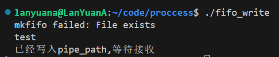

原因是程序执行完毕后该文件未被清除 在使用完有名管道后要通过unlink来清除相关资源 该函数只能调用一次 再次调用会报错

```c
#include <unistd.h>
/**
 * @brief 从文件系统中清除一个名称及其链接的文件
 * 
 * @param pathname 文件路径
 * @return int 成功返回0，失败返回-1，并设置errno
 */
int unlink(const char *pathname);
```

该函数加在fifo_write结尾
示例

```c
/*********code**********/
if(unlink(pipe_path)==-1)
{
    perror("fifo_write unlink");
}
```

注意 在open()有名管道的时候 flags设置为O_RDWR从技术上是可行的 但是可能导致一个进程读取到自己发送的数据 所以打开有名管道的时候 flag只能是O_WRONLY或者O_RDONLY

内核为每一个fifo文件维护一个管道对象 当进程通过fifo交换数据的时候 内核会在内部传递所有数据 不会将其写入文件系统 因此/tmp/myfifo文件大小始终为0

---

### 共享内存

shm_open和shm_unlink函数

```c
#include <sys/mman.h>

/**
 * const char *name: 这是共享内存对象的名称，直接写一个文件名称，本身会保存在 /dev/shm 。名称必须是唯一的，以便不同进程可以定位同一个共享内存段。
 * 命名规则：必须是以正斜杠/开头，以\0结尾的字符串，中间可以包含若干字符，但不能有正斜杠
 * int oflag: 打开模式 二进制可拼接
 *      (1) O_CREAT：如果不存在则创建新的共享内存对象
 *      (2) O_EXCL：当与 O_CREAT 一起使用时，如果共享内存对象已经存在，则返回错误（避免覆盖现有对象）
 *      (3) O_RDONLY：以只读方式打开
 *      (4) O_RDWR：以读写方式打开
 *      (5) O_TRUNC 用于截断现有对象至0长度（只有在打开模式中包含 O_RDWR 时才有效）。
 * mode_t mode: 当创建新共享内存对象时使用的权限位，类似于文件的权限模式,一般0644即可
 * * return: 成功执行,它将返回一个新的描述符;发生错误,返回值为 -1
*/
int shm_open(const char *name, int oflag, mode_t mode);

/**
 * 
 * 删除一个先前由 shm_open() 创建的命名共享内存对象。尽管这个函数被称为“unlink”，但它并没有真正删除共享内存段本身，而是移除了与共享内存对象关联的名称，使得通过该名称无法再打开共享内存。当所有已打开该共享内存段的进程关闭它们的描述符后，系统才会真正释放共享内存资源
 *
 * char *name: 要删除的共享内存对象名称
 * return: 成功返回0 失败返回-1
 */
int shm_unlink(const char *name);
```

```c
#include <unistd.h>
#include <sys/types.h>

/**
 * 将指定文件扩展或截取到指定大小
 * 
 * char *path: 文件名 指定存在的文件即可 不需要打开
 * off_t length: 指定长度 单位字节
 * return: int 成功 0
 *             失败 -1
 */
int truncate(const char *path, off_t length);
/**
 *  将指定文件描述符扩展或截取到指定大小
 * 
 * int fd: 文件描述符 需要打开并且有写权限
 * off_t length: 指定长度 单位字节
 * return: int 成功 0
 *             失败 -1
 */
int ftruncate(int fd, off_t length);
```

truncate和ftruncate都可以将文件缩放到指定大小，二者的行为类似：如果文件被缩小，截断部分的数据丢失，如果文件空间被放大，扩展的部分均为\0字符。缩放前后文件的偏移量不会更改。缩放成功返回0，失败返回-1。

不同的是，前者需要指定路径，而后者需要提供文件描述符；ftruncate缩放的文件描述符可以是通过shm_open()开启的内存对象，而truncate缩放的文件必须是文件系统已存在文件，若文件不存在或没有权限则会失败。

```c
#include <sys/mman.h>

/**
 * 将文件映射到内存区域,进程可以直接对内存区域进行读写操作,就像操作普通内存一样,但实际上是对文件或设备进行读写,从而实现高效的 I/O 操作
 * 
 * void *addr: 指向期望映射的内存起始地址的指针,通常设为 NULL,让系统选择合适的地址
 * size_t length: 要映射的内存区域的长度,以字节为单位
 * int prot: 内存映射区域的保护标志,可以是以下标志的组合
 *          (1) PROT_READ: 允许读取映射区域
 *          (2) PROT_WRITE: 允许写入映射区域
 *          (3) PROT_EXEC: 允许执行映射区域
 *          (4) PROT_NONE: 页面不可访问
 * int flags：映射选项标志
 *          (1) MAP_SHARED: 映射区域是共享的,对映射区域的修改会影响文件和其他映射到同一区域的进程(一般使用共享)
 *          (2) MAP_PRIVATE: 映射区域是私有的,对映射区域的修改不会影响原始文件,对文件的修改会被暂时保存在一个私有副本中
 *          (3) MAP_ANONYMOUS: 创建一个匿名映射,不与任何文件关联
 *          (4) MAP_FIXED: 强制映射到指定的地址,如果不允许映射,将返回错误
 * int fd: 文件描述符,用于指定要映射的文件或设备,如果是匿名映射,则传入无效的文件描述符（例如-1）
 * off_t offset: 从文件开头的偏移量,映射开始的位置
 * return void*: (1) 成功时,返回映射区域的起始地址,可以像操作普通内存那样使用这个地址进行读写
 *               (2) 如果出错,返回 (void *) -1,并且设置 errno 变量来表示错误原因
 */
void *mmap(void *addr, size_t length, int prot, int flags,
           int fd, off_t offset);
/**
 * 用于取消之前通过 mmap() 函数建立的内存映射关系
 * 
 * void *addr: 这是指向之前通过 mmap() 映射的内存区域的起始地址的指针,这个地址必须是有效的,并且必须是 mmap() 返回的有效映射地址
 * size_t length: 这是要解除映射的内存区域的大小(以字节为单位),它必须与之前通过 mmap() 映射的大小一致
 * return: int 成功 0
 *             失败 -1
 */
int munmap(void *addr, size_t length);
```

```c
#include <stdio.h>
#include <stdlib.h>
#include <unistd.h>
#include <fcntl.h>
#include <sys/mman.h>
#include <sys/wait.h>
#include <string.h>

int main()
{   
    char *share;
    char shmname[100] = {0};
    sprintf(shmname,"/letter%d",getpid());
    //创建共享内存的文件描述符
    int fd = shm_open(shmname, O_CREAT | O_RDWR ,0644);
    if(fd < 0)
    {
        perror("共享内存开启失败\n");
        exit(EXIT_FAILURE);
    }   
    //将该区域扩展至100字节
    ftruncate(fd,100);
    //读写方式映射该区域到内存 开启父子共享标签 偏移量从零开始
    share = mmap(NULL,100,PROT_READ | PROT_WRITE ,MAP_SHARED,fd,0);
    if(share == MAP_FAILED)
    {
        perror("共享内存对象映射到内存失败\n");
        exit(EXIT_FAILURE);
    }
    //映射区开启完毕后关闭读取连接 不是删除
    close(fd);
    //创建子进程
    pid_t pid = fork();
    if(pid < 0 )
    {
        perror("子进程创建失败");
    }
    else if(pid == 0)
    {
        //子进程要执行的代码
        strcpy(share,"这是子进程写入的\n");
        printf("子进程完成写入\n");
    }
    else
    {
        //父进程要执行的代码
        wait(NULL);
        printf("父进程%d看到子进程%d写入共享内存的内容:%s",getpid(),pid,share);
        //释放映射区
        int ret = munmap(share,100);
        if(ret < 0 )
        {
            perror("释放映射区");
            exit(EXIT_FAILURE);
        }
    }
    //释放共享内存
    shm_unlink(shmname);
    return 0;
}
```

其结果如下图：
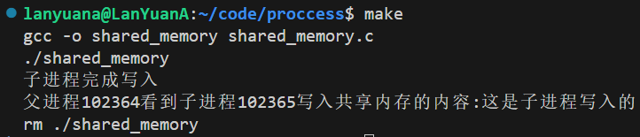

其流程大致为以下步骤：

- 创建共享内存的名称后打开共享内存
- 通过truncate或者ftruncate截断或扩展字节
- mmap将共享内存映射到内存 通过share（自己定义的）来记录
- 映射完毕后关闭文件描述符
- 子进程往share开始的内存写入数据
- 父进程等待子进程写入完毕后读取内存
- 释放映射区munmap 共享内存shm_unlink

Linux的临时文件系统（tmpfs）是一种基于内存的文件系统，它将数据存储在RAM或者在需要时部分使用交换空间（swap）。tmpfs访问速度快，但因为存储在内存，重启后数据清空，通常用于存储一些临时文件。

内存共享对象在临时文件系统重的表示在/dev/shm目录下

---

### 消息队列

相关数据类型

> typedef int mqd_t

该类型定义在mqueue.h中用于记录消息队列描述符 实际是int的别名

> struct mq_attr

```c
/**
 * @brief 消息队列的属性信息
 * mq_flags 标记，对于mq_open，忽略它，因为这个标记是通过前者的调用传递的
 * mq_maxmgs 队列可以容纳的消息的最大数量
 * mq_msgsize 单条消息的最大允许大小，以字节为单位
 * mq_curmsgs 当前队列中的消息数量，对于mq_open，忽略它
 */
struct mq_attr {
long mq_flags;   /* Flags (ignored for mq_open()) */
long mq_maxmsg;  /* Max. # of messages on queue */
long mq_msgsize; /* Max. message size (bytes) */
long mq_curmsgs; /* # of messages currently in queue
                (ignored for mq_open()) */
};
```

> struct timespec

```c
/**
 * @brief 时间结构体，提供了纳秒级的UNIX时间戳
 * tv_sec 秒
 * tv_nsec 纳秒
 */
struct timespec {
time_t tv_sec;        /* seconds */
long   tv_nsec;       /* nanoseconds */
};
```

相关系统调用

```c
//mq_open
#include <fcntl.h>    /* For O_* constants */
#include <sys/stat.h> /* For mode constants */
#include <mqueue.h>

/**
 * @brief 创建或打开一个已存在的POSIX消息队列，消息队列是通过名称唯一标识的。
 *
 * @param name 消息队列的名称
 * 命名规则：必须是以正斜杠/开头，以\0结尾的字符串，中间可以包含若干字符，但不能有正斜杠
 * @param oflag 指定消息队列的控制权限，必须也只能包含以下三者之一
 * O_RDONLY 打开的消息队列只用于接收消息
 * O_WRONLY 打开的消息队列只用于发送消息
 * O_RDWR 打开的消息队列可以用于收发消息
 * 可以与以下选项中的0至多个或操作之后作为oflag
 * O_CLOEXEC 设置close-on-exec标记，这个标记表示执行exec时关闭文件描述符
 * O_CREAT 当文件描述符不存在时创建它，如果指定了这一标记，需要额外提供mode和attr参数
 * O_EXCL 创建一个当前进程独占的消息队列，要同时指定O_CREAT，要求创建的消息队列不存在，否则将会失败，并提示错误EEXIST
 * O_NONBLOCK 以非阻塞模式打开消息队列，如果设置了这个选项，在默认情况下收发消息发生阻塞时，会转而失败，并提示错误EAGAIN
 * @param mode 每个消息队列在mqueue文件系统对应一个文件，mode是用来指定消息队列对应文件的权限的
 * @param attr 属性信息，如果为NULL，则队列以默认属性创建

* @return mqd_t 成功则返回消息队列描述符，失败则返回(mqd_t)-1，同时设置errno以指明错误原因
*/
mqd_t mq_open(const char *name, int oflag, mode_t mode, struct mq_attr *attr);

/**
 * @brief 当oflag没有包含O_CREAT时方可调用
 *
 * @param name 同上
 * @param oflag 同上
 * @return mqd_t 同上
 */
mqd_t mq_open(const char *name, int oflag);
```

```c
//mq_timedsend()
#include <time.h>
#include <mqueue.h>
/**
 * @brief 将msg_ptr指向的消息追加到消息队列描述符mqdes指向的消息队列的尾部。如果消息队列已满，默认情况下，调用阻塞直至有充足的空间允许新的消息入队，或者达到abs_timeout指定的等待时间节点，或者调用被信号处理函数打断。需要注意的是，正如上文提到的，如果在mq_open时指定了O_NONBLOCK标记，则转而失败，并返回错误EAGAIN。
 * 
 * @param mqdes 消息队列描述符
 * @param msg_ptr 指向消息的指针
 * @param msg_len msg_ptr指向的消息长度，不能超过队列的mq_msgsize属性指定的队列最大容量，长度为0的消息是被允许的
 * @param msg_prio 一个非负整数，指定了消息的优先级，消息队列中的数据是按照优先级降序排列的，如果新旧消息的优先级相同，则新的消息排在后面。
 * @param abs_timeout 指向struct timespec类型的对象，指定了阻塞等待的最晚时间。如果消息队列已满，且abs_timeout指定的时间节点已过期，则调用立即返回。
 * @return int 成功返回0，失败返回-1，同时设置errno以指明错误原因。
 */
int mq_timedsend(mqd_t mqdes, const char *msg_ptr, size_t msg_len, unsigned int msg_prio, const struct timespec *abs_timeout);
```

```c
//mq_timedreceive()
#include <time.h>
#include <mqueue.h>

/**
 * @brief 从消息队列中取走最早入队且权限最高的消息，将其放入msg_ptr指向的缓存中。如果消息队列为空，默认情况下调用阻塞，此时的行为与mq_timedsend同理。
 * 
 * @param mqdes 消息队列描述符
 * @param msg_ptr 接收消息的缓存
 * @param msg_len msg_ptr指向的缓存区的大小，必须大于等于mq_msgsize属性指定的队列单条消息最大字节数
 * @param msg_prio 如果不为NULL，则用于接收接收到的消息的优先级 
 * @param abs_timeout 阻塞时等待的最晚时间节点，同mq_timedsend
 * @return ssize_t 成功则返回接收到的消息的字节数，失败返回-1，并设置errno指明错误原因
 */
ssize_t mq_timedreceive(mqd_t mqdes, char *msg_ptr, size_t msg_len, unsigned int *msg_prio, const struct timespec *abs_timeout);
```

```c
//mq_unlink()
/*
 * @brief 清除name对应的消息队列，mqueue文件系统中的对应文件被立即清除。消息队列本身的清除必须等待所有指向该消息队列的描述符全部关闭之后才会发生。
 * 
 * @param name 消息队列名称
 * @return int 成功返回0，失败返回-1，并设置errno指明错误原因
 */
int mq_unlink(const char *name);
```

```c
//clock_gettime()
#include <time.h>

/**
 * @brief 获取以struct timespec形式表示的clockid指定的时钟
 * 
 * @param clockid 特定时钟的标识符，常用的是CLOCK_REALTIME，表示当前真实时间的时钟
 * @param tp 用于接收时间信息的缓存
 * @return int 成功返回0，失败返回-1，同时设置errno以指明错误原因
 */
int clock_gettime(clockid_t clockid, struct timespec *tp);
```

```c
#include <fcntl.h>
#include <sys/stat.h>
#include <mqueue.h>
#include <stdio.h>
#include <time.h>
#include <string.h>
#include <unistd.h>
#include <stdlib.h>


int main(int argc, char const *argv[])
{
    //创建消息队列
    struct mq_attr attr;
    //设置有用的参数 表示队列的容量
    attr.mq_maxmsg = 10;
    attr.mq_msgsize = 100;
    //其他参数 在创建队列的时候用不到
    attr.mq_curmsgs = 0; //当前队列的消息数量
    attr.mq_flags = 0; //标记

    char *name = "/father_son_mq";
    mqd_t mqdes = mq_open(name,O_RDWR | O_CREAT,0644,&attr);

    if(mqdes == (mqd_t)-1)
    {
        perror("mq_open");
        exit(EXIT_FAILURE);
    }
    //创建父子进程
    pid_t pid = fork();
    if(pid <0 )
    {
        perror("fork");
        exit(EXIT_FAILURE);
    }
    else if(pid == 0)
    {
        //子进程要执行的代码 从消息队列里面读取信息
        char receive_buf[100];
        struct  timespec  time_info;
        for(int i=0;i<10;i++)
        {
            //清空buf
            memset(receive_buf,0,100);//写100个0进缓冲区
            //printf("子进程第%d次接收信息\n",(i+1));
            //获取当前的具体时间
            clock_gettime(0,&time_info);
            time_info.tv_sec +=15;
            //接受信息 打印到控制台
            if(mq_timedreceive(mqdes,receive_buf,100,0,&time_info) == -1)
            {
                perror("mq_timedreceive");
            }
            write(STDOUT_FILENO,receive_buf,strlen(receive_buf));
        }
    }
    else
    {
        //父进程要执行的代码 往消息队列里面写入信息
        char send_buf[100];
        struct  timespec  time_info;
        for(int i=0;i<10;i++)
        {
            //清空buf
            memset(send_buf,0,100);//写100个0进缓冲区
            sprintf(send_buf,"父进程第%d次发送信息\n",(i+1));
            //获取当前的具体时间
            clock_gettime(0,&time_info);
            time_info.tv_sec +=5;
            //发送信息
            if(mq_timedsend(mqdes,send_buf,strlen(send_buf),0,&time_info) == -1)
            {
                perror("mq_timedsend");
            }
            printf("父进程发送一条信息 休息1s\n");
            sleep(1);
        }
    }
    //父子进程都要进行的代码
    close(mqdes);//释放消息队列的引用
    if(pid > 0)//父进程释放消息队列 只需要引用一次
    {
        int ret = mq_unlink(name);
        if(ret < 0)
        {
            perror("mq_unlink");
            exit(EXIT_FAILURE);
        }
    }
    return 0;
}
```

以上示例 大致流程如下:

- 创建消息队列结构体 并设置参数
- 创建消息队列 创建父子进程 父进程写入数据 子进程打印数据
- 写数据的时候 要创建timespec类型的结构来获取当前时间来作为等待时间
- 读数据的时候要注意缓冲区大小一定要大于等于消息队列最大字节数 否则将读数据失败

```c
//producer
#include <time.h>
#include <mqueue.h>
#include <stdio.h>
#include <unistd.h>
#include <stdlib.h>
#include <string.h>
//生产者 往消息队列里面写入数据
int main()
{
    struct  mq_attr attr;
    char *name = "/my_mq";
    //设置消息队列参数
    attr.mq_maxmsg = 10;
    attr.mq_msgsize = 100;
    //创建消息队列时两个无用参数
    attr.mq_flags = 0;
    attr.mq_curmsgs =0;

    //创建消息队列描述符
    mqd_t mqdes = mq_open(name,O_WRONLY | O_CREAT,0666,&attr);
    if(mqdes == -1)
    {
        perror("mq_open");
        exit(EXIT_FAILURE);
    }
    char send_buf[100];
    struct timespec time_info;
    while(1){
        //清空缓冲区
        memset(send_buf,0,100);
        //从命令行获取数据
        ssize_t read_cnt = read(STDIN_FILENO,send_buf,100);
        if(read_cnt <0)
        {
            perror("read");
            exit(EXIT_FAILURE);
        }
        clock_gettime(0,&time_info);
        time_info.tv_sec += 5;
        //退出
        if(read_cnt == 0)
        {
            printf("Received EOF,Exit...\n");
            char eof = EOF;
            if(mq_timedsend(mqdes,&eof,1,0,&time_info) == -1)
            {
                perror("mq_timedsend");
            }
            break;
        }
        //正常发送数据
        if(read_cnt>0)
        {
            if(mq_timedsend(mqdes,send_buf,strlen(send_buf),0,&time_info) == -1)
            {
                perror("mq_timedsend");
            }
            printf("从命令行接收到数据,已发送到消费者端\n");
        }
    }
    //发送结束后关闭连接
    close(mqdes);
    return 0;
}
```

```c
#include <time.h>
#include <mqueue.h>
#include <stdio.h>
#include <unistd.h>
#include <stdlib.h>
#include <string.h>
//消费者 从消息队列里面读数据并打印
int main()
{
    struct  mq_attr attr;
    char *name = "/my_mq";
    //设置消息队列参数
    attr.mq_maxmsg = 10;
    attr.mq_msgsize = 100;
    //创建消息队列时两个无用参数
    attr.mq_flags = 0;
    attr.mq_curmsgs =0;

    //创建消息队列描述符
    mqd_t mqdes = mq_open(name,O_RDONLY | O_CREAT,0666,&attr);
    if(mqdes == -1)
    {
        perror("mq_open");
    }
    char read_buf[100];
    struct timespec time_info;
    while(1)
    {
        //清空缓冲区
        memset(read_buf,0,100);
        clock_gettime(0,&time_info);
        //获取1天后的timespec结构对象 目的是测试期间使得消费者一直等待生产者发送的数据
        time_info.tv_sec += 86400;
        //从消息队列中获取信息
        if(mq_timedreceive(mqdes,read_buf,100,NULL,&time_info) == -1)
        {
            perror("mq_timedreceive");
        }
        if(read_buf[0] == EOF)
        {
            printf("接受到生成者发送的终止信号 准备退出...\n");
            break;            
        }
        printf("接收到来自于生产者的数据\n%s", read_buf);
    }
        //发送结束后关闭连接
        close(mqdes);
        mq_unlink(name);
}
```

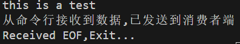

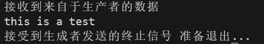

以上示例 从控制台获取输入 直到输入eof(ctrl D)后向消息队列发送一个eof后终止进程 

特别注意 mq_open的权限问题 否则将不能将数据写入到/dev/mqueue/yourname中

---

信号处理例程

```c
#include <signal.h>

// 信号处理函数声明
typedef void (*sighandler_t)(int);

/**
 *  signal系统调用会注册某一信号对应的处理函数。如果注册成功，当进程收到这一信号时，将不会调用默认的处理函数，而是调用这里的自定义函数
 * 
 * int signum: 要处理的信号
 * sighandler_t handler: 当收到对应的signum信号时，要调用的函数
 * return: sighandler_t 返回之前的信号处理函数，如果错误会返回SEG_ERR
 */
sighandler_t signal(int signum, sighandler_t handler);
```

```c
#include <stdio.h>
#include <stdlib.h>
#include <signal.h>
#include <unistd.h>

// 定义信号处理函数
void sigint_handler(int signum) 
{
    printf("\n收到%d信号,停止程序!\n",signum);
    exit(signum);
}

int main() 
{   // 注册SIGINT信号处理函数 收到ctrl+c信号之后不执行默认的函数,而是执行新的注册函数
    if (signal(SIGINT, sigint_handler) == SIG_ERR) {
        perror("注册新的信号处理函数失败\n");
        return 1;
    }
    while(1)
    {
        sleep(1);
        printf("hello!\n");
    }
    return 0;
}
```

> ctrl + c 所以当接收到终止信号的时候会调用sigint_handler
