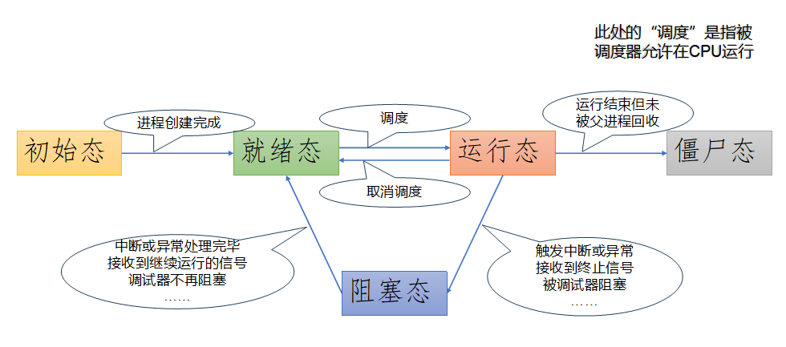
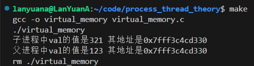
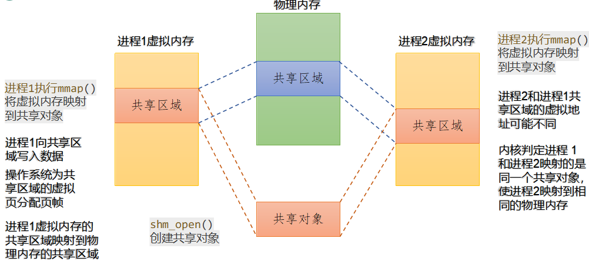
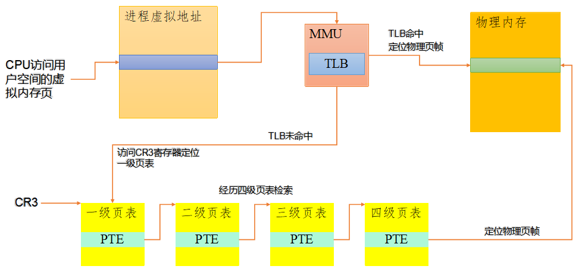
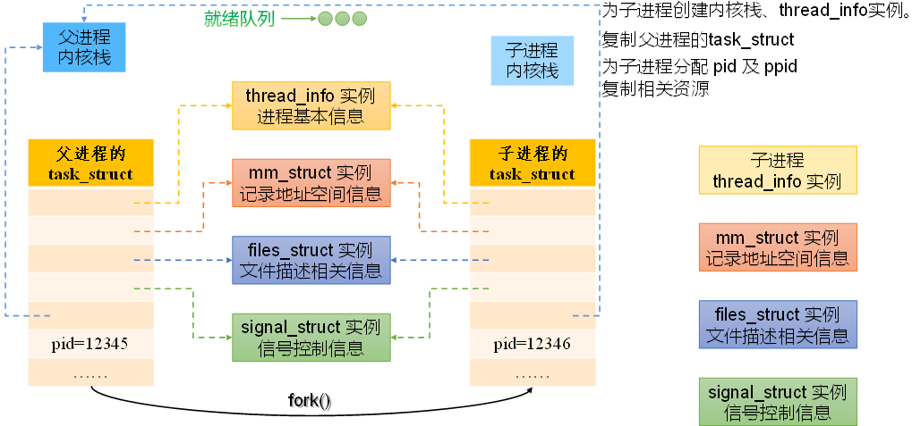
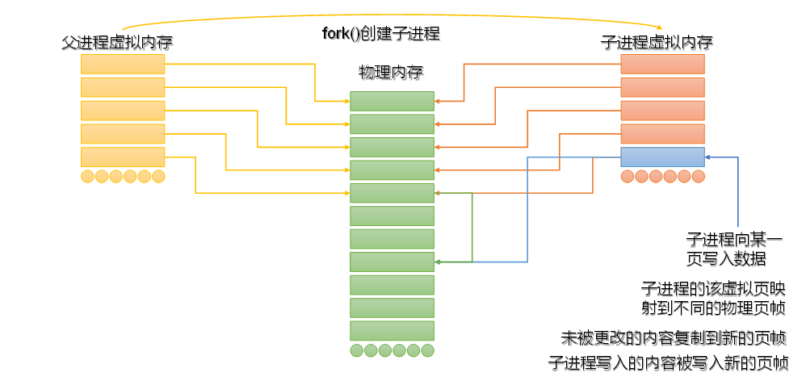
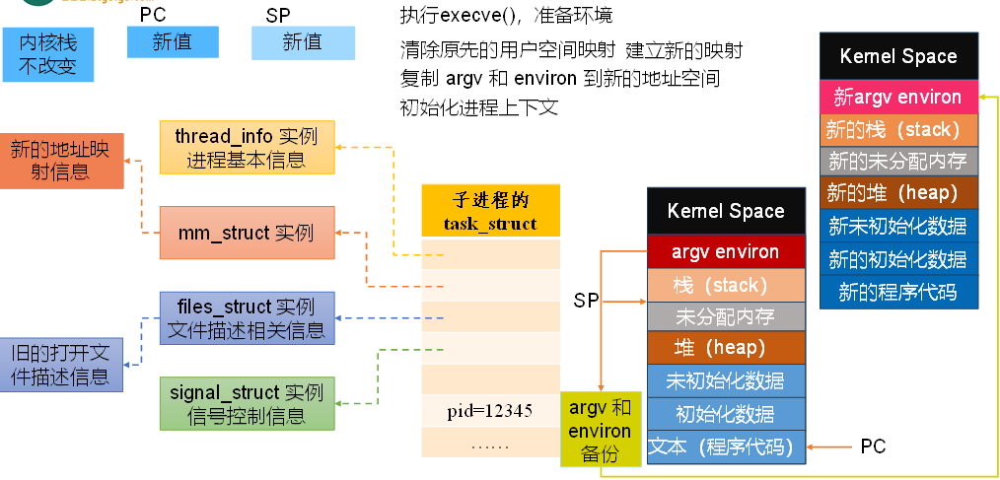
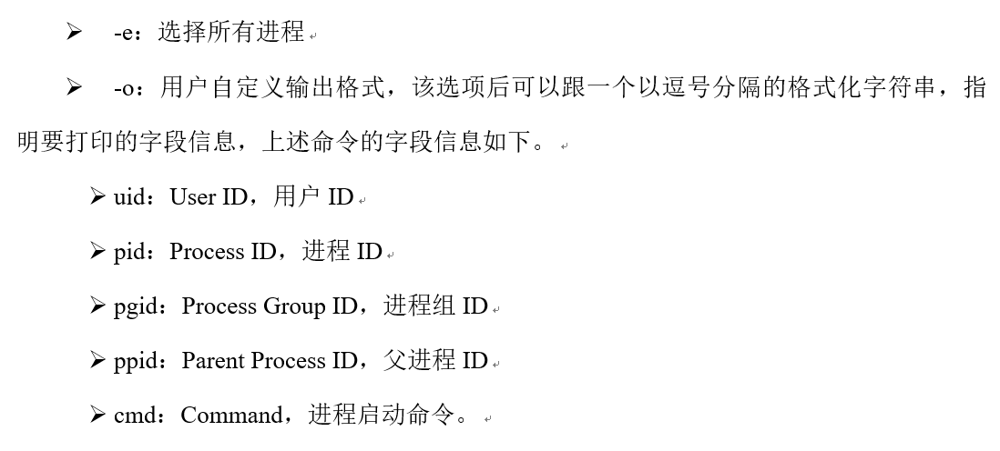
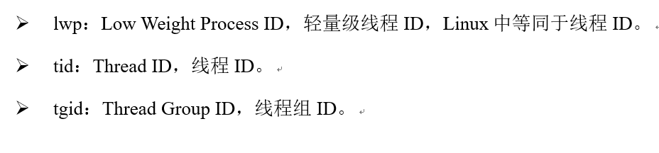
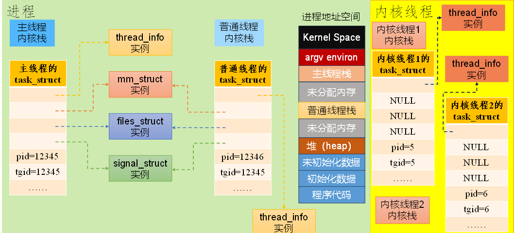

# ***线程与进程***

内核是操作系统的核心部分，负责管理计算机的硬件资源，包括处理器、内存、存储设备和其他外围设备。内核提供系统服务的基础，如进程管理、内存管理、设备驱动、文件系统和网络通信等。
内核作为硬件和应用程序之间的中介，提供一个抽象层，使得应用程序不需要直接与硬件交互。

进程控制块 PCB

方便管理进程 包括进程ID 状态信息 进程切换保存和回复的cpu寄存器 内存管理信息 工作目录 进程调度信息 I/O状态信息  同步和通信信息 用户ID和组ID

栈帧（Stack Frame）是程序在调用函数时用于存储函数调用和局部变量的一块内存。每次函数调用时，都会在调用者的栈上创建一个新的栈帧。这个栈帧包含了函数的返回地址、参数、局部变量以及保存的必要的寄存器值。
每个栈帧对应于一个函数调用的上下文，它是程序运行时栈内存组织的基本单元。栈帧允许函数调用彼此隔离，同时支持递归调用和嵌套调用。

进程状态：

- 初始态 Initial
- 就绪态 Ready
- 运行态 Running
- 阻塞态 Blocked
- 终止态 Final
- 僵尸态 Zombie PCB长期未释放

---

## ***虚拟内存***

在这个程序中地址相同但是获取的值不同是为什么？

虚拟内存为每个进程都分配了一段虚拟的地址空间 对于程序来说看起来是连续的 但是实际上可能分散储存 这可以简化内存管理 应用程序不需要关心物理内存的使用情况

物理内存即RAM 其大小直接关系到计算机能够同时处理的信息量。更多的物理内存意味着可以同时运行更多的程序，或者处理更大的数据集

怎么实现虚拟内存到物理内存？ MMU来实现 会查询页表找到对面的内存地址然后完成内存访问 还要检查访问权限 确保程序不会访问未授权的内存区域

若找不到 MMU会通知操作系统，由操作系统来处理这种情况，为虚拟页分配页帧，或将数据从硬盘加载到内存的一个页帧中，然后更新页表以建立新的映射关系。完成这些操作后，当程序再次尝试访问原来的虚拟地址时，可以正确地访问到映射后的物理页帧中的数据

最终是操作系统完成配置和管理MMU使用的数据结构（如页表），以及处理MMU生成的各种内存管理相关的异常（如缺页故障）

在操作系统的上下文中，“页”（Page）是虚拟内存管理中的一个基本单位，通常大小为4KB或2MB等

页帧（Page Frame），也称为物理页（Physical Page），是物理内存中的一个固定大小的区块。在虚拟内存系统中，物理内存被划分为许多这样大小相等的页帧，以便于内存的管理和映射

页表是操作系统用于管理虚拟内存系统中的虚拟地址到物理地址映射的数据结构。页表包含页表项（Page Table Entries, PTEs），每个PTE对应一个页，包含该页映射到的页帧的物理地址及访问该页的权限和状态（如是否在物理内存中，是否可写等）。在x86-64架构下，页表大小为4K

---

## ***异常与中断***

内核态是CPU的一种运行模式，具有执行所有指令和访问所有硬件资源的权限。在这种模式下，操作系统内核执行其核心功能。所有与硬件交互的操作都必须在内核态下执行。
由于具有完全的系统控制权，任何在内核态执行的代码都必须是高度可靠的，以避免系统崩溃或安全漏洞

用户态是CPU的另一种运行模式，权限受限。应用程序在用户态下运行，不能直接执行特权指令或访问受保护的内存区域。
用户态为应用程序提供了一个安全的执行环境，通过系统调用请求操作系统提供的服务。

特权指令是指只有在内核态下才可以执行的指令。这些指令提供了对硬件和关键系统资源的直接控制能力，因此它们的执行被严格限制在操作系统内核中，以防止恶意软件或错误的程序代码破坏系统的稳定性和安全性

中断（Interrupt）通常是I/O设备或时钟触发的，信号来自处理器外部，不是由任何一条指令造成的，从这个角度讲，它是异步的。中断处理完毕后总是执行下一条指令

异常是（Exception）CPU执行指令时检测到特定条件触发的。x86-64架构定义了三种异常：陷入（Trap）、故障（Fault）和终止（Abort）

在x86-64架构中，中断和异常区别在于：中断处理例程被调用时，CPU会清除EFLAGS寄存器中的IF（Interrupt Enable）位，避免其它中断干扰当前中断处理例程的执行。而异常处理例程被调用时IF不会被清除

操作系统启动时，内核会分配和初始化一张称为中断描述符表（Interrupt Descriptor Table IDT）的跳转表，将中断向量和中断或异常处理程序映射。IDT中的每一项（entry）对应一种中断或异常。
中断描述符表寄存器（Interrupt Descriptor Table Register IDTR）指明了IDT的基地址和边界

CPU以相同的方式处理中断和异常。当中断或异常发生的时候，CPU暂停当前程序或任务的执行，通过IDTR定位IDT，通过中断号检索IDT，确定中断或异常处理例程的入口。CPU切换到中断或异常处理例程，执行完毕后，回到被中断的程序或任务

任务状态段（Task State Segment TSS）是x86-64架构中用于支持任务切换和状态管理的数据结构，在早期的操作系统设计中，它被用于实现硬件级的任务切换功能，但在现代操作系统中，主要用于管理内核栈的切换

内核栈用于在中断或异常处理和CPU调度切换线程时保存当前正在执行的进程的状态，并在内核线程的工作中发挥作用。
当线程在用户空间执行时，内核栈中只有thread_info对象

（1）临时存储当前CPU寄存器SS，RSP（栈指针）、RFLAGS（状态寄存器）、CS、RIP（程序计数器）等寄存器的值。

（2）从TSS加载段选择器的信息和栈指针到SS和ESP寄存器，切换到内核栈，并为中断或异常处理例程开辟栈帧，此时切换至内核态。

（3）将第一步临时存储的寄存器值压入内核栈。
（4）将error code压入内核栈。

    ① error code是硬件层面由CPU自动处理和生成的，与特定的中断或异常关联，错误码包含了导致中断或异常的具体原因。

    ② 而在讲解perror()时用到的errno是C标准库提供的全局变量。二者是不同的。

（5）更新程序计数器，指向中断或异常处理例程。

（6）如果是中断处理例程，清除RFLAGS寄存器中的IF标志位。

（7）在内核态下开始执行中断或异常处理例程。

中断或异常的返回 如果最终是执行Abort 则不会返回

- 检查权限 进入内核态
- 恢复CS RIP RFLAGS SS RSP
- 内核栈中的异常处理程序栈帧弹栈 栈指针重新指向进程用户控件的用户站栈 切换到用户态

中断上文：在异常之前处理器的状态 即压入内核栈的数据 即段选择器的值 栈指针 程序计数器 状态相关寄存器的值

中断下文：涉及中断或异常处理内核所处的环境和状态 包括内核栈中保存的用户线程状态 状态寄存器 段选择器 内核栈指针等 内核态下执行的中断或异常处理函数等内容

页表基地址 x86-64架构实现了四级页表 一级页表存储在CR3寄存器 记录在PCB中 在进程切换会被保存和更新 MMU访问CR3定位一级页表 逐级检索完成地址转换

若未检索到 则操作系统会介入分配页帧

fork函数的作用

COW copy on write写时复制机制

fork的时候虚拟内存映射的是相同的物理内存 只有当两者其一执行了写入操作才会复制写入区域的内容 进而复制原数据到新的页帧并修改

清除原先的空间映射（不涉及内核空间），建立新映射 复制argv和env到新的地址空间初始化进程上下文 设置内核资源和寄存器等

> 查看进程组ID 

> ps -eo uid,pid,pgid,ppid,cmd

---

进程组ID用来表示一个或多个进程的集合 用于信号传递和终端控制

会话Session 是一个或多个进程组的集合  一般来说一个进程的PGID是自己的父进程 也可能是自己 可以通过setpgid()来将pid设置为各自的pgid 两个进程各自创建一个进程组

信号传递可以向一个进程组所有进程发送信号 而不是单独向每个进程发送

实现进程切换

- 存值 切换内核态 内核栈  压栈
- 调整pc 进入中断/异常服务程序
    - A的寄存器的值保存进pcb结构体中
    - 清除TLB
    - 将B的PCB的页表基址 栈指针等加载到寄存器中 指向B的Heineken栈
- 权限检查
- 恢复CS RIP 指向用户进程代码 恢复RFLAGS SS 栈指针（用户栈） 切换到用户态
- 执行进程B

---

线程是进程中的执行单元，它共享进程的资源和地址空间，但拥有自己的执行堆栈、程序计数器和一组寄存器

对于拥有多个线程的进程，主线程的线程ID等于进程ID，主线程是该进程的第一个线程，是创建其它线程的线程

在Linux中，线程等同于轻量级进程，二者都有独立的task_struct结构体实例。线程创建和进程创建在技术上是完全等同的，fork()和进程创建函数pthread_create()底层都调用了系统调用clone()。

线程之间共享进程资源，包括地址空间、文件系统信息、打开的文件描述符和信号处理函数，而不同进程之间的资源是隔离的

线程间的通信通常比进程间的通信（例如，通过管道、共享内存）更为高效。因为地址空间是共享的，线程间可以直接通过如全局变量这样的方式通信

线程的创建和上下文切换通常比进程更轻量级，因此在需要频繁创建和销毁执行单元的场景中，线程可能是更合适的选择

Linux中，同一进程的所有线程同属于一个线程组。线程组ID（Thread Group ID，TGID）用于标识一个线程组，它等于进程号，等于主线程（该进程的第一个线程，创建其它线程的线程）的线程ID（TID）

---

Linux的内核线程是在内核空间中运行的轻量级进程，它们没有独立的地址空间和大部分用户空间资源。内核线程是操作系统内核功能的一部分，主要用于管理和执行内核级任务，如硬件中断处理、系统调用服务、内存管理等

内核线程拥有自己的内核栈

不同于普通进程，struct mm_struct类型的字段mm及active_mm取值为NULL，它们通常共享内核的全局地址空间 内核线程的task_struct中flags字段被标记为PF_KTHREAD，用于表示这是一个内核线程。

内核线程工作在内核态，相互之间地位是等同的，因此，任意内核线程的TID、TGID、PID都是相同的。并且，所有内核线程的PGID都是0。这是因为内核线程不与任何特定的终端相关联，也不参与普通的作业控制和信号处理，这些通常是用户空间进程的特性。PGID设置为0是设计上的选择，用于确保内核线程在操作系统中的特殊性和隔离性

