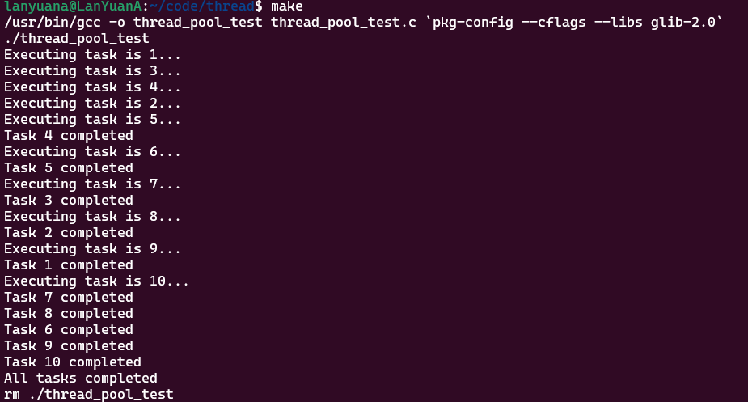

# 线程

进程是正在执行程序的实例 有自己的地址空间、代码段、数据段。和文件描述符等资源

线程是进程内的执行单元 共享相同的地址空间和其他资源 包括文件描述符 信号处理等 但线程有自己的栈空间

线程通信更方便但也会有同步问题

多线程比多进程更适合多并发

## 线程控制

```c
//pthread_create
#include <pthread.h>

/**
 * 创建一个新线程
 * 
 * pthread_t *thread: 指向线程标识符的指针,线程创建成功时,用于存储新创建线程的线程标识符
 * const pthread_attr_t *attr: pthead_attr_t结构体,这个参数可以用来设置线程的属性,如优先级、栈大小等。如果不需要定制线程属性,可以传入 NULL,此时线程将采用默认属性。 
 * void *(*start_routine)(void *): 一个指向函数的指针,它定义了新线程开始执行时的入口点。这个函数必须接受一个 void * 类型的参数,并返回 void * 类型的结果
 * void *arg: start_routine 函数的参数,可以是一个指向任意类型数据的指针
 * return: int 线程创建结果
 *             成功 0
 *             失败 非0
 */
int pthread_create(pthread_t *thread, const pthread_attr_t *attr,void *(*start_routine)(void *), void *arg);
```

> pthread_t 实际是long类型的别名

```c
//创建线程例程
#include <pthread.h>
#include <stdio.h>
#include <stdlib.h>
#include <unistd.h>

#define BUF_LEN 1024

char *buf;
/**
 * @brief 线程input_thread读取标准输入的数据，放入缓存区
 * 
 * @param argv 不需要输入参数，所以固定为NULL
 * @return void* 也不需要返回值
 */
void *input_thread(void *argv)
{
    int i=0;
    while(1)
    {
        //从标准输入读取一个字符
        char c = fgetc(stdin);
        //若不是换行或者0 则写入缓冲区
        if(c && c != '\n')
        {
            buf[i++] = c;
            //缓冲区索引溢出 i归零
            if(i >= BUF_LEN)
            {
                i = 0;
            }
        }
    }
}

/**
 * @brief 线程output_thread从缓存区读取数据写到标准输出，每个字符换行
 * 
 * @param argv 不需要输入参数，所以固定为NULL
 * @return void* 也不需要返回值
 */
void *output_thread(void *argv)
{
    //从缓冲区读数据并打印到stdout上
    int i = 0;
    while(1)
    {
        if(buf[i])
        {
            fputc(buf[i],stdout);
            fputc('\n',stdout);
            
            //清除读取完毕的字节
            buf[i] = 0;
            i++;
            if(i > BUF_LEN)
            {
                i = 0;
            }
        }
        else
        {
            sleep(1);
        }
    }
}

int main()
{
    pthread_t pid_input_thread;
    pthread_t pid_output_thread;

    //分配缓存
    buf = malloc(BUF_LEN);
    //初始化缓冲区
    for(int i = 0;i < BUF_LEN;i++)
    {
        buf[i] = 0;
    }
    //创建读取线程
    pthread_create(&pid_input_thread,NULL,input_thread,NULL);
    //创建写出线程
    pthread_create(&pid_output_thread,NULL,output_thread,NULL);
    //等待线程结束
    pthread_join(pid_input_thread,NULL);
    pthread_join(pid_output_thread,NULL);

    //释放缓冲区
    free(buf);
    return 0;
}
```

在main程序里创建线程句柄 调用pthread_create跳转到要执行的函数中去

---

线程终止的方法：

- 线程执行return
- 线程内部执行pthread_exit
- 其他线程执行pthread_cancel

```c
//pthread_exit
#include <pthread.h>

/**
 * 结束关闭调用该方法的线程，并返回一个内存指针用于存放结果
 * void *retval: 要返回给其它线程的数据
 */
void pthread_exit(void *retval);
```

retval指向的区域不能在线程的栈中 其他线程如果想调用这个返回值 需要调用pthread_join

```c
//pthread_join
#include <pthread.h>
/**
 * 等待指定线程结束，获取目标线程的返回值，并在目标线程结束后回收它的资源
 * 
 * pthread_t thread: 指定线程ID
 * void **retval: 这是一个可选参数，用于接收线程结束后传递的返回值。如果非空，pthread_join 会在成功时将线程的 exit status 复制到 *retval 所指向的内存位置。如果线程没有显式地通过 pthread_exit 提供返回值，则该参数将被设为 NULL 或忽略
 * return: int 成功 0
 *              失败 1
 */
int pthread_join(pthread_t thread, void **retval);
```

```c
//pthread_detach
#include <pthread.h>
/**
 * @brief 将线程标记为detached状态。POSIX线程终止后，如果没有调用pthread_detach或pthread_join，其资源会继续占用内存，类似于僵尸进程的未回收状态。默认情况下创建线程后，它处于可join状态，此时可以调用pthread_join等待线程终止并回收资源。但是如果主线程不需要等待线程终止，可以将其标记为detached状态，这意味着线程终止后，其资源会自动被系统回收。
 * 
 * @param thread 线程ID
 * @return int 成功返回0，失败返回错误码
 */
int pthread_detach(pthread_t thread);
```

```c
//pthread_cancel
#include <pthread.h>
/**
 * @brief 向目标线程发送取消请求。目标线程是否和何时响应取决于它的取消状态和类型
 *  取消状态（Cancelability State）：可以是enabled（默认）或disabled。如果取消状态为禁用，则取消请求会被挂起，直至线程启用取消功能。如果取消状态为启用，则线程的取消类型决定它何时取消。
 *  取消类型（Cancelability Type）：可以是asynchronous（异步）或deferred（被推迟，默认值）。
 *      asynchronous：意味着线程可能在任何时候被取消（通常立即被取消，但系统并不保证这一点）
 *      deferred：被推迟意味着取消请求会被挂起，直至被取消的线程执行取消点（cancellation point）函数时才会真正执行线程的取消操作。
*      取消点函数：是在POSIX线程库中专门设计用于检查和处理取消请求的函数。当被取消的线程执行这些函数时，如果线程的取消状态是enabled且类型是deferred，则它会立即响应取消请求并终止执行。man 7 pthreads可以看到取消点函数列表。
 * 
 * @param thread 目标线程，即被取消的线程
 * @return int 成功返回0，失败返回非零的错误码
 *      需要注意的是，取消操作和pthread_cancel函数的调用是异步的，这个函数的返回值只能告诉调用者取消请求是否成功发送。当线程被成功取消后，通过pthread_join和线程关联将会获得PTHREAD_CANCELED作为返回信息，这是判断取消是否完成的唯一方式
 */
int pthread_cancel(pthread_t thread);
```

```c
//pthread_setcancelstate
#include <pthread.h>

/**
 * @brief 设置调用线程的取消状态
 *  PTHREAD_CANCEL_ENABLE：启用取消功能
 *  PTHREAD_CANCEL_DISABLE：禁用取消功能
 * 
 * @param state 目标状态
 * @param oldstate 指针，用于返回历史状态
 * @return int 成功返回0，失败返回非零错误码
 */
int pthread_setcancelstate(int state, int *oldstate);
```

```c
//pthread_setcanceltype
#include <pthread.h>
/**
 * @brief 设置调用线程的取消类型
 *  PTHREAD_CANCEL_DEFERRED：设置取消类型为推迟
 *  PTHREAD_CANCEL_ASYNCHRONOUS：设置取消类型为异步
 * 
 * @param type 目标类型
 * @param oldtype 指针，用于接收历史类型
 * @return int 成功返回0，失败返回非零错误码
 */
int pthread_setcanceltype(int type, int *oldtype);
```

```c
//pthread_test 测试线程的返回值
#include <pthread.h>
#include <stdio.h>
#include <stdlib.h>
#include <unistd.h>
#include <math.h>
#include <string.h>

typedef struct Result //定义一个结构体 存放指针和长度
{
    char *p;
    int len;
} Result;


//创建两个线程 一个线程退出的时候给另一个线程返回结构体 当接收到结构体的时候 执行函数0
void *white_thread(void *argv)
{
    Result *result = malloc(sizeof(Result));//申请结果结构体的内存
    char code = *((char *)argv);//code存放参数的指针
    //存放回信
    char *ans = malloc(101);
    while (1)
    {
        //从命令行读取数据
        fgets(ans,100,stdin);
        if(ans[0] == code)
        {
            //成功读取到数据
            //释放掉输入数据
            free(ans);
            printf("白线程读到启动命令了\n");
            //定义一个result类型数据作为返回值
            char *whiteAns = strdup("这是白线程的回应\n");
            result->p = whiteAns;
            result->len = strlen(whiteAns);
            //结束进程 把返回值传回
            pthread_exit((void *)result);
        }
        else
        {
            printf("白进程还在运行\n");
        }
    }
}

void *red_thread(void *argv)
{
    Result *result = malloc(sizeof(Result));//申请结果结构体的内存
    char code = *((char *)argv);//code存放参数的指针
    //存放回信
    char *ans = malloc(101);
    while (1)
    {
        //从命令行读取数据
        fgets(ans,100,stdin);
        if(ans[0] == code)
        {
            //成功读取到数据
            //释放掉输入数据
            free(ans);
            printf("红线程读到启动命令了\n");
            //定义一个result类型数据作为返回值
            char *redAns = strdup("这是红线程的回应\n");
            result->p = redAns;
            result->len = strlen(redAns);
            //结束进程 把返回值传回
            pthread_exit((void *)result);
        }
        else
        {
            printf("红进程还在运行\n");
        }
    }
}

int main()
{
    //创建两个线程句柄
    pthread_t pid_white;
    pthread_t pid_red;
    //创建两个参数传给函数
    char white_code = 'w';
    char red_code = 'r';
    //创建两个result类型的结果保存返回值
    Result *white_result = NULL;
    Result *red_result = NULL;
    //创建两个线程
    pthread_create(&pid_white,NULL,white_thread,&white_code);
    pthread_create(&pid_red,NULL,red_thread,&red_code);
    //获取线程结果
    pthread_join(pid_white,(void **)&white_result);
    printf("这是对白线程的测试:%s",white_result->p);
    //释放内存
    free(white_result->p);
    free(white_result);

    pthread_join(pid_red,(void **)&red_result);
    printf("这是对红线程的测试:%s",red_result->p);
    //释放内存
    free(red_result->p);
    free(red_result);
    
    return 0;
}
```

> char *whiteAns = strdup("这是白线程的回应\n");
> 如果不使用strdup函数 内容保存在只读内存段 导致free出现段错误 使用后在堆上创建副本 可以安全free

该程序的缺点是：stdin是全局资源 同时只能有一个线程读取 只能先读取w后r 若先r则由白线程先读  不能正常终止红进程

在pthread_detach测试中 子线程挂为detach状态 意思为主线程不需要等待子线程结束返回 当子进程结束后自动回收资源

必须要注意 主线程若在子线程之前结束则整个进程结束 子进程被强制退出

## 线程同步

- 竞态条件

当多个线程并发访问或修改同一个共享资源的时候 如果没有合适的同步措施就会遇到线程同步问题 则程序结果就会依赖于线程执行的具体时序 导致了竞态条件

如何避免这种情况：

- 避免多线程写入统一地址
- 给资源枷锁 同一时间操作资源的线程只有一个

常见的锁：

- 互斥锁 Mutex 保证同一时刻只有一个线程可以执行临界区的代码
- 读写锁 Reader/Writer Locks 允许多个读者同时读共享数据 但写者的访问是互斥的
- 自旋锁 Spinlocks 在获得锁之前 线程在循环中忙等待 适用于锁持有时间非常短的场景 常见于Linux内核

```c
//pthread_mutex_t
typedef union
{
  struct __pthread_mutex_s __data;
  char __size[__SIZEOF_PTHREAD_MUTEX_T];
  long int __align;
} pthread_mutex_t;
```

可以实现保护共享数据 保持线程的同步确保线程按预定的顺序进行

操作：

- 初始化 pthread_mutex_init
- 锁定 pthread_mutex_lock 获取锁 若无则阻塞
- 尝试锁定 pthread_mutex_trylock 若无则立刻返回
- 销毁锁 pthread_mutex_destroy 清理资源

```c
#include <pthread.h>
/**
 * @brief 获取锁，如果此时锁被占则阻塞
 * 
 * @param mutex 锁
 * @return int 获取锁结果
 */
int pthread_mutex_lock(pthread_mutex_t *mutex);

/**
 * @brief 非阻塞式获取锁，如果锁此时被占则返回EBUSY
 * 
 * @param mutex 锁
 * @return int 获取锁结果
 */
int pthread_mutex_trylock(pthread_mutex_t *mutex);

/**
 * @brief 释放锁
 * 
 * @param mutex 锁
 * @return int 释放锁结果
 */
int pthread_mutex_unlock(pthread_mutex_t *mutex);
```

> static pthread_mutex_t counter_mutex = PTHREAD_MUTEX_INITIALIZER;

通过宏定义来初始化互斥锁

当使用动态分配创建的互斥锁 pthread_mutex_init的时候 或者互斥锁会被跨文件多个函数或文件使用 不再使用的时候必须显性销毁掉 对于静态初始化 不需要显性销毁

---

***读写锁***

读操作：在读写锁的控制下，多个线程可以同时获得读锁。这些线程可以并发地读取共享资源，但它们的存在阻止了写锁的授予。
写操作：如果至少有一个读操作持有读锁，写操作就无法获得写锁。写操作将会阻塞，直到所有的读锁都被释放。

```c
typedef union
{
  struct __pthread_rwlock_arch_t __data;
  char __size[__SIZEOF_PTHREAD_RWLOCK_T];
  long int __align;
} pthread_rwlock_t;

//pthread_rwlock_init
/**
 * @brief 为rwlock指向的读写锁分配所有需要的资源，并将锁初始化为未锁定状态。读写锁的属性由attr参数指定，如果attr为NULL，则使用默认属性。当锁的属性为默认时，可以通过宏PTHREAD_RWLOCK_INITIALIZER初始化，即
 * pthread_rwlock_t rwlock = PTHREAD_RWLOCK_INITIALIZER; 效果和调用当前方法并为attr传入NULL是一样的
 * 
 * @param rwlock 读写锁
 * @param attr 读写锁的属性
 * @return int 成功则返回0，否则返回错误码
 */
int pthread_rwlock_init(pthread_rwlock_t *restrict rwlock, const pthread_rwlockattr_t *restrict attr);

//pthread_rwlock_destroy
#include <pthread.h>

/**
 * @brief 销毁rwlock指向的读写锁对象，并释放它使用的所有资源。当任何线程持有锁的时候销毁锁，或尝试销毁一个未初始化的锁，结果是未定义的。
 * 
 * @param rwlock 
 * @return int 
 */
int pthread_rwlock_destroy(pthread_rwlock_t *rwlock);

//pthread_rwlock_rdlock
/**
 * @brief 应用一个读锁到rwlock指向的读写锁上，并使调用线程获得读锁。如果写线程持有锁，调用线程无法获得读锁，它会阻塞直至获得锁。
 * 
 * @param rwlock 读写锁
 * @return int 成功返回0，失败返回错误码
 */
int pthread_rwlock_rdlock(pthread_rwlock_t *rwlock);

//pthread_rwlock_wrlock
/**
 * @brief 应用一个写锁到rwlock指向的读写锁上，并使调用线程获得写锁。只要任意线程持有读写锁，则调用线程无法获得写锁，它将阻塞直至获得写锁。
 * 
 * @param rwlock 读写锁
 * @return int 成功返回0，失败返回错误码
 */
int pthread_rwlock_wrlock(pthread_rwlock_t *rwlock);

//pthread_rwlock_unlock
/**
 * @brief 释放调用线程锁持有的rwlock指向的读写锁。
 * 
 * @param rwlock 读写锁
 * @return int 成功返回0.失败返回错误码
 */
int pthread_rwlock_unlock(pthread_rwlock_t *rwlock);
```

写饥饿（write starvation）指读程序一直运行导致无法写入

解决方案：可修改属性pthread_rwlockattr_t 默认是读优先 当写操作阻塞的时候读操作仍然可以获得锁 可以尝试修改为写优先 避免写饥饿

初始化和销毁函数与上述类似

> pthread_rwlockattr_t

> pthread_rwlockattr_init

> pthread_rwlockattr_destory

```c
#include <pthread.h>

/**
 * @brief 将attr指向的属性对象中的"锁类型"属性设置为pref规定的值
 * 
 * @param attr 读写锁属性对象指针
 * @param pref 希望设置的锁类型，可以被设置为以下三种取值的其中一种
 * PTHREAD_RWLOCK_PREFER_READER_NP: 默认值，读线程拥有更高优先级。当存在阻塞的写线程时，读线程仍然可以获得读写锁。只要不断有新的读线程，写线程将一直保持"饥饿"。
 * PTHREAD_RWLOCK_PREFER_WRITER_NP: 写线程拥有更高优先级。这一选项被glibc忽略。
 * PTHREAD_RWLOCK_PREFER_WRITER_NONRECURSIVE_NP: 写线程拥有更高优先级，在当前系统环境下，它是有效的，将锁类型设置为该值以避免写饥饿。
 * @return int 成功返回0，失败返回非零的错误码
 */
int pthread_rwlockattr_setkind_np(pthread_rwlockattr_t *attr, int pref);
```

```c
    pthread_rwlockattr_t attr;
    pthread_rwlockattr_init(&attr);
    pthread_rwlockattr_setkind_np(&attr,PTHREAD_RWLOCK_PREFER_WRITER_NONRECURSIVE_NP);
    
    pthread_rwlock_init(&rwlock,&attr);
    pthread_rwlockattr_destroy(&attr);
```

具体操作可参考上述代码 设置attr的参数并传给rwlock的参数项

---

自旋锁

保护非常短的代码段或数据结构 避免多个处理器同时访问共享资源 他的优点是在锁被占用的时候会持续检查锁的状态（自旋），而不是让线程进入休眠 避免了线程上下文切换的开销

主要用于内核模块和驱动程序中 不能在用户控件使用

---

***条件变量***

函数参数使用restrict修饰，相当于约定：函数执行期间，该参数指向的内存区域不会被其它指针修改

在线程间协同工作

```c
#include <pthread.h>

/**
 * @brief 调用该方法的线程必须持有mutex锁。调用该方法的线程会阻塞并临时释放mutex锁，并等待其他线程调用pthread_cond_signal或pthread_cond_broadcast唤醒。被唤醒后该线程会尝试重新获取mutex锁。
 * 
 * @param cond 指向条件变量的指针。条件变量用于等待某个条件的发生。通过某一cond等待的线程需要通过同一cond的signal唤醒
 * @param mutex 与条件变量配合使用的互斥锁的指针。在调用pthread_cond_wait之前，线程必须已经获得了这个互斥锁。
 * @return int 成功时返回0；失败时返回错误码，而非-1。错误码可能包括EINVAL、EPERM等，具体取决于错误的性质。
 */
int pthread_cond_wait(pthread_cond_t *restrict cond, pthread_mutex_t *restrict mutex);

/**
 * @brief 同pthread_cond_wait相似，但是它添加了超时机制。如果在指定的abstime时间内条件变量没有被触发，函数将返回一个超时错误（ETIMEDOUT）。
 * 
 * @param cond 指向条件变量的指针
 * @param mutex 与条件变量配合使用的互斥锁的指针
 * @param abstime 指向timespec结构的指针，表示等待条件变量的绝对超时时间。timespec结构包含秒和纳秒两部分，指定了从某一固定点（如UNIX纪元，1970年1月1日）开始的时间。
 * @return int 成功时返回0；如果超时则返回ETIMEDOUT；其他错误情况返回相应的错误码。
 */
int pthread_cond_timedwait(pthread_cond_t *restrict cond, pthread_mutex_t *restrict mutex, const struct timespec *restrict abstime);

/**
 * @brief 唤醒因cond而阻塞的线程，如果有多个线程因为cond阻塞，那么随机唤醒一个。如果没有线程在等待，这个函数什么也不做。
 * 
 * @param cond 指向条件变量的指针
 * @return int 成功时返回0；失败时返回错误码
 */
int pthread_cond_signal(pthread_cond_t *cond);

/**
 * @brief 唤醒所有正在等待条件变量cond的线程。如果没有线程在等待，这个函数什么也不做。
 * 
 * @param cond 指向条件变量的指针。
 * @return int 成功时返回0；失败时返回错误码。
 */
int pthread_cond_broadcast(pthread_cond_t *cond);
```

条件变量必须和互斥锁搭配使用 互斥的对临界资源进行访问 提供了一种线程间的通信机制 允许线程无竞争的方式等待特定条件的发生

> pthread_cond_t是一个条件变量 线程间同步的另一种机制

- 初始化（pthread_cond_init）：创建并初始化条件变量。
- 等待（pthread_cond_wait）：在给定的互斥锁上等待条件变量。调用时，线程将释放互斥锁并进入等待状态，直到被唤醒。
- 定时等待（pthread_cond_timedwait）：等待条件变量或直到超过指定的时间。
- 信号（pthread_cond_signal）：唤醒至少一个等待该条件变量的线程。
- 广播（pthread_cond_broadcast）：唤醒所有等待该条件变量的线程。
- 销毁（pthread_cond_destroy）：清理条件变量资源。

> static pthread_cond_t cond = PTHREAD_COND_INITIALIZER;

>使用PTHREAD_COND_INITIALIZER可以让条件变量在程序启动时即处于可用状态，这对于全局或静态分配的条件变量尤其有用。

这种方式创建的条件变量通常不需要销毁 但是在程序运行时候被重新初始化的时候就要进行销毁

只适用于静态或全局变量的初始化 若是动态分配的就要使用init函数进行初始化

与读写锁类似 若要修改属性则不适用 需要通过attr和init函数进行

```c
//获得锁 得不到就等待
pthread_mutex_lock(&mutex);

if(condition)
{
    //暂停线程 等待唤醒
    pthread_cond_wait(&cond,&mutex);
}

/*要执行的代码*/

pthread_cond_signal(&cond);//向另一个线程发出信号
//解锁互斥锁
pthread_mutex_unlock(&mutex);
```

---

***信号量Semaphore***

用于解决多个进程或线程之间的同步与互斥问题

用于实现互斥的“二进制信号量”和用于同步的“计数信号量”。

- 有名信号量（named semaphore）在系统中是可见的 可以在任意进程之间进行通信 通过名字唯一标识 通过名字来访问同一个信号量对象 位于/dev.shm目录下
- 无名信号量（unnamed semaphore）直接通过sem_t结构的内存位置标识 需要初始化 不使用的时候进行销毁 不需要创建和链接 设置更快 运行也更高效

有两种操作：

- P操作（Proberen 尝试）：也被成为等待操作 wait 用于减少信号量 如果信号量大于0就减一并继续执行 若信号量为0则 进程或线程阻塞
- V操作（Verhogen 增加）：也被成为信号操作 用于增加信号量的值

系统调用

```c
//sem_init
#include <semaphore.h>

/**
 * @brief 在sem指向的地址初始化一个无名信号量。
 * 
 * @param sem 信号量地址
 * @param pshared 指明信号量是线程间共享还是进程间共享的
 * 0: 信号量是线程间共享的，应该被置于所有线程均可见的地址（如，全局变量或在堆中动态分配的变量）
 * 非0: 信号量是进程间共享的，应该被置于共享内存区域，任何进程只要能访问共享内存区域，即可操作进程间共享的信号量
 * @param value 信号量的初始值
 * @return int 成功返回0，失败返回-1，同时errno被设置以记录错误信息
 */
int sem_init(sem_t *sem, int pshared, unsigned int value);

//sem_destroy
/**
 * @brief 销毁sem指向的无名信号量
 * 
 * @param sem 无名信号量
 * @return int 成功返回0，失败返回-1，并设置errno指示错误原因
 */
int sem_destroy(sem_t *sem);

//sem_post
/**
 * @brief 将sem指向的信号量加一，如果信号量从0变为1，且其他进程或线程因信号量而阻塞，则阻塞的进程或线程会被唤醒并获取信号量，然后继续执行。POSIX标准并未明确定义唤醒策略，具体唤醒的是哪个进程或线程取决于操作系统的调度策略。
 * 
 * @param sem 信号量指针
 * @return int 成功返回0，失败则信号量的值未被修改，返回-1，并设置errno以指明错误原因
 */
int sem_post(sem_t *sem);

//sem wait
/**
 * @brief 将sem指向的信号量减一。如果信号量的值大于0，函数可以执行减一操作，然后立即返回，调用线程继续执行。如果当前信号量的值是0，则调用阻塞直至信号量的值大于0，或信号处理函数打断当前调用。
 * 
 * @param sem 信号量指针
 * @return int 成功返回0，失败则信号量的值保持不变，返回-1，并设置errno以指明错误原因
 */
int sem_wait(sem_t *sem);

//time
/**
 * @brief 返回以秒为单位的UNIX时间戳
 * 
 * @param tloc 记录时间的指针，如果不为NULL，则当前的UNIX秒级时间戳也会存在tloc指向的位置，否则不会存储。
 * @return time_t 成功则返回以秒为单位的UNIX时间戳，失败则返回(time_t)-1
 */
time_t time(time_t *tloc);

//rand
/**
 * @brief 返回一个 0-RAND_MAX 之间的伪随机数。当前机器环境下，RAND_MAX为int类型的最大值
 * 
 * @return int 伪随机数
 */
int rand(void);

//srand
/**
 * @brief 将seed设置为rand()生成随机数时使用的随机种子，如果没有设置随机种子，rand()会自动将1作为随机种子
 * 
 * @param seed 随机种子
 */
void srand(unsigned int seed);
```

```c
sem_t unnamed_sem; 

void *add_num(void *argv)
{
    sem_wait(&unnamed_sem);
    int tmp = shard_num +1;
    shard_num = tmp;
    sem_post(&unnamed_sem);
}

int main()
{
    sem_init(&unnamed_sem,0,1);
   /***********code************/
    sem_destroy(&unnamed_sem);
    return 0;
}
```

```c
#include <stdio.h>
#include <unistd.h>
#include <fcntl.h>
#include <sys/mman.h>
#include <sys/stat.h>
#include <sys/types.h>
#include <sys/wait.h>
#include <semaphore.h>

int main()
{
    //创建虚拟内存名称后打开
    char *sem_name = "/semshm";
    char *name = "/myshm";

    int fd = shm_open(name,O_CREAT | O_RDWR,0666);
    int sem_fd = shm_open(sem_name,O_CREAT | O_RDWR,0666);

    ftruncate(fd,sizeof(int));
    ftruncate(sem_fd,sizeof(int));
    //映射到内存上
    int *share= mmap(NULL,sizeof(int),PROT_READ |PROT_WRITE,MAP_SHARED,fd,0);
    sem_t *sem = mmap(NULL,sizeof(sem_t),PROT_READ |PROT_WRITE,MAP_SHARED,sem_fd,0);

    close(fd);
    close(sem_fd);

    sem_init(sem,1,1);
    *share = 0;

    int pid = fork();
    if(pid < 0)
    {
        perror("fork");
    }
    else if(pid > 0)
    {
        //父进程要执行的代码
        sem_wait(sem);
        int tmp = *share +1;
        sleep(1);
        *share = tmp;
        sem_post(sem);

        //等待子进程结束
        waitpid(pid,NULL,0);
        printf("this is father, child finished\n");
        printf("the final value is %d\n", *share);
    }
    else
    {
        //子进程要执行的代码
        sem_wait(sem);
        int tmp = *share +1;
        sleep(1);
        *share = tmp;
        sem_post(sem);
    }
    //解除共享内存的映射
    munmap(share,sizeof(int));
    munmap(sem,sizeof(sem_t));

    sem_destroy(sem);
    
    if(pid > 0)
    {
        shm_unlink(name);
        shm_unlink(sem_name);
    }
    return 0 ;
}
```

以上代码展示了信号量怎么使用于进程之间 通过共享内存实现

信号量必须置于共享内存区域，以确保多个进程都可以访问，否则每个进程各自管理自己的信号量，后者并没有起到进程间通信的作用

无名信号量实际上可以用于任意进程间的通信，而不仅限于父子进程。在非父子进程通信时，共享资源的初始化和释放要格外注意，必须按照合理的顺序进行。

用双信号量可以实现两个进程之间的先后关系 即同步

```c
#include <stdio.h>
#include <stdlib.h>
#include <pthread.h>
#include <unistd.h>
#include <semaphore.h>
#include <time.h>

sem_t *full;
sem_t *empty;

int shard_num;

int rand_num()
{
    srand(time(NULL));
    return rand();
}

//生产者线程
void *producer(void *argv)
{
    for(int i = 0 ; i < 5;i++)
    {
        sem_wait(empty); //empty -1
        printf("\n==========> 第 %d 轮数据传输 <=========\n\n", i + 1);
        sleep(1);
        shard_num = rand_num();
        printf("producer has sent data\n");
        sem_post(full);//full +1
    }
}

//消费者线程
void *consumer(void *argv)
{
    for(int i = 0 ; i < 5;i++)
    {
        sem_wait(full); //full -1
        printf("consumer has read data\n");
        printf("the shardnum =%d\n",shard_num);
        sleep(1);
        sem_post(empty);//empty +1
    }
}

int main()
{
    full = malloc(sizeof(sem_t));
    empty = malloc(sizeof(sem_t));

    sem_init(full,0,0);
    sem_init(empty,0,1);
/****************创建线程***************/

    sem_destroy(full);
    sem_destroy(empty);
    return 0;
}
```

二进制信号量和计数信号量的划分更多地是从控制效果来说的

二进制信号量起到了互斥锁的作用，当多个进程或线程访问共享资源时，确保同一时刻只有一个进程或线程进入了临界区，起到了“互斥”的作用；而计数信号量起到了“控制顺序”的作用，明确了“谁先执行”、“谁后执行”。不能只看信号量值的波动范围

---

***有名信号量***

通常用于进程间的通信 因为线程间通信有更方便的方法

```c
//sem_open
#include <fcntl.h>           /* For O_* constants */
#include <sys/stat.h>        /* For mode constants */
#include <semaphore.h>
/**
 * @brief 创建或打开一个已存在的POSIX有名信号量。
 * 
 * @param name 信号量的名称
 * @param oflag 标记位，控制调用函数的行为。是一个或多个值或操作的结果。常用的是O_CREAT。
 * O_CREAT: 如果信号量不存在则创建，指定了这个标记，必须提供mode和value
 * @param mode 有名信号量在临时文件系统中对应文件的权限。需要注意的是，应确保每个需要访问当前有名信号量的进程都可以获得读写权限。
 * @param value 信号量的初始值
 * @return sem_t* 成功则返回创建的有名信号量的地址，失败则返回SEM_FAILED，同时设置errno以指出错误原因
 */
sem_t *sem_open(const char *name, int oflag,
        mode_t mode, unsigned int value);

/**
 * @brief 见四个参数的sem_open()
 * 
 * @param name 同上
 * @param oflag 同上
 * @return sem_t* 同上
 */
sem_t *sem_open(const char *name, int oflag);

//sem_close
#include <semaphore.h>

/**
 * @brief 关闭对于sem指向的有名信号量的引用，每个打开了有名信号量的进程在结束时都应该关闭引用
 * 
 * @param sem 有名信号量指针
 * @return int 成功返回0，失败返回-1，并设置errno以指明错误原因
 */
int sem_close(sem_t *sem);
//sem_unlink
#include <semaphore.h>

/**
 * @brief 移除内存中的有名信号量对象，/dev/shm下的有名信号量文件会被清除。当没有任何进程引用该对象时才会执行清除操作。只应该执行一次。
 * 
 * @param name 有名信号量的名称
 * @return int 成功返回0，失败返回-1，并设置errno以指明错误原因
 */
int sem_unlink(const char *name);
```

使用有名信号量的时候不需要将信号量放入到共享内存

```c
char *sem_name = "/semshm";
sem_t *sem = sem_open(sem_name,O_CREAT | O_RDWR,0666,1);
//使用后都要关闭连接
sem_close(sem);
sem_unlink(sem_name);
```

作用于同步操作于上述无名信号量相似

```c
//一进程
sem_wait();
/***code***/

//另一进程
/***code***/
sem_post(sem);
```

同样的有名信号量在/dev/shm目录下

无名信号量用于进程间通信时必须将信号量存储在进程间可以共享的内存区域，作为内存地址直接在进程间共享。而内存区域的共享是通过内存共享对象的唯一名称来实现的

---

## 线程池

线程池是一种用于管理和重用多个线程的设计模式。它通过维护一个线程池（线程的集合），可以有效地处理并发任务而无需每次都创建和销毁线程。这种方法可以减少线程创建和销毁的开销，提高性能和资源利用率。

工作流程：

- 线程池创建：线程池会创建一定数量的线程，这些线程进入等待状态，准备执行任务，或在提交任务后才创建线程（取决于配置）。线程池中的所有任务执行的都是同一个任务函数。
- 任务队列：线程池维护一个任务队列。当我们向线程池提交任务时，任务会被放入这个队列中。实际上，放入任务队列的是我们在提交任务时传递的任务数据。
- 执行任务：线程池中的线程从任务队列中取出任务数据，然后调用任务函数，执行任务。执行完成后，线程不会退出，而是继续从任务队列中取下一个任务执行。如果没有待执行的任务，线程通常在等待一段时间后被回收（取决于具体的配置）

相关数据类型

> typedef void (*GFunc)(gpointer data, gpointer user_data);

> typedef void *gpointer;

> typedef int gint;

> typedef gint gboolean;

```c
//Gerror
/**
 * @brief 记录已发生的错误信息
 * domain: 表示错误的域（或命名空间）。GQuark 是一个无符号整数，用于唯一标识一个字符串。它通常用来区分不同的错误类别，例如文件操作错误、网络错误等。
 * code: 表示错误的代码。这是一个整型值，用于具体描述错误。每个域中的错误代码应该是唯一的，并且通常有一组预定义的错误代码。
 * gchar: 表示错误消息。gchar 是 char 的别名，用于在 GLib 中统一字符类型。message 是一个字符串指针，包含了详细的错误描述信息。
 */
struct GError {
    GQuark domain;
    gint code;
    gchar *message;
}

//GThreadPool
/**
 * @brief 线程池对象
 * func：线程池中执行的任务
* user_data：线程池中共享的用户数据指针，会在每个任务函数调用时传递给任务函数。
 * exclusive：标记当前线程池是否独占线程
 */
struct GThreadPool {
    GFunc func;
    gpointer user_data;
    gboolean exclusive;
}
````

```c
//g_thread_pool_new
/**
 * @brief 创建新的线程池
 *
 * @param func 池中线程执行的函数
 * @param user_data 传递给func的数据，可以为NULL，这里的user_data最终会被存储在GThreadPool结构体的user_data属性中
 * @param max_threads 线程池容量，即当前线程池中可以同时运行的线程数。-1表示没有限制
 * @param exclusive 独占标记位。决定当前的线程池独占所有的线程还是与其它线程池共享这些线程。取值可以是TRUE或FALSE
 *  TRUE：立即启动数量为max_threads的线程，且启动的线程只能被当前线程池使用
 *  FALSE：只有在需要时，即需要执行任务时才创建线程，且线程可以被多个非独享资源的线程池共用
 * @param error 用于报告错误信息，可以是NULL，表示忽略错误
 * @return GThreadPool* 线程池实例指针。无论是否发生错误，都会返回有效的线程池
 */
GThreadPool *g_thread_pool_new(
    GFunc func,
    gpointer user_data,
    gint max_threads,
    gboolean exclusive,
    GError **error);

//g_thread_pool_push
/**
 * @brief 向pool指向的线程池实例添加数据，这一行为实际上会向任务队列添加新的任务。当存在可用线程时任务立即执行，否则任务数据会一直待在队列中，直至腾出可用线程执行任务
 * 
 * @param pool 指向线程池实例的指针
 * @param data 传递给每个任务的独享数据
* @param error 错误信息
 * @return gboolean 成功返回TRUE，失败返回FALSE
 */
gboolean g_thread_pool_push(
    GThreadPool *pool,
    gpointer data,
    GError **error);

//g_thread_pool_free
/**
 * @brief 释放为pool指向的线程池分配的所有资源
 * 
 * @param pool 线程池指针
 * @param immediate 是否立即释放线程池
 *  TRUE：立即释放所有资源，未处理的数据不被处理
 *  FALSE：在最后一个任务执行完毕之前，线程池不会被释放
 *  需要注意的是：执行任务时，线程池的任何一个线程都不会被打断。无论这个参数是何取值，都可以保证至少线程池释放前正在运行的线程可以完成它们的任务。
 * @param wait_ 当前函数是否阻塞等待所有任务完成
 *  TRUE：所有需要处理的任务执行完毕当前函数才会返回
 *  FALSE：当前函数立即返回
 */
void g_thread_pool_free (
  GThreadPool* pool,
  gboolean immediate,
  gboolean wait_
);

```c
#include <glib.h>
#include <stdio.h>
#include <unistd.h>
#include <stdlib.h>

void task_func(gpointer data,gpointer user_data)
{
    int task_num = *(int *)data;
    free(data);
    printf("Executing task is %d...\n", task_num);
    sleep(1);
    printf("Task %d completed\n", task_num);
}

int main()
{
    //创建线程池
    GThreadPool *thread_pool = g_thread_pool_new(task_func,NULL,5,TRUE,NULL);
    //添加任务
    for (int i = 0;i<10;i++)
    {
        int *tmp = malloc(sizeof(int));
        *tmp = i+1;
        g_thread_pool_push(thread_pool,tmp,NULL);
    }
    //等待所有任务完成
    g_thread_pool_free(thread_pool, FALSE, TRUE);
    printf("All tasks completed\n");
}
```

```Makefile
CC := /usr/bin/gcc
thread_pool_test: thread_pool_test.c
    $(CC) -o $@ $^ `pkg-config --cflags -libs glib-2.0`
    ./$@
    rm ./$@
```

流程：

- 创建一个线程池
- 往线程池里面添加任务 传入data
- 任务读取data并执行任务
- 释放线程池

